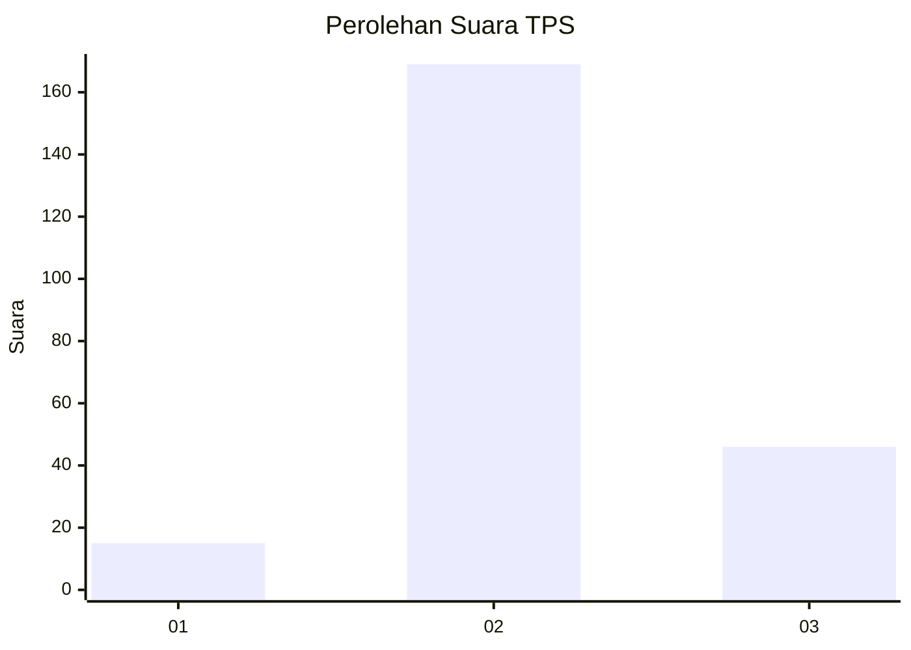

# Hasil

## Grafik

## Tabel

| No. | Nama Paslon    | Suara | Suara (raw) | Persentase |
|:--- |:-------------- | -----:| -----------:| ----------:|
| 1   | ANIES MUHAIMIN | 15    | [15][p-1]   | 6,52       |
| 2   | PRABOWO GIBRAN | 169   | [169][p-2]  | 73,48      |
| 3   | GANJAR MAHFUD  | 46    | [46][p-3]   | 20,00      |

[p-1]: https://github.com/gigit-pemilu/pemilu-2024/blob/main/pilpres/hitung-suara/sub/35-jawa-timur/sub/25-gresik/sub/06-wringinanom/sub/2002-sumbergede/sub/004-tps/sub/paslon-1.txt
[p-2]: https://github.com/gigit-pemilu/pemilu-2024/blob/main/pilpres/hitung-suara/sub/35-jawa-timur/sub/25-gresik/sub/06-wringinanom/sub/2002-sumbergede/sub/004-tps/sub/paslon-2.txt
[p-3]: https://github.com/gigit-pemilu/pemilu-2024/blob/main/pilpres/hitung-suara/sub/35-jawa-timur/sub/25-gresik/sub/06-wringinanom/sub/2002-sumbergede/sub/004-tps/sub/paslon-3.txt

## Foto C Plano

https://sirekap-obj-formc.kpu.go.id/51c0/pemilu/ppwp/35/25/06/20/02/3525062002004-20240214-223548--9f030fd2-9ce3-45b0-a0c5-791a846f4546.jpg

https://sirekap-obj-formc.kpu.go.id/51c0/pemilu/ppwp/35/25/06/20/02/3525062002004-20240214-221135--64904f63-3f1e-45c3-86bf-42205a9fcb67.jpg

https://sirekap-obj-formc.kpu.go.id/51c0/pemilu/ppwp/35/25/06/20/02/3525062002004-20240214-221144--e5a1266c-767e-4f51-a5df-6c4bc4c8f2f8.jpg

## Metadata

| Key        | Value               |
| ---------- | ------------------- |
| Time Stamp | 2024-02-15 17:30:25 |

