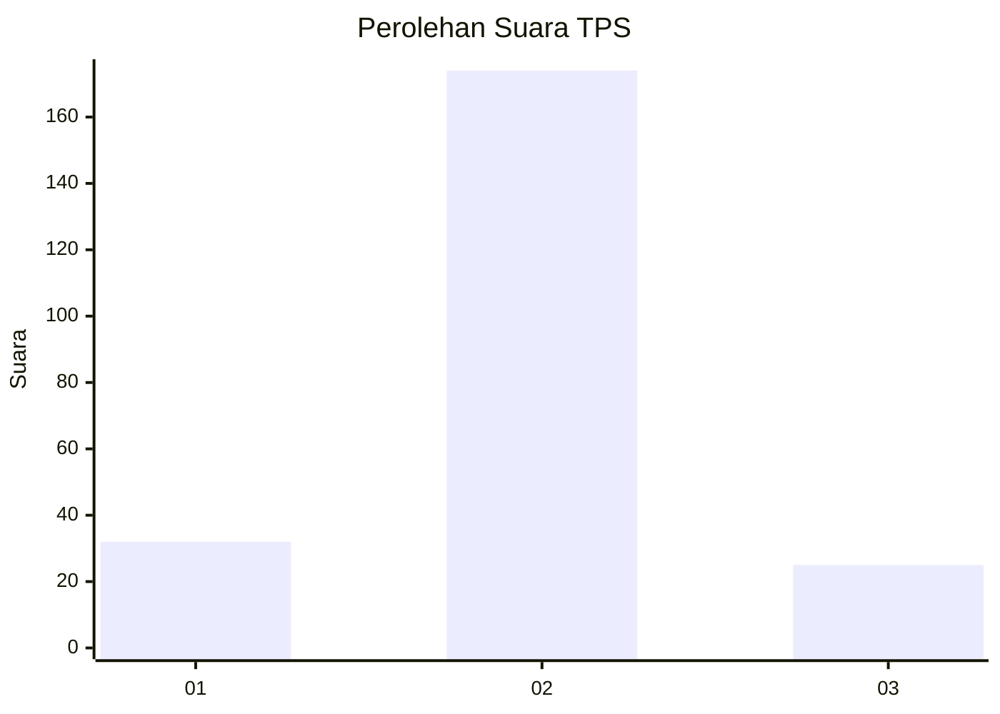
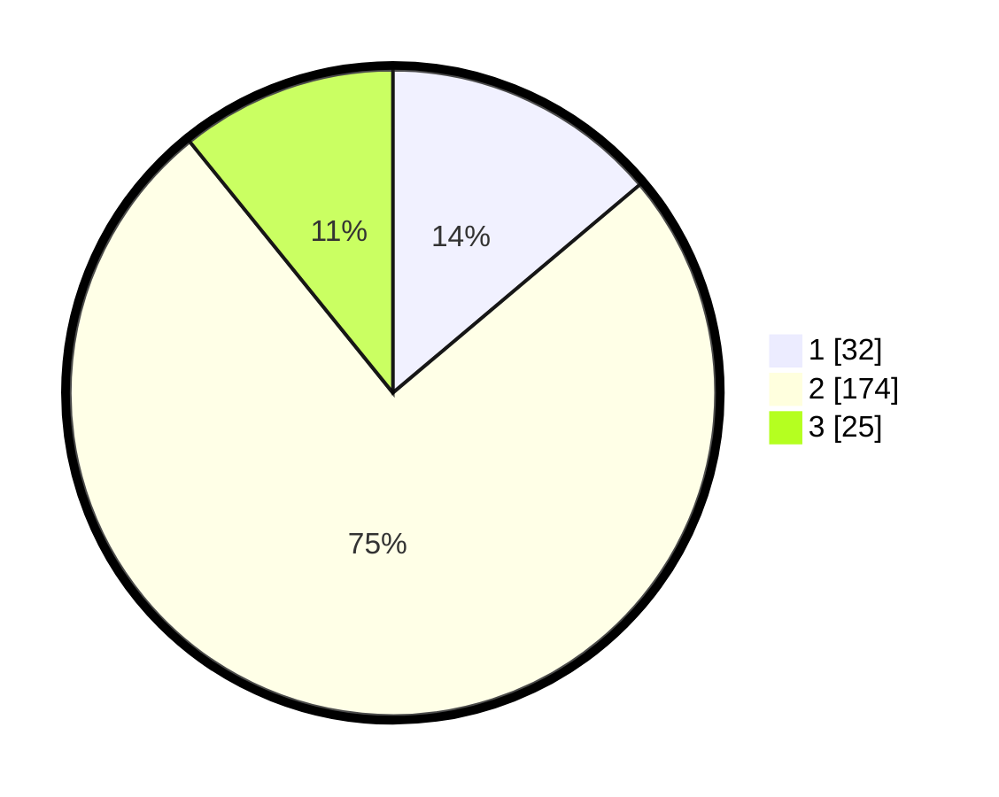

# Hasil

## Grafik

## Tabel

| No. | Nama Paslon    | Suara | Suara (raw) | Persentase |
|:--- |:-------------- | -----:| -----------:| ----------:|
| 1   | ANIES MUHAIMIN | 32    | [32][p-1]   | 13,85      |
| 2   | PRABOWO GIBRAN | 174   | [174][p-2]  | 75,32      |
| 3   | GANJAR MAHFUD  | 25    | [25][p-3]   | 10,82      |

[p-1]: https://github.com/gigit-pemilu/pemilu-2024-35-jawa-timur/blob/main/pilpres/hitung-suara/sub/35-jawa-timur/sub/25-gresik/sub/06-wringinanom/sub/2004-kedunganyar/sub/002-tps/sub/paslon-1.txt
[p-2]: https://github.com/gigit-pemilu/pemilu-2024-35-jawa-timur/blob/main/pilpres/hitung-suara/sub/35-jawa-timur/sub/25-gresik/sub/06-wringinanom/sub/2004-kedunganyar/sub/002-tps/sub/paslon-2.txt
[p-3]: https://github.com/gigit-pemilu/pemilu-2024-35-jawa-timur/blob/main/pilpres/hitung-suara/sub/35-jawa-timur/sub/25-gresik/sub/06-wringinanom/sub/2004-kedunganyar/sub/002-tps/sub/paslon-3.txt

## Foto C Plano

https://sirekap-obj-formc.kpu.go.id/66b8/pemilu/ppwp/35/25/06/20/04/3525062004002-20240218-184539--ef1fb42d-5ab4-4d08-b3ab-67198a2e3b6f.jpg

https://sirekap-obj-formc.kpu.go.id/66b8/pemilu/ppwp/35/25/06/20/04/3525062004002-20240215-001528--c5921889-331f-4e92-bf9f-826f92db4ce3.jpg

https://sirekap-obj-formc.kpu.go.id/66b8/pemilu/ppwp/35/25/06/20/04/3525062004002-20240214-210952--2d9e3e66-bc6e-41d2-b526-1c7ff9b4f3e0.jpg

## Metadata

| Key        | Value               |
| ---------- | ------------------- |
| Time Stamp | 2024-02-19 06:16:00 |

## DATA PEMILIH TETAP

Jumlah pemilih dalam DPT: **555**.
 * L: **337**.
 * P: **522**.

## DATA PENGGUNA HAK PILIH

Jumlah pengguna hak pilih dalam DPT: **335**.
 * L: **525**.
 * P: **355**.

Jumlah pengguna hak pilih dalam DPTb: **3**.
 * L: **5**.
 * P: **0**.

Jumlah pengguna hak pilih dalam DPK: **58**.
 * L: **808**.
 * P: **58**.

Jumlah pengguna hak pilih: **237**.
 * L: **522**.
 * P: **385**.

## JUMLAH SUARA SAH DAN TIDAK SAH

JUMLAH SELURUH SUARA SAH: **231**.

JUMLAH SUARA TIDAK SAH: **6**.

JUMLAH SELURUH SUARA SAH DAN SUARA TIDAK SAH: **237**.

