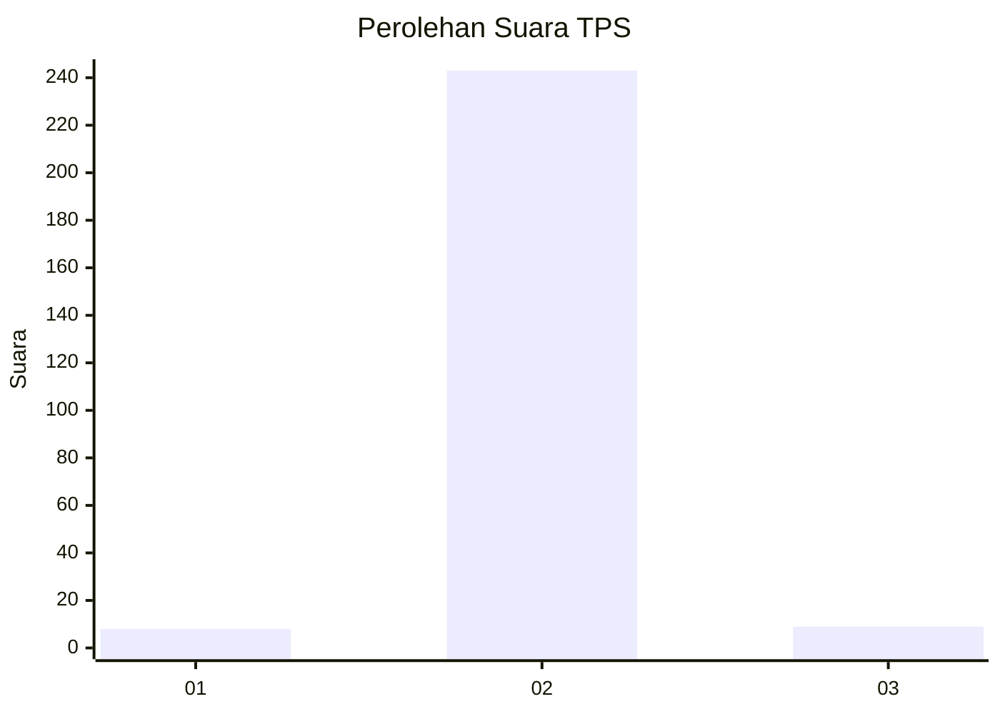
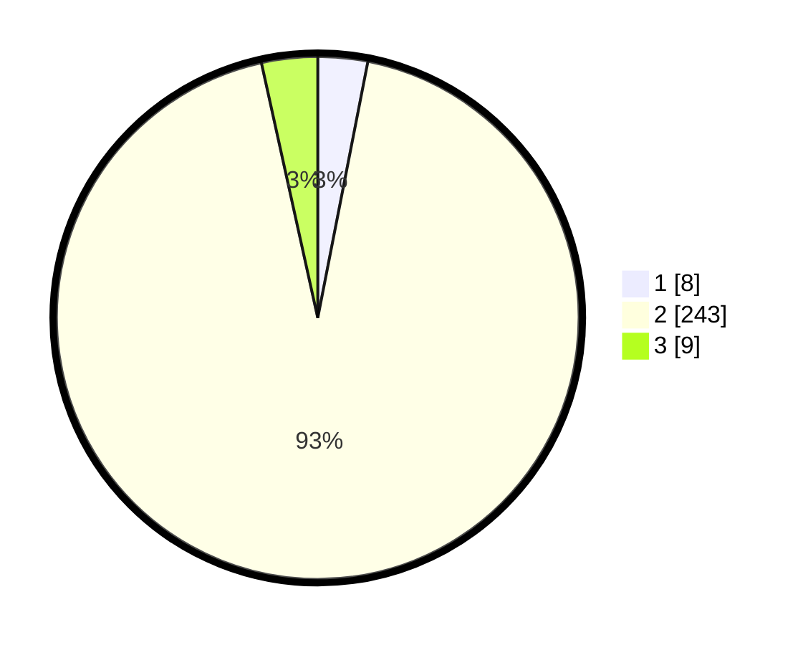

# Hasil

## Grafik

## Tabel

| No. | Nama Paslon    | Suara | Suara (raw) | Persentase |
|:--- |:-------------- | -----:| -----------:| ----------:|
| 1   | ANIES MUHAIMIN | 8     | [8][p-1]    | 3,08       |
| 2   | PRABOWO GIBRAN | 243   | [243][p-2]  | 93,46      |
| 3   | GANJAR MAHFUD  | 9     | [9][p-3]    | 3,46       |

[p-1]: https://github.com/gigit-pemilu/pemilu-2024-35-jawa-timur/blob/main/pilpres/hitung-suara/sub/35-jawa-timur/sub/25-gresik/sub/06-wringinanom/sub/2005-sumberwaru/sub/003-tps/sub/paslon-1.txt
[p-2]: https://github.com/gigit-pemilu/pemilu-2024-35-jawa-timur/blob/main/pilpres/hitung-suara/sub/35-jawa-timur/sub/25-gresik/sub/06-wringinanom/sub/2005-sumberwaru/sub/003-tps/sub/paslon-2.txt
[p-3]: https://github.com/gigit-pemilu/pemilu-2024-35-jawa-timur/blob/main/pilpres/hitung-suara/sub/35-jawa-timur/sub/25-gresik/sub/06-wringinanom/sub/2005-sumberwaru/sub/003-tps/sub/paslon-3.txt

## Foto C Plano

https://sirekap-obj-formc.kpu.go.id/961d/pemilu/ppwp/35/25/06/20/05/3525062005003-20240214-231746--a9a40758-5122-4fbb-9c3c-a7f88f472229.jpg

https://sirekap-obj-formc.kpu.go.id/961d/pemilu/ppwp/35/25/06/20/05/3525062005003-20240214-231917--0451ce35-27ff-4d72-a369-ff06c2f20981.jpg

https://sirekap-obj-formc.kpu.go.id/961d/pemilu/ppwp/35/25/06/20/05/3525062005003-20240214-232024--753fa476-9f1e-4426-be58-ab638574b3d7.jpg

## Metadata

| Key        | Value               |
| ---------- | ------------------- |
| Time Stamp | 2024-02-16 14:00:34 |

