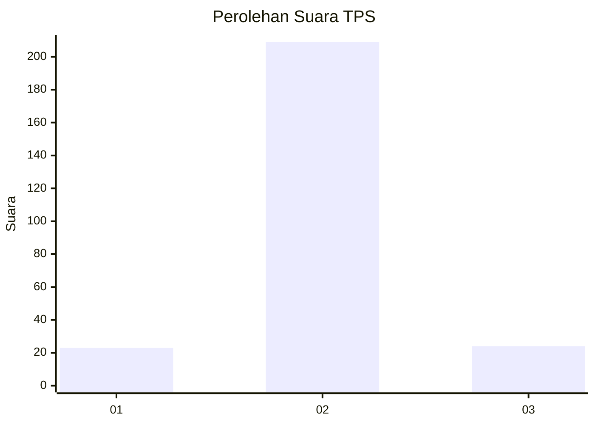
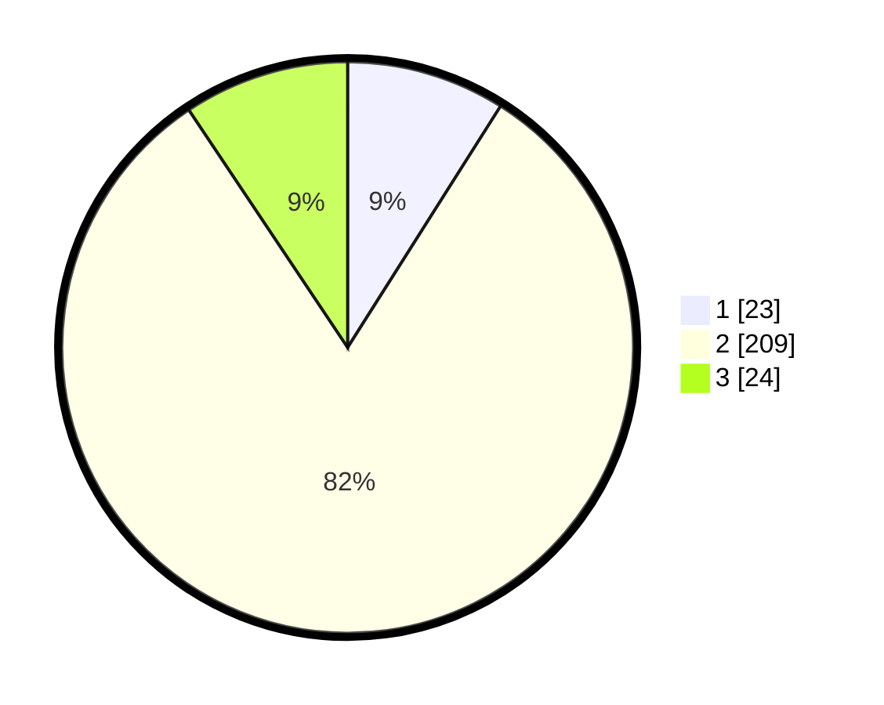

# Hasil

## Grafik

## Tabel

| No. | Nama Paslon    | Suara | Suara (raw) | Persentase |
|:--- |:-------------- | -----:| -----------:| ----------:|
| 1   | ANIES MUHAIMIN | 23    | [23][p-1]   | 8,98       |
| 2   | PRABOWO GIBRAN | 209   | [209][p-2]  | 81,64      |
| 3   | GANJAR MAHFUD  | 24    | [24][p-3]   | 9,38       |

[p-1]: https://github.com/gigit-pemilu/pemilu-2024-35-jawa-timur/blob/main/pilpres/hitung-suara/sub/35-jawa-timur/sub/25-gresik/sub/06-wringinanom/sub/2005-sumberwaru/sub/008-tps/sub/paslon-1.txt
[p-2]: https://github.com/gigit-pemilu/pemilu-2024-35-jawa-timur/blob/main/pilpres/hitung-suara/sub/35-jawa-timur/sub/25-gresik/sub/06-wringinanom/sub/2005-sumberwaru/sub/008-tps/sub/paslon-2.txt
[p-3]: https://github.com/gigit-pemilu/pemilu-2024-35-jawa-timur/blob/main/pilpres/hitung-suara/sub/35-jawa-timur/sub/25-gresik/sub/06-wringinanom/sub/2005-sumberwaru/sub/008-tps/sub/paslon-3.txt

## Foto C Plano

https://sirekap-obj-formc.kpu.go.id/4960/pemilu/ppwp/35/25/06/20/05/3525062005008-20240215-010703--ac14709d-65ab-4131-be0e-3bd5f8e0f02a.jpg

https://sirekap-obj-formc.kpu.go.id/4960/pemilu/ppwp/35/25/06/20/05/3525062005008-20240215-010739--4b578ee3-fec0-4f54-b64e-04c580f0e5e8.jpg

https://sirekap-obj-formc.kpu.go.id/4960/pemilu/ppwp/35/25/06/20/05/3525062005008-20240215-010815--48a6f5e9-ff11-4d8a-bb43-6b184286c4b5.jpg

## Metadata

| Key        | Value               |
| ---------- | ------------------- |
| Time Stamp | 2024-02-16 14:00:34 |

