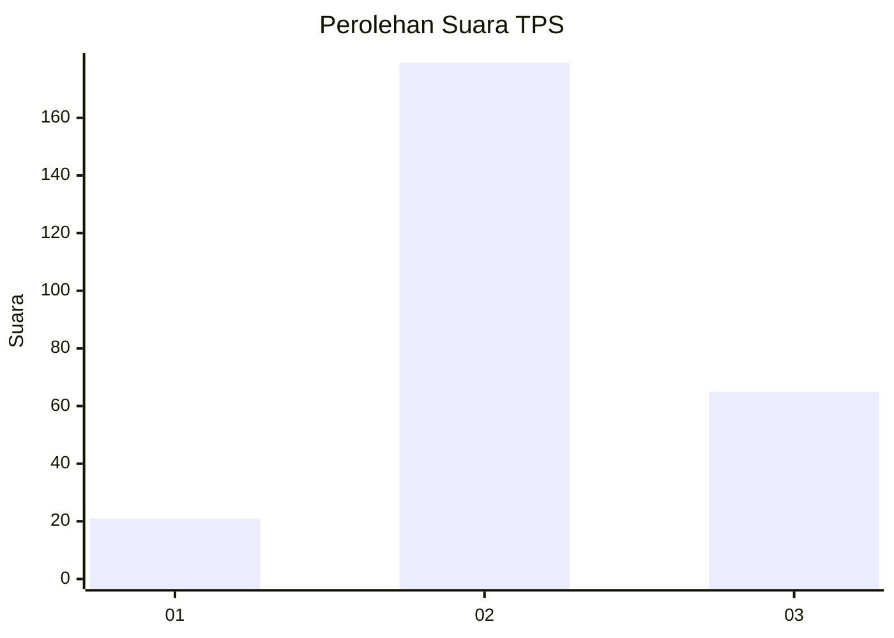
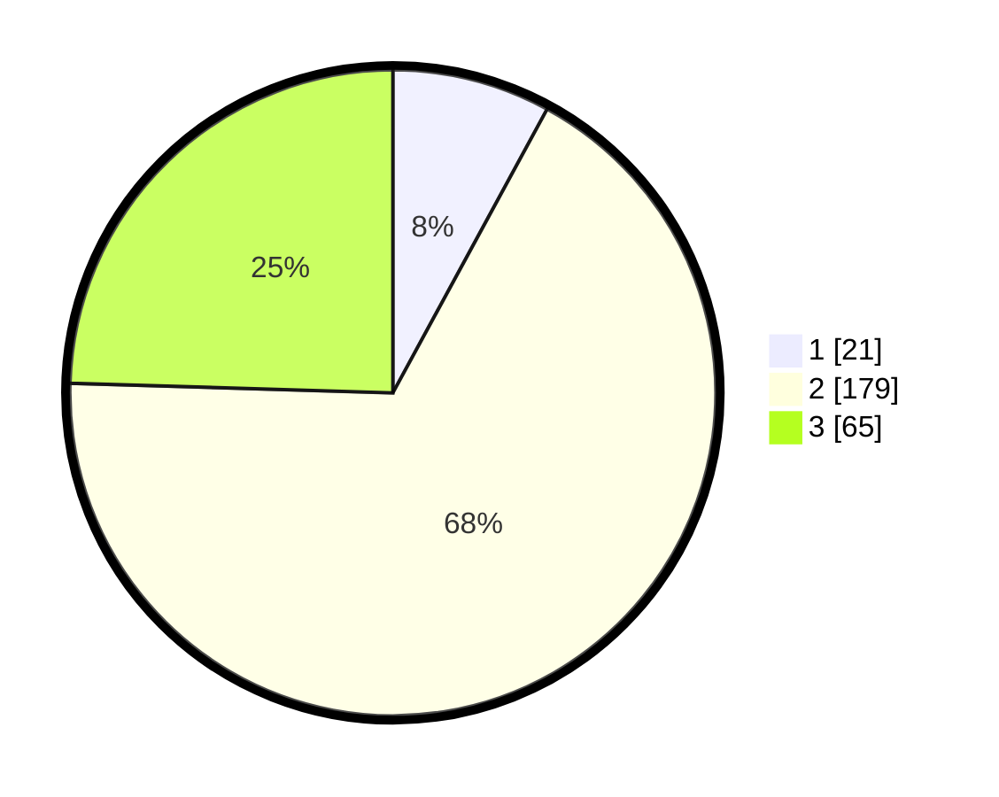

# Hasil

## Grafik

## Tabel

| No. | Nama Paslon    | Suara | Suara (raw) | Persentase |
|:--- |:-------------- | -----:| -----------:| ----------:|
| 1   | ANIES MUHAIMIN | 21    | [21][p-1]   | 7,92       |
| 2   | PRABOWO GIBRAN | 179   | [179][p-2]  | 67,55      |
| 3   | GANJAR MAHFUD  | 65    | [65][p-3]   | 24,53      |

[p-1]: https://github.com/gigit-pemilu/pemilu-2024/blob/main/pilpres/hitung-suara/sub/35-jawa-timur/sub/25-gresik/sub/06-wringinanom/sub/2006-kesambenkulon/sub/011-tps/sub/paslon-1.txt
[p-2]: https://github.com/gigit-pemilu/pemilu-2024/blob/main/pilpres/hitung-suara/sub/35-jawa-timur/sub/25-gresik/sub/06-wringinanom/sub/2006-kesambenkulon/sub/011-tps/sub/paslon-2.txt
[p-3]: https://github.com/gigit-pemilu/pemilu-2024/blob/main/pilpres/hitung-suara/sub/35-jawa-timur/sub/25-gresik/sub/06-wringinanom/sub/2006-kesambenkulon/sub/011-tps/sub/paslon-3.txt

## Foto C Plano

https://sirekap-obj-formc.kpu.go.id/60d5/pemilu/ppwp/35/25/06/20/06/3525062006011-20240214-225945--f334e0e9-ce91-49f0-bc12-43048a94a56a.jpg

https://sirekap-obj-formc.kpu.go.id/60d5/pemilu/ppwp/35/25/06/20/06/3525062006011-20240214-230229--9420f0d0-44d6-453b-a7be-2097d9fa2f1e.jpg

https://sirekap-obj-formc.kpu.go.id/60d5/pemilu/ppwp/35/25/06/20/06/3525062006011-20240214-230453--e83a8a80-6470-4961-bf39-66402204dd48.jpg

## Metadata

| Key        | Value               |
| ---------- | ------------------- |
| Time Stamp | 2024-02-16 14:00:34 |

