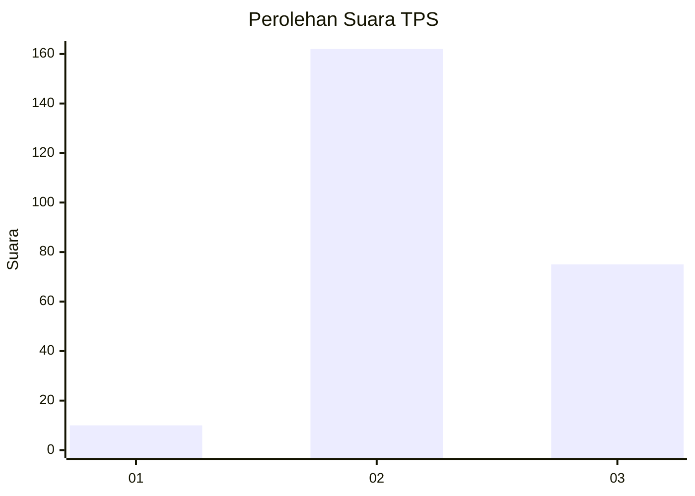

# Hasil

## Grafik

## Tabel

| No. | Nama Paslon    | Suara | Suara (raw) | Persentase |
|:--- |:-------------- | -----:| -----------:| ----------:|
| 1   | ANIES MUHAIMIN | 10    | [10][p-1]   | 4,05       |
| 2   | PRABOWO GIBRAN | 162   | [162][p-2]  | 65,59      |
| 3   | GANJAR MAHFUD  | 75    | [75][p-3]   | 30,36      |

[p-1]: https://github.com/gigit-pemilu/pemilu-2024-35-jawa-timur/blob/main/pilpres/hitung-suara/sub/35-jawa-timur/sub/25-gresik/sub/06-wringinanom/sub/2006-kesambenkulon/sub/015-tps/sub/paslon-1.txt
[p-2]: https://github.com/gigit-pemilu/pemilu-2024-35-jawa-timur/blob/main/pilpres/hitung-suara/sub/35-jawa-timur/sub/25-gresik/sub/06-wringinanom/sub/2006-kesambenkulon/sub/015-tps/sub/paslon-2.txt
[p-3]: https://github.com/gigit-pemilu/pemilu-2024-35-jawa-timur/blob/main/pilpres/hitung-suara/sub/35-jawa-timur/sub/25-gresik/sub/06-wringinanom/sub/2006-kesambenkulon/sub/015-tps/sub/paslon-3.txt

## Foto C Plano

https://sirekap-obj-formc.kpu.go.id/c3a2/pemilu/ppwp/35/25/06/20/06/3525062006015-20240214-214822--47e6b1ff-2d85-49ee-a2c2-46588f5eb7cb.jpg

https://sirekap-obj-formc.kpu.go.id/c3a2/pemilu/ppwp/35/25/06/20/06/3525062006015-20240214-214841--982ea865-8d12-4275-96fc-f980ab586d29.jpg

https://sirekap-obj-formc.kpu.go.id/c3a2/pemilu/ppwp/35/25/06/20/06/3525062006015-20240214-214901--7bbdd66d-bf60-410e-8979-1a6ee25b08bf.jpg

## Metadata

| Key        | Value               |
| ---------- | ------------------- |
| Time Stamp | 2024-02-15 18:00:26 |

