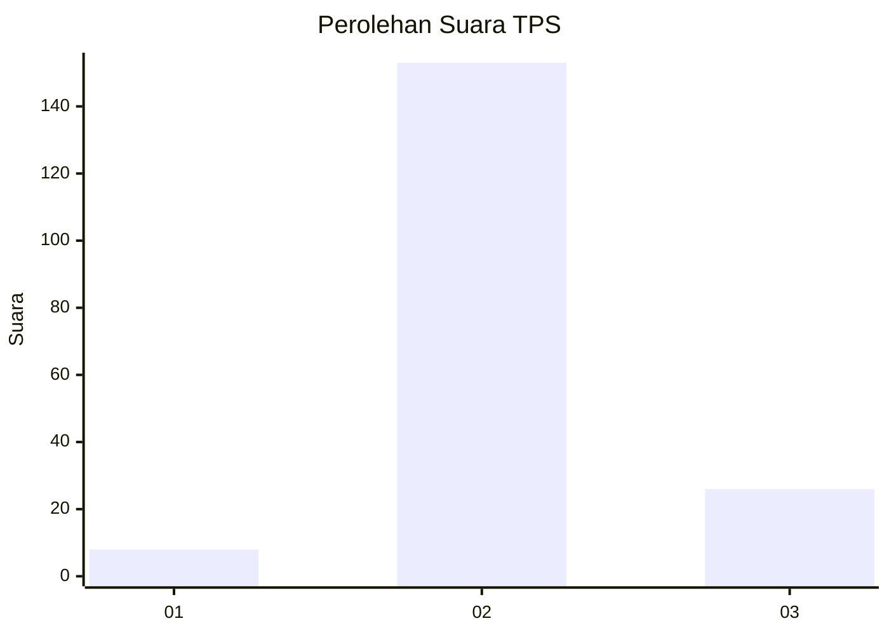
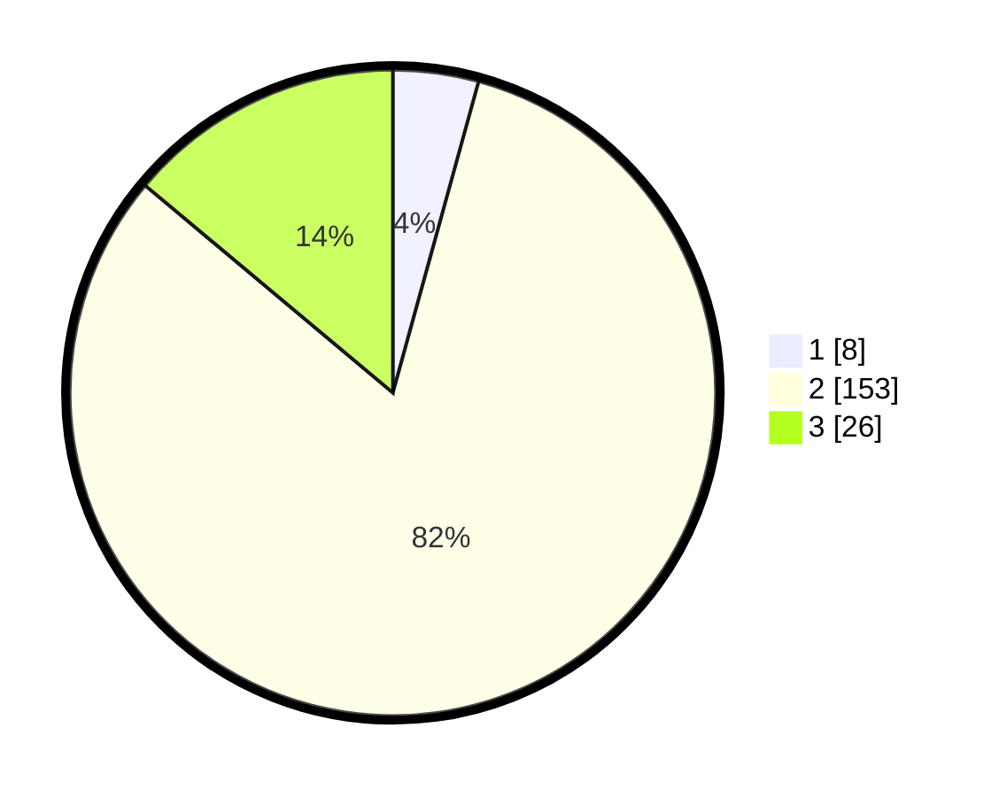

# Hasil

## Grafik

## Tabel

| No. | Nama Paslon    | Suara | Suara (raw) | Persentase |
|:--- |:-------------- | -----:| -----------:| ----------:|
| 1   | ANIES MUHAIMIN | 8     | [8][p-1]    | 4,28       |
| 2   | PRABOWO GIBRAN | 153   | [153][p-2]  | 81,82      |
| 3   | GANJAR MAHFUD  | 26    | [26][p-3]   | 13,90      |

[p-1]: https://github.com/gigit-pemilu/pemilu-2024-35-jawa-timur/blob/main/pilpres/hitung-suara/sub/35-jawa-timur/sub/25-gresik/sub/06-wringinanom/sub/2009-sooko/sub/002-tps/sub/paslon-1.txt
[p-2]: https://github.com/gigit-pemilu/pemilu-2024-35-jawa-timur/blob/main/pilpres/hitung-suara/sub/35-jawa-timur/sub/25-gresik/sub/06-wringinanom/sub/2009-sooko/sub/002-tps/sub/paslon-2.txt
[p-3]: https://github.com/gigit-pemilu/pemilu-2024-35-jawa-timur/blob/main/pilpres/hitung-suara/sub/35-jawa-timur/sub/25-gresik/sub/06-wringinanom/sub/2009-sooko/sub/002-tps/sub/paslon-3.txt

## Foto C Plano

https://sirekap-obj-formc.kpu.go.id/c2a4/pemilu/ppwp/35/25/06/20/09/3525062009002-20240214-214215--3f2bef9a-7003-4762-84d8-8e9c124fae32.jpg

https://sirekap-obj-formc.kpu.go.id/c2a4/pemilu/ppwp/35/25/06/20/09/3525062009002-20240214-214436--00128285-5837-43cb-bea3-508859fd95ef.jpg

https://sirekap-obj-formc.kpu.go.id/c2a4/pemilu/ppwp/35/25/06/20/09/3525062009002-20240214-214539--b68e82ce-8d99-41a2-a0dc-91b0b2786174.jpg

## Metadata

| Key        | Value               |
| ---------- | ------------------- |
| Time Stamp | 2024-02-16 16:25:10 |

