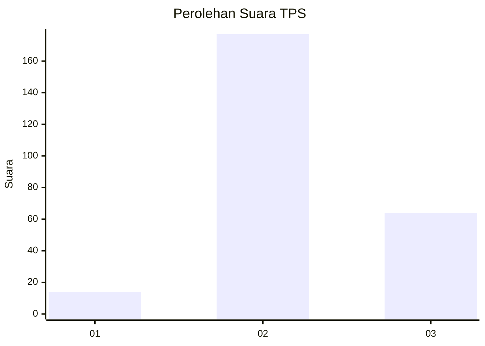
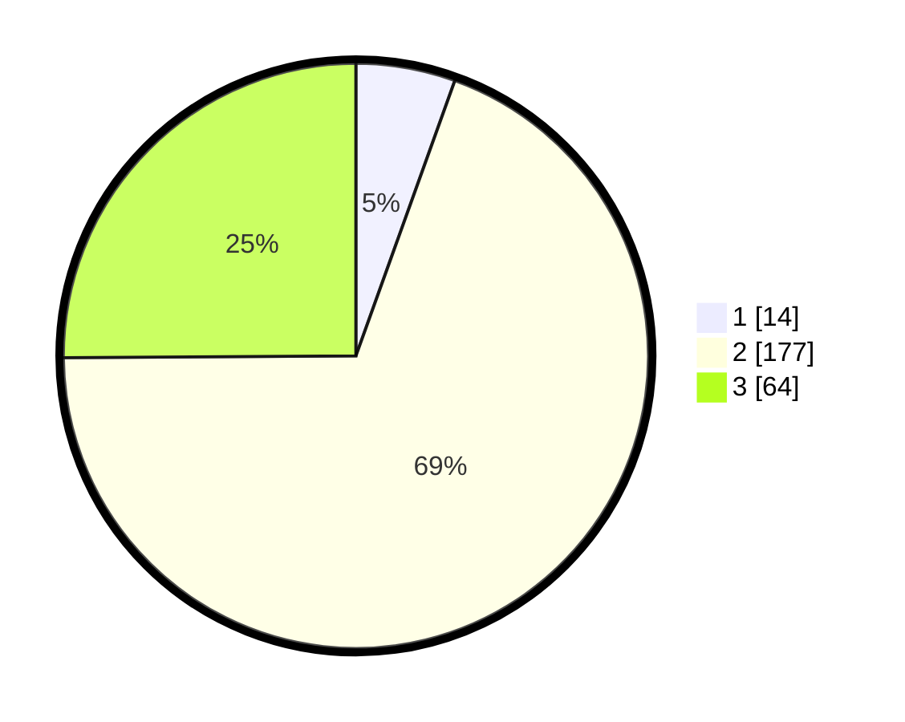

# Hasil

## Grafik

## Tabel

| No. | Nama Paslon    | Suara | Suara (raw) | Persentase |
|:--- |:-------------- | -----:| -----------:| ----------:|
| 1   | ANIES MUHAIMIN | 14    | [14][p-1]   | 5,49       |
| 2   | PRABOWO GIBRAN | 177   | [177][p-2]  | 69,41      |
| 3   | GANJAR MAHFUD  | 64    | [64][p-3]   | 25,10      |

[p-1]: https://github.com/gigit-pemilu/pemilu-2024/blob/main/pilpres/hitung-suara/sub/35-jawa-timur/sub/25-gresik/sub/06-wringinanom/sub/2009-sooko/sub/011-tps/sub/paslon-1.txt
[p-2]: https://github.com/gigit-pemilu/pemilu-2024/blob/main/pilpres/hitung-suara/sub/35-jawa-timur/sub/25-gresik/sub/06-wringinanom/sub/2009-sooko/sub/011-tps/sub/paslon-2.txt
[p-3]: https://github.com/gigit-pemilu/pemilu-2024/blob/main/pilpres/hitung-suara/sub/35-jawa-timur/sub/25-gresik/sub/06-wringinanom/sub/2009-sooko/sub/011-tps/sub/paslon-3.txt

## Foto C Plano

https://sirekap-obj-formc.kpu.go.id/0f46/pemilu/ppwp/35/25/06/20/09/3525062009011-20240215-002640--8ad05f34-3dae-4f72-914f-2e1d83af0787.jpg

https://sirekap-obj-formc.kpu.go.id/0f46/pemilu/ppwp/35/25/06/20/09/3525062009011-20240215-002953--18e6406d-7720-4b74-87fc-f80088dad8b3.jpg

https://sirekap-obj-formc.kpu.go.id/0f46/pemilu/ppwp/35/25/06/20/09/3525062009011-20240215-003227--4d1622b5-d585-40f8-b549-e3aa758f3304.jpg

## Metadata

| Key        | Value               |
| ---------- | ------------------- |
| Time Stamp | 2024-02-16 16:25:10 |

