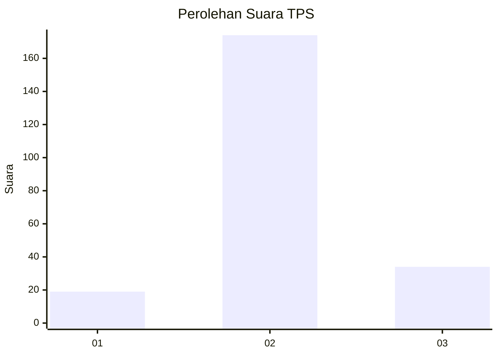

# Hasil

## Grafik

## Tabel

| No. | Nama Paslon    | Suara | Suara (raw) | Persentase |
|:--- |:-------------- | -----:| -----------:| ----------:|
| 1   | ANIES MUHAIMIN | 19    | [19][p-1]   | 8,37       |
| 2   | PRABOWO GIBRAN | 174   | [174][p-2]  | 76,65      |
| 3   | GANJAR MAHFUD  | 34    | [34][p-3]   | 14,98      |

[p-1]: https://github.com/gigit-pemilu/pemilu-2024/blob/main/pilpres/hitung-suara/sub/35-jawa-timur/sub/25-gresik/sub/06-wringinanom/sub/2011-pedagangan/sub/001-tps/sub/paslon-1.txt
[p-2]: https://github.com/gigit-pemilu/pemilu-2024/blob/main/pilpres/hitung-suara/sub/35-jawa-timur/sub/25-gresik/sub/06-wringinanom/sub/2011-pedagangan/sub/001-tps/sub/paslon-2.txt
[p-3]: https://github.com/gigit-pemilu/pemilu-2024/blob/main/pilpres/hitung-suara/sub/35-jawa-timur/sub/25-gresik/sub/06-wringinanom/sub/2011-pedagangan/sub/001-tps/sub/paslon-3.txt

## Foto C Plano

https://sirekap-obj-formc.kpu.go.id/4b77/pemilu/ppwp/35/25/06/20/11/3525062011001-20240218-161728--54a37cf7-5c52-4fe0-9f3e-c913fcc6dd76.jpg

https://sirekap-obj-formc.kpu.go.id/4b77/pemilu/ppwp/35/25/06/20/11/3525062011001-20240218-161320--ddb9769a-a721-45a1-a1d4-c4cf0c0b8980.jpg

https://sirekap-obj-formc.kpu.go.id/4b77/pemilu/ppwp/35/25/06/20/11/3525062011001-20240218-161833--a5b56a3f-a06d-4c72-a6f7-681c29eeec12.jpg

## Metadata

| Key        | Value               |
| ---------- | ------------------- |
| Time Stamp | 2024-02-20 11:00:00 |

