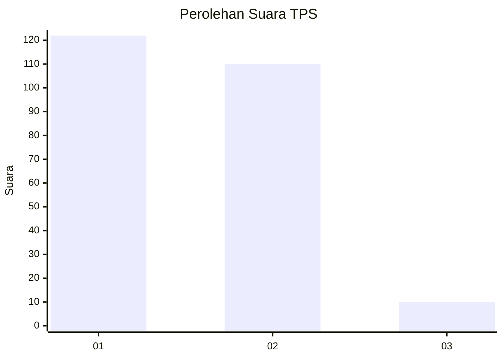
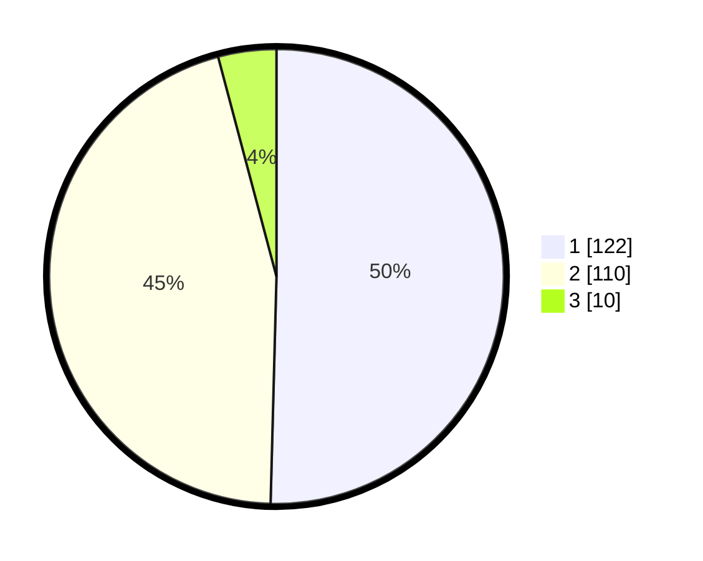

# Hasil

## Grafik

## Tabel

| No. | Nama Paslon    | Suara | Suara (raw) | Persentase |
|:--- |:-------------- | -----:| -----------:| ----------:|
| 1   | ANIES MUHAIMIN | 122   | [122][p-1]  | 50,41      |
| 2   | PRABOWO GIBRAN | 110   | [110][p-2]  | 45,45      |
| 3   | GANJAR MAHFUD  | 10    | [10][p-3]   | 4,13       |

[p-1]: https://github.com/gigit-pemilu/pemilu-2024-35-jawa-timur/blob/main/pilpres/hitung-suara/sub/35-jawa-timur/sub/25-gresik/sub/06-wringinanom/sub/2012-lebanisuko/sub/004-tps/sub/paslon-1.txt
[p-2]: https://github.com/gigit-pemilu/pemilu-2024-35-jawa-timur/blob/main/pilpres/hitung-suara/sub/35-jawa-timur/sub/25-gresik/sub/06-wringinanom/sub/2012-lebanisuko/sub/004-tps/sub/paslon-2.txt
[p-3]: https://github.com/gigit-pemilu/pemilu-2024-35-jawa-timur/blob/main/pilpres/hitung-suara/sub/35-jawa-timur/sub/25-gresik/sub/06-wringinanom/sub/2012-lebanisuko/sub/004-tps/sub/paslon-3.txt

## Foto C Plano

https://sirekap-obj-formc.kpu.go.id/d6ff/pemilu/ppwp/35/25/06/20/12/3525062012004-20240214-213441--dc62799e-53a9-4195-b974-3bedd78102d6.jpg

https://sirekap-obj-formc.kpu.go.id/d6ff/pemilu/ppwp/35/25/06/20/12/3525062012004-20240214-220026--adf24d61-b0a9-454d-8a68-6e834a7f53ff.jpg

https://sirekap-obj-formc.kpu.go.id/d6ff/pemilu/ppwp/35/25/06/20/12/3525062012004-20240214-220109--6f9ad317-f861-4300-9c5b-92489ab07277.jpg

## Metadata

| Key        | Value               |
| ---------- | ------------------- |
| Time Stamp | 2024-02-16 16:25:10 |

