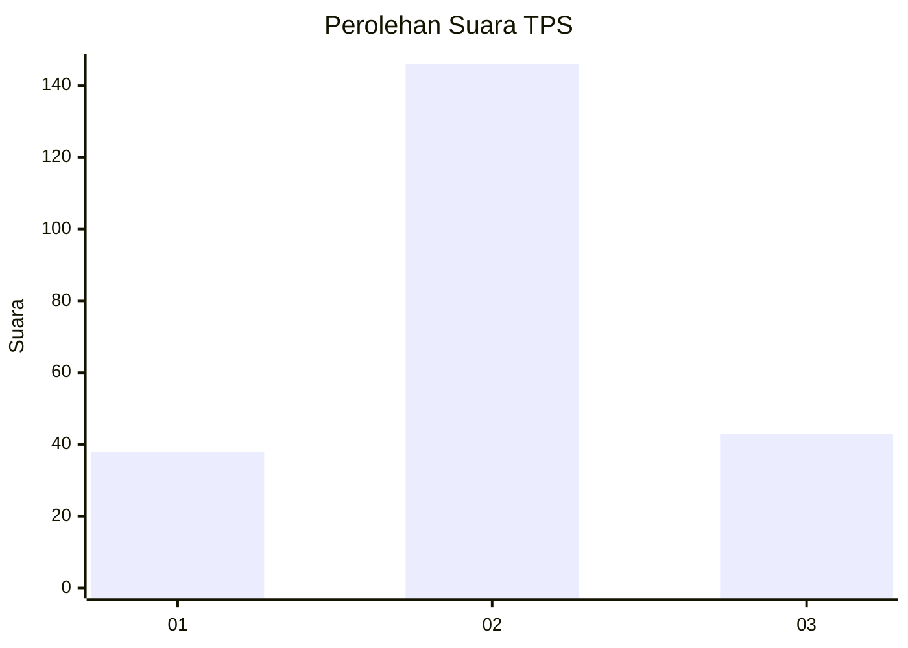
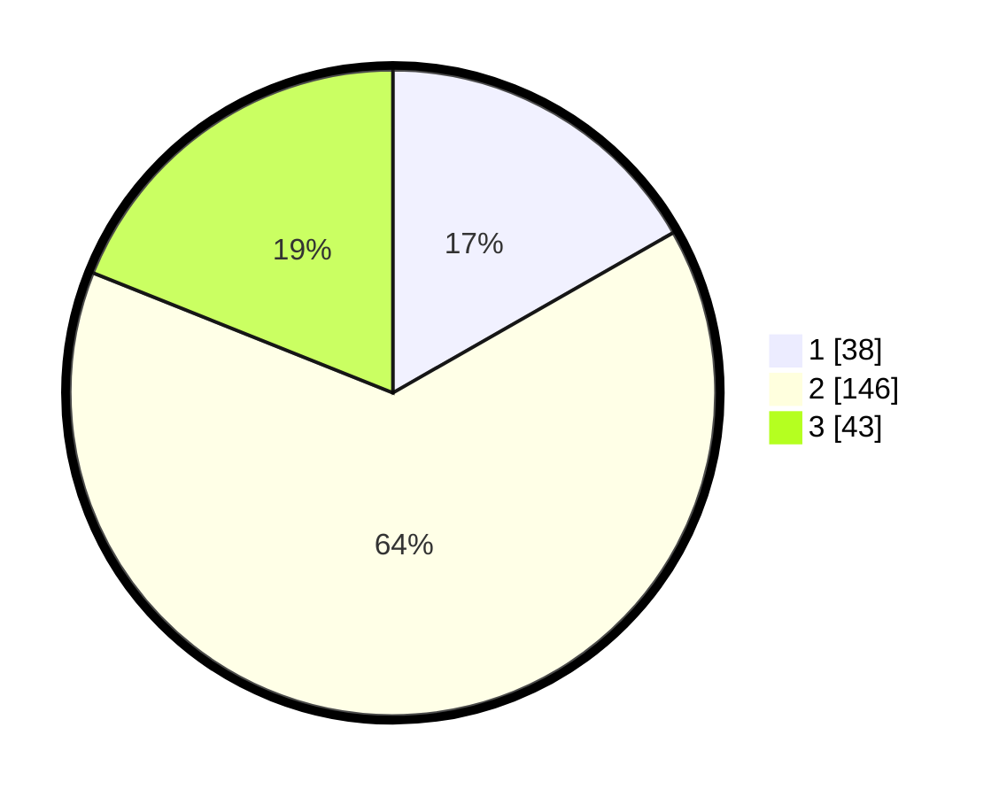

# Hasil

## Grafik

## Tabel

| No. | Nama Paslon    | Suara | Suara (raw) | Persentase |
|:--- |:-------------- | -----:| -----------:| ----------:|
| 1   | ANIES MUHAIMIN | 38    | [38][p-1]   | 16,74      |
| 2   | PRABOWO GIBRAN | 146   | [146][p-2]  | 64,32      |
| 3   | GANJAR MAHFUD  | 43    | [43][p-3]   | 18,94      |

[p-1]: https://github.com/gigit-pemilu/pemilu-2024-35-jawa-timur/blob/main/pilpres/hitung-suara/sub/35-jawa-timur/sub/25-gresik/sub/07-ujungpangkah/sub/2001-pangkahkulon/sub/001-tps/sub/paslon-1.txt
[p-2]: https://github.com/gigit-pemilu/pemilu-2024-35-jawa-timur/blob/main/pilpres/hitung-suara/sub/35-jawa-timur/sub/25-gresik/sub/07-ujungpangkah/sub/2001-pangkahkulon/sub/001-tps/sub/paslon-2.txt
[p-3]: https://github.com/gigit-pemilu/pemilu-2024-35-jawa-timur/blob/main/pilpres/hitung-suara/sub/35-jawa-timur/sub/25-gresik/sub/07-ujungpangkah/sub/2001-pangkahkulon/sub/001-tps/sub/paslon-3.txt

## Foto C Plano

https://sirekap-obj-formc.kpu.go.id/dfc6/pemilu/ppwp/35/25/07/20/01/3525072001001-20240220-204323--c6e059de-357e-43fc-b2e8-e7ba265e4076.jpg

https://sirekap-obj-formc.kpu.go.id/dfc6/pemilu/ppwp/35/25/07/20/01/3525072001001-20240220-195551--aa2ff2b8-ace5-4b74-a7fd-e299321429bc.jpg

https://sirekap-obj-formc.kpu.go.id/dfc6/pemilu/ppwp/35/25/07/20/01/3525072001001-20240220-195043--d275b277-44b1-4498-bbf7-6eb89e5d3451.jpg

## Metadata

| Key        | Value               |
| ---------- | ------------------- |
| Time Stamp | 2024-02-21 07:00:00 |

