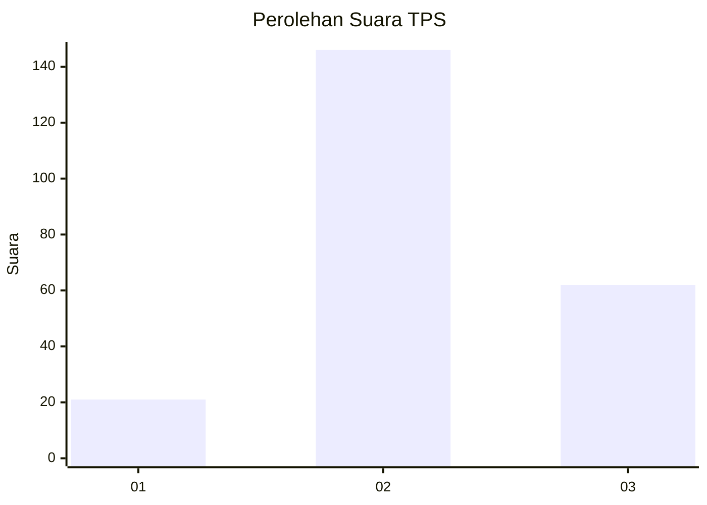
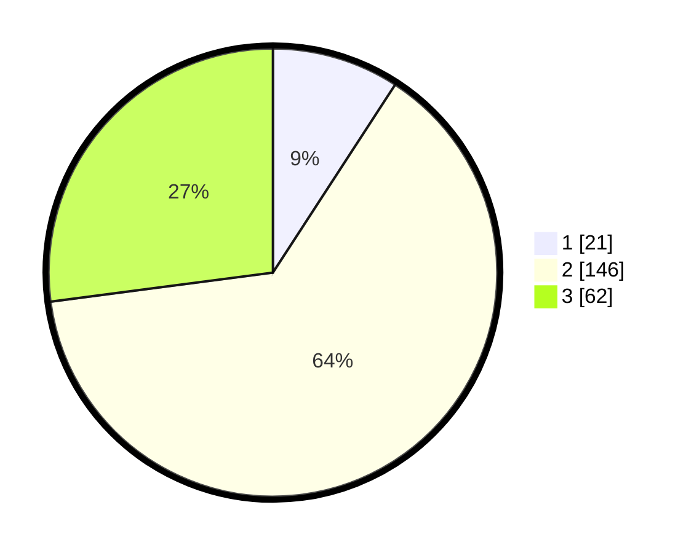

# Hasil

## Grafik

## Tabel

| No. | Nama Paslon    | Suara | Suara (raw) | Persentase |
|:--- |:-------------- | -----:| -----------:| ----------:|
| 1   | ANIES MUHAIMIN | 21    | [21][p-1]   | 9,17       |
| 2   | PRABOWO GIBRAN | 146   | [146][p-2]  | 63,76      |
| 3   | GANJAR MAHFUD  | 62    | [62][p-3]   | 27,07      |

[p-1]: https://github.com/gigit-pemilu/pemilu-2024/blob/main/pilpres/hitung-suara/sub/35-jawa-timur/sub/25-gresik/sub/07-ujungpangkah/sub/2012-ketapanglor/sub/002-tps/sub/paslon-1.txt
[p-2]: https://github.com/gigit-pemilu/pemilu-2024/blob/main/pilpres/hitung-suara/sub/35-jawa-timur/sub/25-gresik/sub/07-ujungpangkah/sub/2012-ketapanglor/sub/002-tps/sub/paslon-2.txt
[p-3]: https://github.com/gigit-pemilu/pemilu-2024/blob/main/pilpres/hitung-suara/sub/35-jawa-timur/sub/25-gresik/sub/07-ujungpangkah/sub/2012-ketapanglor/sub/002-tps/sub/paslon-3.txt

## Foto C Plano

https://sirekap-obj-formc.kpu.go.id/df2e/pemilu/ppwp/35/25/07/20/12/3525072012002-20240215-004233--d29d03f2-227a-477a-af10-6aa4e0ee3ea8.jpg

https://sirekap-obj-formc.kpu.go.id/df2e/pemilu/ppwp/35/25/07/20/12/3525072012002-20240215-004342--e8a11c8e-58bd-40c8-a3d4-fd84922f1adc.jpg

https://sirekap-obj-formc.kpu.go.id/df2e/pemilu/ppwp/35/25/07/20/12/3525072012002-20240215-004540--0087398c-3d25-40fb-a8bf-08bb1bc597ac.jpg

## Metadata

| Key        | Value               |
| ---------- | ------------------- |
| Time Stamp | 2024-02-16 21:01:00 |

