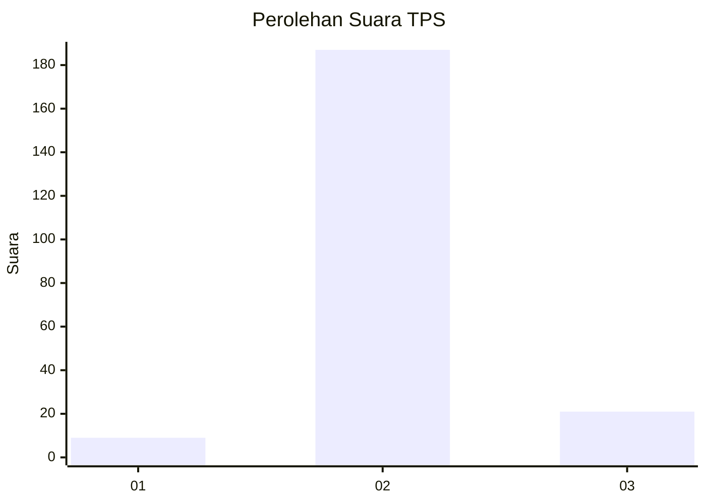
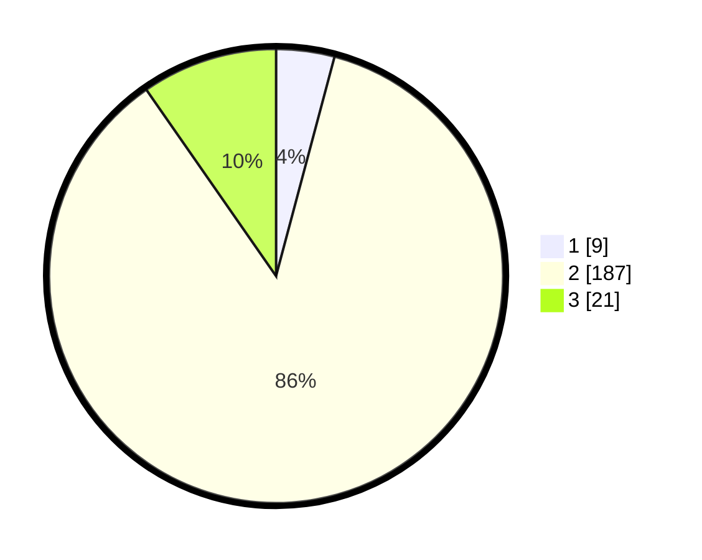

# Hasil

## Grafik

## Tabel

| No. | Nama Paslon    | Suara | Suara (raw) | Persentase |
|:--- |:-------------- | -----:| -----------:| ----------:|
| 1   | ANIES MUHAIMIN | 9     | [9][p-1]    | 4,15       |
| 2   | PRABOWO GIBRAN | 187   | [187][p-2]  | 86,18      |
| 3   | GANJAR MAHFUD  | 21    | [21][p-3]   | 9,68       |

[p-1]: https://github.com/gigit-pemilu/pemilu-2024/blob/main/pilpres/hitung-suara/sub/35-jawa-timur/sub/25-gresik/sub/07-ujungpangkah/sub/2013-tanjangawan/sub/001-tps/sub/paslon-1.txt
[p-2]: https://github.com/gigit-pemilu/pemilu-2024/blob/main/pilpres/hitung-suara/sub/35-jawa-timur/sub/25-gresik/sub/07-ujungpangkah/sub/2013-tanjangawan/sub/001-tps/sub/paslon-2.txt
[p-3]: https://github.com/gigit-pemilu/pemilu-2024/blob/main/pilpres/hitung-suara/sub/35-jawa-timur/sub/25-gresik/sub/07-ujungpangkah/sub/2013-tanjangawan/sub/001-tps/sub/paslon-3.txt

## Foto C Plano

https://sirekap-obj-formc.kpu.go.id/31a8/pemilu/ppwp/35/25/07/20/13/3525072013001-20240215-014415--59c1a9c9-d5de-494e-abd5-753cf891192e.jpg

https://sirekap-obj-formc.kpu.go.id/31a8/pemilu/ppwp/35/25/07/20/13/3525072013001-20240215-014531--0b5d2917-b44e-42a3-afd3-58be6d7ad92b.jpg

https://sirekap-obj-formc.kpu.go.id/31a8/pemilu/ppwp/35/25/07/20/13/3525072013001-20240215-014618--4bd62cf0-75d1-4a4e-907b-ce1bc035efca.jpg

## Metadata

| Key        | Value               |
| ---------- | ------------------- |
| Time Stamp | 2024-02-16 21:01:00 |

