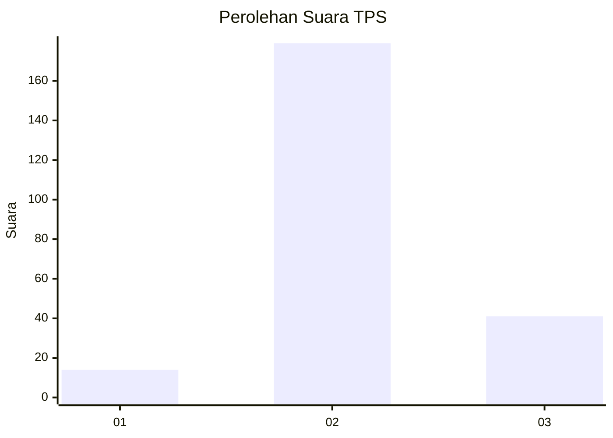

# Hasil

## Grafik

## Tabel

| No. | Nama Paslon    | Suara | Suara (raw) | Persentase |
|:--- |:-------------- | -----:| -----------:| ----------:|
| 1   | ANIES MUHAIMIN | 14    | [14][p-1]   | 5,98       |
| 2   | PRABOWO GIBRAN | 179   | [179][p-2]  | 76,50      |
| 3   | GANJAR MAHFUD  | 41    | [41][p-3]   | 17,52      |

[p-1]: https://github.com/gigit-pemilu/pemilu-2024/blob/main/pilpres/hitung-suara/sub/35-jawa-timur/sub/25-gresik/sub/08-kedamean/sub/2002-glindah/sub/002-tps/sub/paslon-1.txt
[p-2]: https://github.com/gigit-pemilu/pemilu-2024/blob/main/pilpres/hitung-suara/sub/35-jawa-timur/sub/25-gresik/sub/08-kedamean/sub/2002-glindah/sub/002-tps/sub/paslon-2.txt
[p-3]: https://github.com/gigit-pemilu/pemilu-2024/blob/main/pilpres/hitung-suara/sub/35-jawa-timur/sub/25-gresik/sub/08-kedamean/sub/2002-glindah/sub/002-tps/sub/paslon-3.txt

## Foto C Plano

https://sirekap-obj-formc.kpu.go.id/4e85/pemilu/ppwp/35/25/08/20/02/3525082002002-20240214-213105--cf852940-d39e-4747-8714-1942f98900c4.jpg

https://sirekap-obj-formc.kpu.go.id/4e85/pemilu/ppwp/35/25/08/20/02/3525082002002-20240214-160148--45958554-43f1-4a94-b39b-96f38b8a1dbc.jpg

https://sirekap-obj-formc.kpu.go.id/4e85/pemilu/ppwp/35/25/08/20/02/3525082002002-20240214-160145--361ad90c-948f-46c3-9760-1a90b664eb8f.jpg

## Metadata

| Key        | Value               |
| ---------- | ------------------- |
| Time Stamp | 2024-02-19 06:16:00 |

## DATA PEMILIH TETAP

Jumlah pemilih dalam DPT: **374**.
 * L: **538**.
 * P: **536**.

## DATA PENGGUNA HAK PILIH

Jumlah pengguna hak pilih dalam DPT: **256**.
 * L: **737**.
 * P: **539**.

Jumlah pengguna hak pilih dalam DPTb: **0**.
 * L: **8**.
 * P: **8**.

Jumlah pengguna hak pilih dalam DPK: **8**.
 * L: **0**.
 * P: **40**.

Jumlah pengguna hak pilih: **356**.
 * L: **537**.
 * P: **529**.

## JUMLAH SUARA SAH DAN TIDAK SAH

JUMLAH SELURUH SUARA SAH: **234**.

JUMLAH SUARA TIDAK SAH: **22**.

JUMLAH SELURUH SUARA SAH DAN SUARA TIDAK SAH: **256**.

