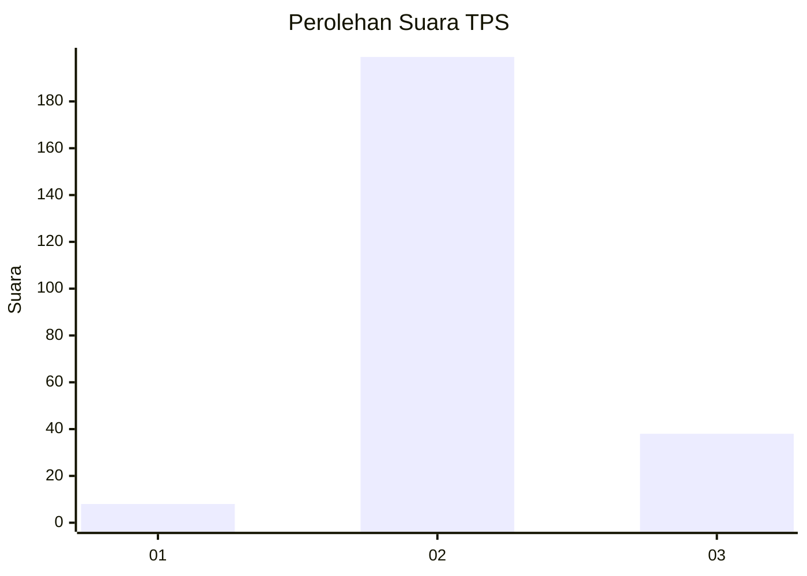
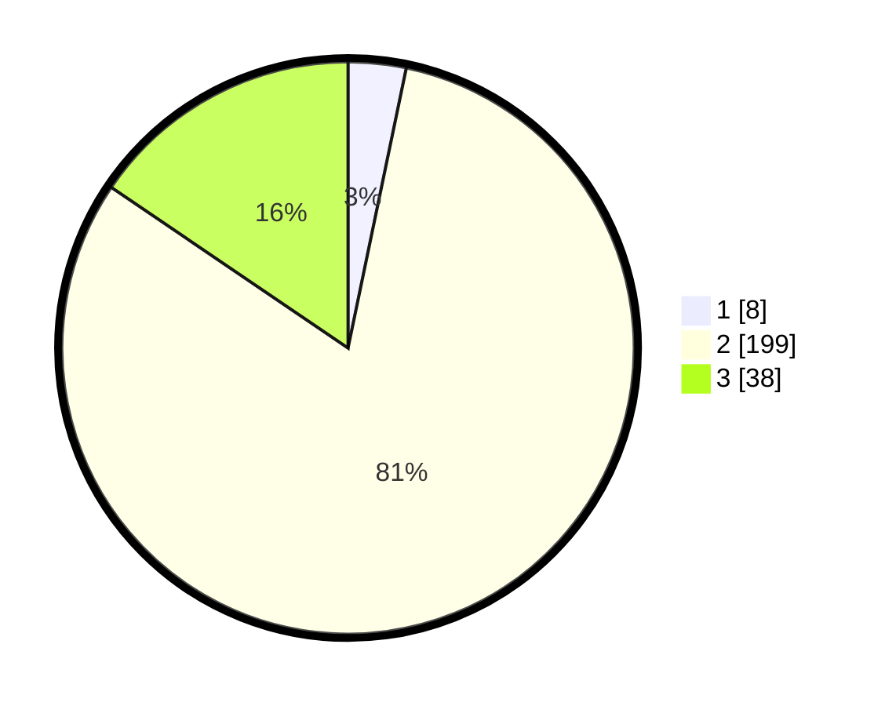

# Hasil

## Grafik

## Tabel

| No. | Nama Paslon    | Suara | Suara (raw) | Persentase |
|:--- |:-------------- | -----:| -----------:| ----------:|
| 1   | ANIES MUHAIMIN | 8     | [8][p-1]    | 3,27       |
| 2   | PRABOWO GIBRAN | 199   | [199][p-2]  | 81,22      |
| 3   | GANJAR MAHFUD  | 38    | [38][p-3]   | 15,51      |

[p-1]: https://github.com/gigit-pemilu/pemilu-2024-35-jawa-timur/blob/main/pilpres/hitung-suara/sub/35-jawa-timur/sub/25-gresik/sub/08-kedamean/sub/2008-turirejo/sub/008-tps/sub/paslon-1.txt
[p-2]: https://github.com/gigit-pemilu/pemilu-2024-35-jawa-timur/blob/main/pilpres/hitung-suara/sub/35-jawa-timur/sub/25-gresik/sub/08-kedamean/sub/2008-turirejo/sub/008-tps/sub/paslon-2.txt
[p-3]: https://github.com/gigit-pemilu/pemilu-2024-35-jawa-timur/blob/main/pilpres/hitung-suara/sub/35-jawa-timur/sub/25-gresik/sub/08-kedamean/sub/2008-turirejo/sub/008-tps/sub/paslon-3.txt

## Foto C Plano

https://sirekap-obj-formc.kpu.go.id/0c69/pemilu/ppwp/35/25/08/20/08/3525082008008-20240215-000201--0d9e4f2f-78fd-4358-b3b4-b6522ad7d68a.jpg

https://sirekap-obj-formc.kpu.go.id/0c69/pemilu/ppwp/35/25/08/20/08/3525082008008-20240215-000403--02e23d6e-4e43-4a2f-a679-820496878162.jpg

https://sirekap-obj-formc.kpu.go.id/0c69/pemilu/ppwp/35/25/08/20/08/3525082008008-20240215-000504--0f5fbbce-2489-4fee-a208-bcf8492898d3.jpg

## Metadata

| Key        | Value               |
| ---------- | ------------------- |
| Time Stamp | 2024-02-16 03:00:26 |

