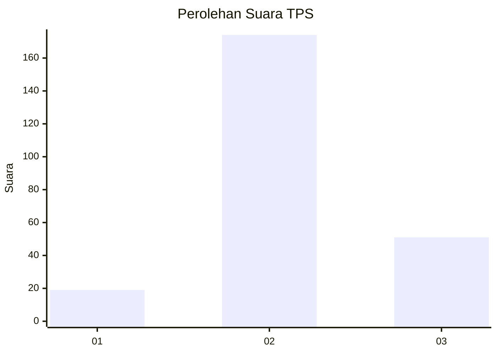
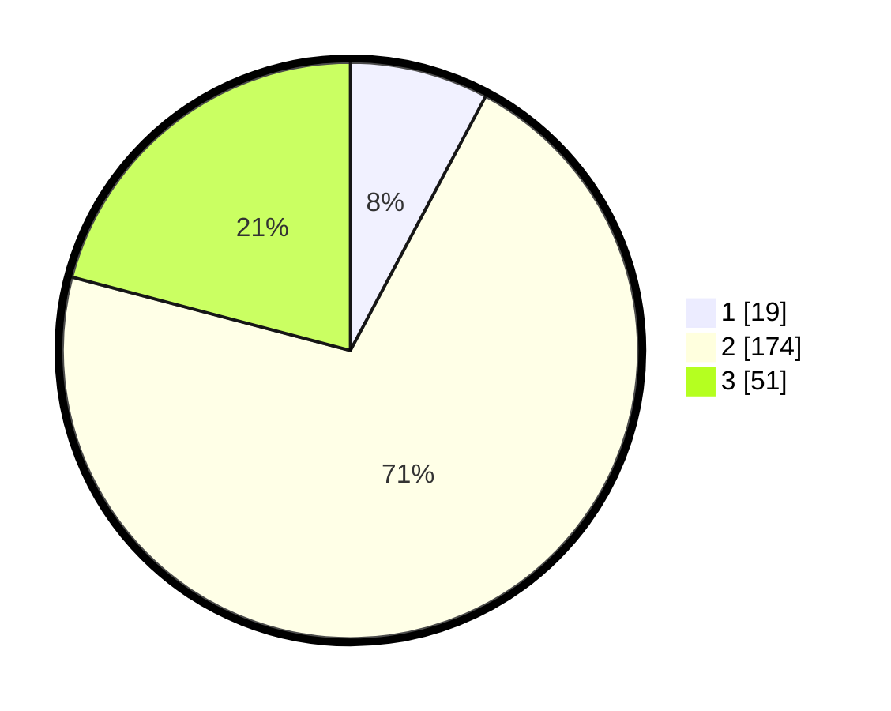

# Hasil

## Grafik

## Tabel

| No. | Nama Paslon    | Suara | Suara (raw) | Persentase |
|:--- |:-------------- | -----:| -----------:| ----------:|
| 1   | ANIES MUHAIMIN | 19    | [19][p-1]   | 7,79       |
| 2   | PRABOWO GIBRAN | 174   | [174][p-2]  | 71,31      |
| 3   | GANJAR MAHFUD  | 51    | [51][p-3]   | 20,90      |

[p-1]: https://github.com/gigit-pemilu/pemilu-2024/blob/main/pilpres/hitung-suara/sub/35-jawa-timur/sub/25-gresik/sub/09-sidayu/sub/2005-kertosono/sub/006-tps/sub/paslon-1.txt
[p-2]: https://github.com/gigit-pemilu/pemilu-2024/blob/main/pilpres/hitung-suara/sub/35-jawa-timur/sub/25-gresik/sub/09-sidayu/sub/2005-kertosono/sub/006-tps/sub/paslon-2.txt
[p-3]: https://github.com/gigit-pemilu/pemilu-2024/blob/main/pilpres/hitung-suara/sub/35-jawa-timur/sub/25-gresik/sub/09-sidayu/sub/2005-kertosono/sub/006-tps/sub/paslon-3.txt

## Foto C Plano

https://sirekap-obj-formc.kpu.go.id/9638/pemilu/ppwp/35/25/09/20/05/3525092005006-20240215-010928--8e653c5b-c4b0-42c2-84ef-0f1102dd1f7a.jpg

https://sirekap-obj-formc.kpu.go.id/9638/pemilu/ppwp/35/25/09/20/05/3525092005006-20240215-011037--c9d39b84-d3b1-4fda-a310-17b8cab6050c.jpg

https://sirekap-obj-formc.kpu.go.id/9638/pemilu/ppwp/35/25/09/20/05/3525092005006-20240215-011151--c6269d1e-6218-4af6-a03b-470c808c9645.jpg

## Metadata

| Key        | Value               |
| ---------- | ------------------- |
| Time Stamp | 2024-02-25 12:00:00 |

