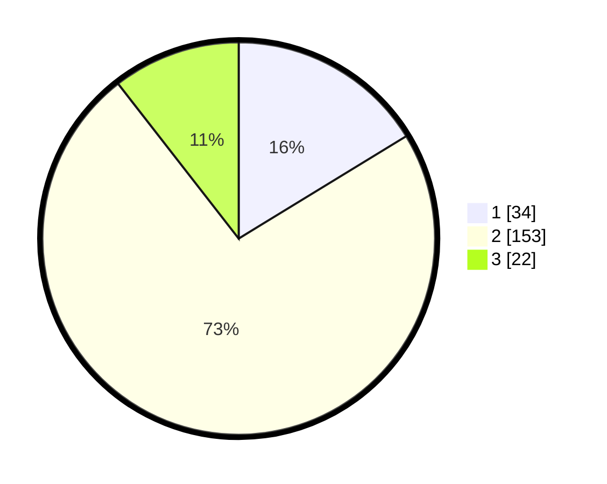

# Hasil

## Grafik

## Tabel

| No. | Nama Paslon    | Suara | Suara (raw) | Persentase |
|:--- |:-------------- | -----:| -----------:| ----------:|
| 1   | ANIES MUHAIMIN | 34    | [34][p-1]   | 16,27      |
| 2   | PRABOWO GIBRAN | 153   | [153][p-2]  | 73,21      |
| 3   | GANJAR MAHFUD  | 22    | [22][p-3]   | 10,53      |

[p-1]: https://github.com/gigit-pemilu/pemilu-2024/blob/main/pilpres/hitung-suara/sub/35-jawa-timur/sub/25-gresik/sub/10-manyar/sub/2008-sembayat/sub/004-tps/sub/paslon-1.txt
[p-2]: https://github.com/gigit-pemilu/pemilu-2024/blob/main/pilpres/hitung-suara/sub/35-jawa-timur/sub/25-gresik/sub/10-manyar/sub/2008-sembayat/sub/004-tps/sub/paslon-2.txt
[p-3]: https://github.com/gigit-pemilu/pemilu-2024/blob/main/pilpres/hitung-suara/sub/35-jawa-timur/sub/25-gresik/sub/10-manyar/sub/2008-sembayat/sub/004-tps/sub/paslon-3.txt

## Foto C Plano

https://sirekap-obj-formc.kpu.go.id/2ce4/pemilu/ppwp/35/25/10/20/08/3525102008004-20240214-213338--c7e88c2b-bc82-4214-b4b5-c8aa92666221.jpg

https://sirekap-obj-formc.kpu.go.id/2ce4/pemilu/ppwp/35/25/10/20/08/3525102008004-20240214-213402--f3520568-fa37-4591-ba44-ea5b2ca25753.jpg

https://sirekap-obj-formc.kpu.go.id/2ce4/pemilu/ppwp/35/25/10/20/08/3525102008004-20240214-213707--c01890a9-56f1-4f2d-825f-5338b16a4095.jpg

## Metadata

| Key        | Value               |
| ---------- | ------------------- |
| Time Stamp | 2024-02-16 21:01:00 |

