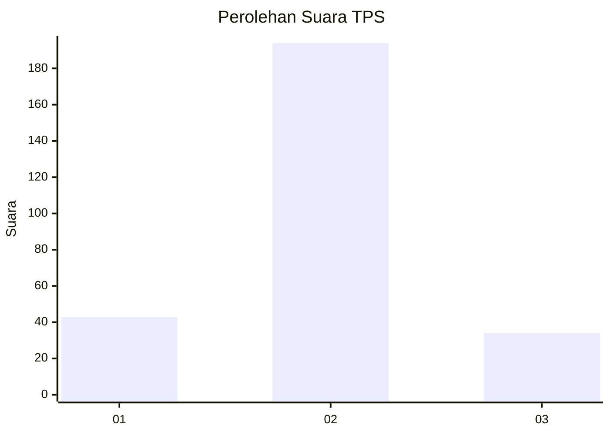
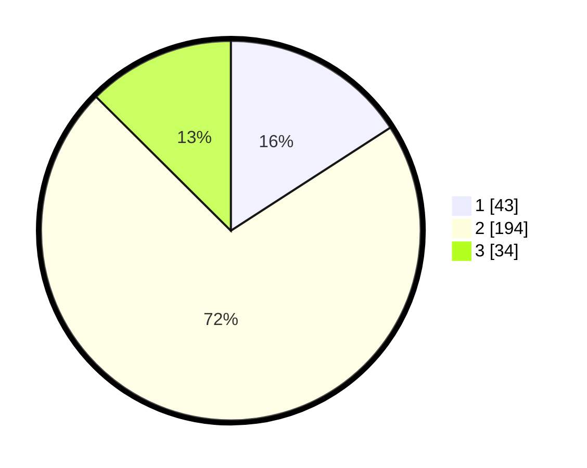

# Hasil

## Grafik

## Tabel

| No. | Nama Paslon    | Suara | Suara (raw) | Persentase |
|:--- |:-------------- | -----:| -----------:| ----------:|
| 1   | ANIES MUHAIMIN | 43    | [43][p-1]   | 15,87      |
| 2   | PRABOWO GIBRAN | 194   | [194][p-2]  | 71,59      |
| 3   | GANJAR MAHFUD  | 34    | [34][p-3]   | 12,55      |

[p-1]: https://github.com/gigit-pemilu/pemilu-2024/blob/main/pilpres/hitung-suara/sub/35-jawa-timur/sub/25-gresik/sub/10-manyar/sub/2017-banjarsari/sub/002-tps/sub/paslon-1.txt
[p-2]: https://github.com/gigit-pemilu/pemilu-2024/blob/main/pilpres/hitung-suara/sub/35-jawa-timur/sub/25-gresik/sub/10-manyar/sub/2017-banjarsari/sub/002-tps/sub/paslon-2.txt
[p-3]: https://github.com/gigit-pemilu/pemilu-2024/blob/main/pilpres/hitung-suara/sub/35-jawa-timur/sub/25-gresik/sub/10-manyar/sub/2017-banjarsari/sub/002-tps/sub/paslon-3.txt

## Foto C Plano

https://sirekap-obj-formc.kpu.go.id/ffd5/pemilu/ppwp/35/25/10/20/17/3525102017002-20240214-231613--4cfab350-dc4a-4110-bc9a-9c32933b23fb.jpg

https://sirekap-obj-formc.kpu.go.id/ffd5/pemilu/ppwp/35/25/10/20/17/3525102017002-20240214-215256--50d13149-d030-4b53-905e-bdc956e680f9.jpg

https://sirekap-obj-formc.kpu.go.id/ffd5/pemilu/ppwp/35/25/10/20/17/3525102017002-20240219-154655--183714fb-972c-453b-b21e-9229954507b2.jpg

## Metadata

| Key        | Value               |
| ---------- | ------------------- |
| Time Stamp | 2024-02-19 16:00:00 |

