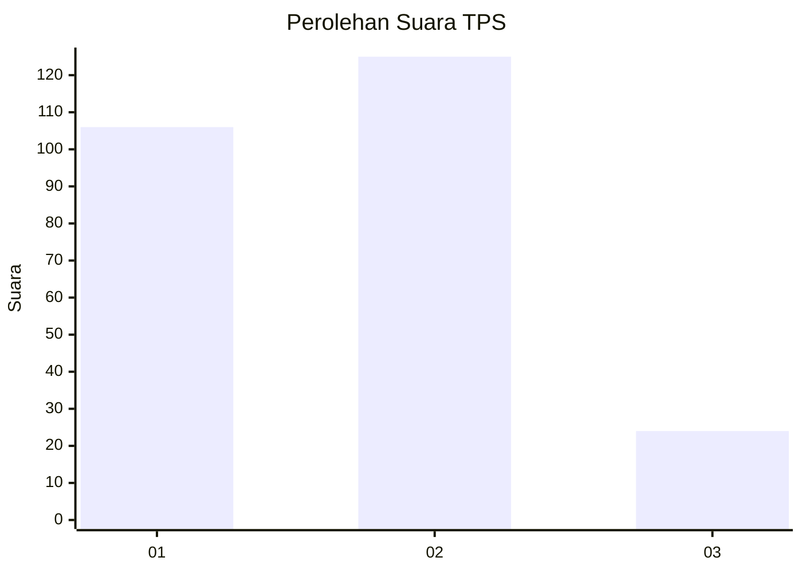
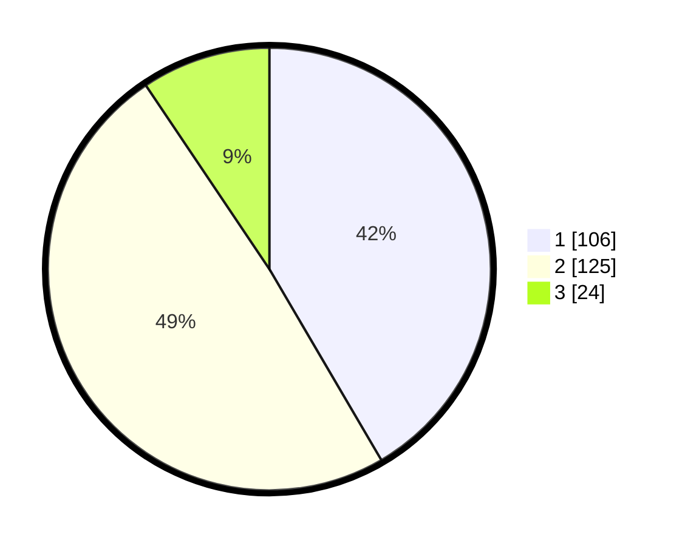

# Hasil

## Grafik

## Tabel

| No. | Nama Paslon    | Suara | Suara (raw) | Persentase |
|:--- |:-------------- | -----:| -----------:| ----------:|
| 1   | ANIES MUHAIMIN | 106   | [106][p-1]  | 41,57      |
| 2   | PRABOWO GIBRAN | 125   | [125][p-2]  | 49,02      |
| 3   | GANJAR MAHFUD  | 24    | [24][p-3]   | 9,41       |

[p-1]: https://github.com/gigit-pemilu/pemilu-2024-35-jawa-timur/blob/main/pilpres/hitung-suara/sub/35-jawa-timur/sub/25-gresik/sub/10-manyar/sub/2022-yosowilangun/sub/013-tps/sub/paslon-1.txt
[p-2]: https://github.com/gigit-pemilu/pemilu-2024-35-jawa-timur/blob/main/pilpres/hitung-suara/sub/35-jawa-timur/sub/25-gresik/sub/10-manyar/sub/2022-yosowilangun/sub/013-tps/sub/paslon-2.txt
[p-3]: https://github.com/gigit-pemilu/pemilu-2024-35-jawa-timur/blob/main/pilpres/hitung-suara/sub/35-jawa-timur/sub/25-gresik/sub/10-manyar/sub/2022-yosowilangun/sub/013-tps/sub/paslon-3.txt

## Foto C Plano

https://sirekap-obj-formc.kpu.go.id/6290/pemilu/ppwp/35/25/10/20/22/3525102022013-20240214-220552--bc593fe8-348a-4fb2-ad52-478c4454773b.jpg

https://sirekap-obj-formc.kpu.go.id/6290/pemilu/ppwp/35/25/10/20/22/3525102022013-20240214-220743--68496bd6-2adb-4883-bb0c-f531e62d04b4.jpg

https://sirekap-obj-formc.kpu.go.id/6290/pemilu/ppwp/35/25/10/20/22/3525102022013-20240214-220922--b01930b1-e23d-4341-ba6a-bd6ff57a5ea5.jpg

## Metadata

| Key        | Value               |
| ---------- | ------------------- |
| Time Stamp | 2024-02-22 11:00:00 |

## DATA PEMILIH TETAP

Jumlah pemilih dalam DPT: **285**.
 * L: **138**.
 * P: **757**.

## DATA PENGGUNA HAK PILIH

Jumlah pengguna hak pilih dalam DPT: **325**.
 * L: **727**.
 * P: **773**.

Jumlah pengguna hak pilih dalam DPTb: **22**.
 * L: **0**.
 * P: **8**.

Jumlah pengguna hak pilih dalam DPK: **5**.
 * L: **846**.
 * P: **4**.

Jumlah pengguna hak pilih: **252**.
 * L: **113**.
 * P: **447**.

## JUMLAH SUARA SAH DAN TIDAK SAH

JUMLAH SELURUH SUARA SAH: **255**.

JUMLAH SUARA TIDAK SAH: **5**.

JUMLAH SELURUH SUARA SAH DAN SUARA TIDAK SAH: **260**.

