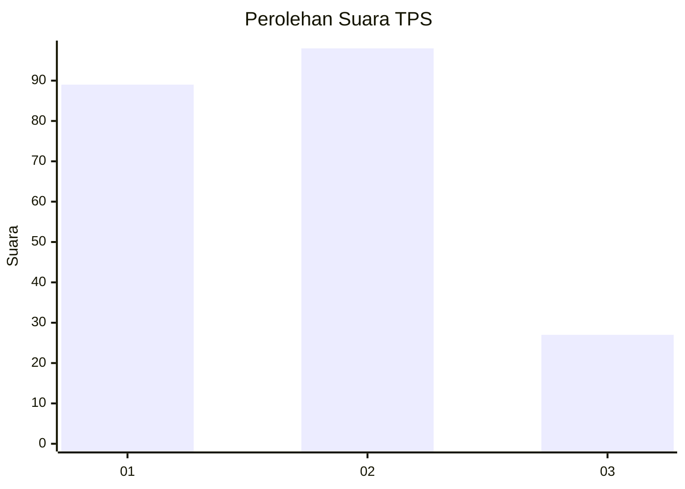
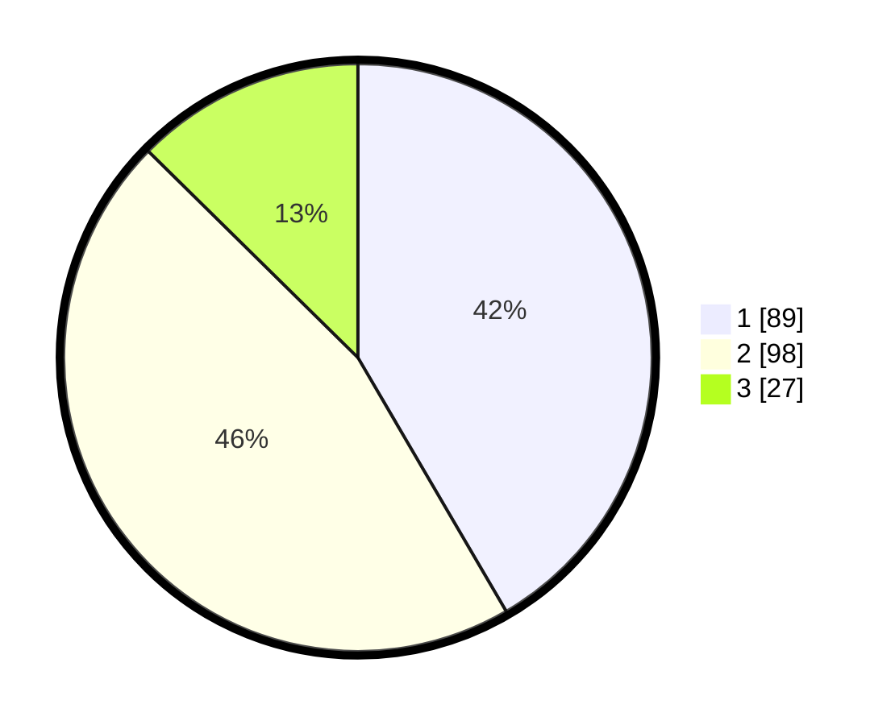

# Hasil

## Grafik

## Tabel

| No. | Nama Paslon    | Suara | Suara (raw) | Persentase |
|:--- |:-------------- | -----:| -----------:| ----------:|
| 1   | ANIES MUHAIMIN | 89    | [89][p-1]   | 41,59      |
| 2   | PRABOWO GIBRAN | 98    | [98][p-2]   | 45,79      |
| 3   | GANJAR MAHFUD  | 27    | [27][p-3]   | 12,62      |

[p-1]: https://github.com/gigit-pemilu/pemilu-2024/blob/main/pilpres/hitung-suara/sub/35-jawa-timur/sub/25-gresik/sub/10-manyar/sub/2022-yosowilangun/sub/018-tps/sub/paslon-1.txt
[p-2]: https://github.com/gigit-pemilu/pemilu-2024/blob/main/pilpres/hitung-suara/sub/35-jawa-timur/sub/25-gresik/sub/10-manyar/sub/2022-yosowilangun/sub/018-tps/sub/paslon-2.txt
[p-3]: https://github.com/gigit-pemilu/pemilu-2024/blob/main/pilpres/hitung-suara/sub/35-jawa-timur/sub/25-gresik/sub/10-manyar/sub/2022-yosowilangun/sub/018-tps/sub/paslon-3.txt

## Foto C Plano

https://sirekap-obj-formc.kpu.go.id/9a20/pemilu/ppwp/35/25/10/20/22/3525102022018-20240214-214548--a9cf14f1-d2e9-44ee-8244-3aaaf72489d0.jpg

https://sirekap-obj-formc.kpu.go.id/9a20/pemilu/ppwp/35/25/10/20/22/3525102022018-20240222-220609--d294925d-c674-4c0e-ab61-db74687d3f6d.jpg

https://sirekap-obj-formc.kpu.go.id/9a20/pemilu/ppwp/35/25/10/20/22/3525102022018-20240214-214637--20d36c6f-f03b-4689-bb3d-6b3cec2675e4.jpg

## Metadata

| Key        | Value               |
| ---------- | ------------------- |
| Time Stamp | 2024-02-22 23:00:00 |

## DATA PEMILIH TETAP

Jumlah pemilih dalam DPT: **230**.
 * L: **3**.
 * P: **222**.

## DATA PENGGUNA HAK PILIH

Jumlah pengguna hak pilih dalam DPT: **807**.
 * L: **884**.
 * P: **402**.

Jumlah pengguna hak pilih dalam DPTb: **9**.
 * L: **3**.
 * P: **5**.

Jumlah pengguna hak pilih dalam DPK: **804**.
 * L: **6**.
 * P: **0**.

Jumlah pengguna hak pilih: **207**.
 * L: **403**.
 * P: **604**.

## JUMLAH SUARA SAH DAN TIDAK SAH

JUMLAH SELURUH SUARA SAH: **214**.

JUMLAH SUARA TIDAK SAH: **3**.

JUMLAH SELURUH SUARA SAH DAN SUARA TIDAK SAH: **217**.

