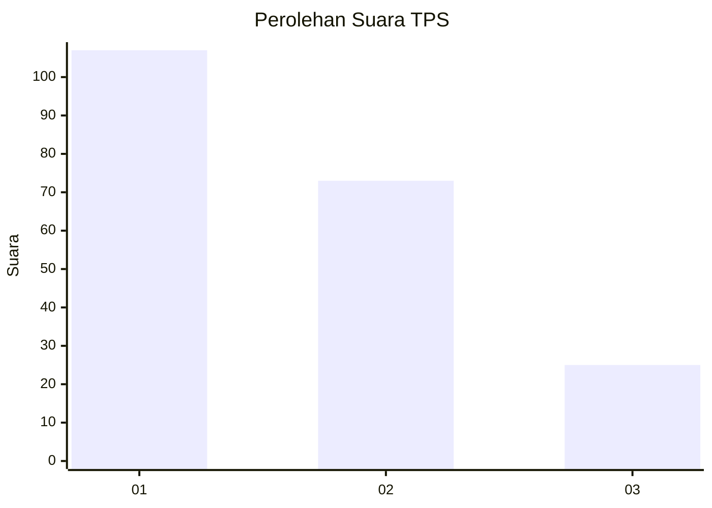
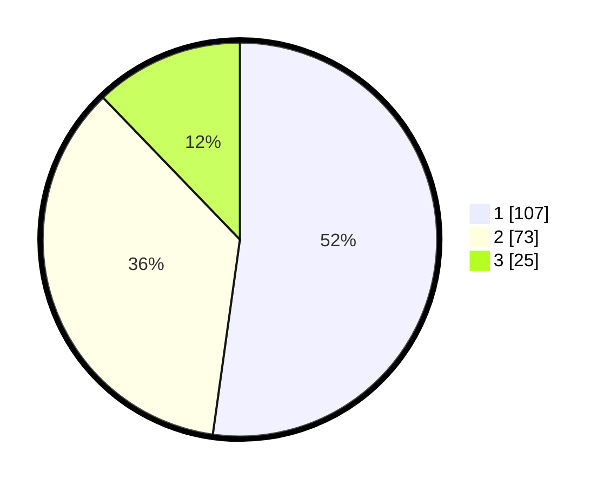

# Hasil

## Grafik

## Tabel

| No. | Nama Paslon    | Suara | Suara (raw) | Persentase |
|:--- |:-------------- | -----:| -----------:| ----------:|
| 1   | ANIES MUHAIMIN | 107   | [107][p-1]  | 52,20      |
| 2   | PRABOWO GIBRAN | 73    | [73][p-2]   | 35,61      |
| 3   | GANJAR MAHFUD  | 25    | [25][p-3]   | 12,20      |

[p-1]: https://github.com/gigit-pemilu/pemilu-2024/blob/main/pilpres/hitung-suara/sub/35-jawa-timur/sub/25-gresik/sub/10-manyar/sub/2022-yosowilangun/sub/019-tps/sub/paslon-1.txt
[p-2]: https://github.com/gigit-pemilu/pemilu-2024/blob/main/pilpres/hitung-suara/sub/35-jawa-timur/sub/25-gresik/sub/10-manyar/sub/2022-yosowilangun/sub/019-tps/sub/paslon-2.txt
[p-3]: https://github.com/gigit-pemilu/pemilu-2024/blob/main/pilpres/hitung-suara/sub/35-jawa-timur/sub/25-gresik/sub/10-manyar/sub/2022-yosowilangun/sub/019-tps/sub/paslon-3.txt

## Foto C Plano

https://sirekap-obj-formc.kpu.go.id/fa43/pemilu/ppwp/35/25/10/20/22/3525102022019-20240224-072447--146ee0cc-7802-4564-ad7c-49f1d423421b.jpg

https://sirekap-obj-formc.kpu.go.id/fa43/pemilu/ppwp/35/25/10/20/22/3525102022019-20240215-003042--ccd406d9-c8db-4622-92e6-741119cffb5f.jpg

https://sirekap-obj-formc.kpu.go.id/fa43/pemilu/ppwp/35/25/10/20/22/3525102022019-20240215-003232--221fae2a-edac-4980-9e3a-94f425325afe.jpg

## Metadata

| Key        | Value               |
| ---------- | ------------------- |
| Time Stamp | 2024-02-24 22:31:28 |

