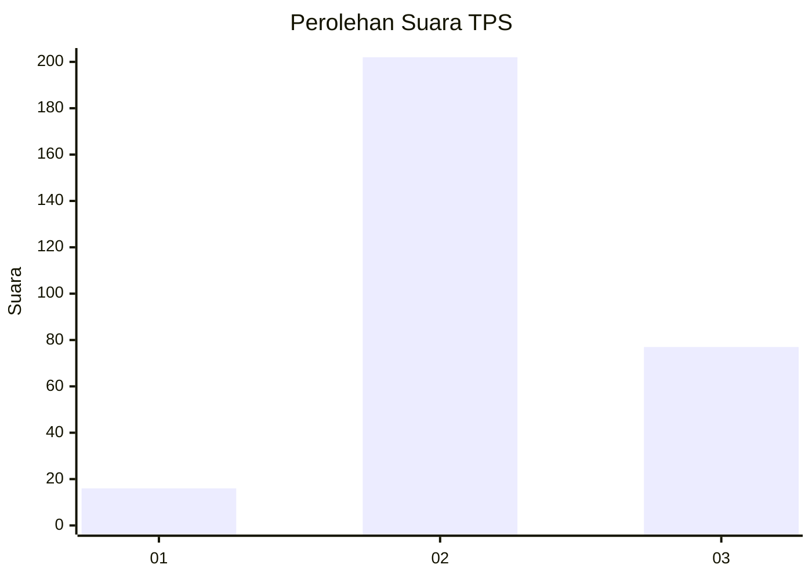
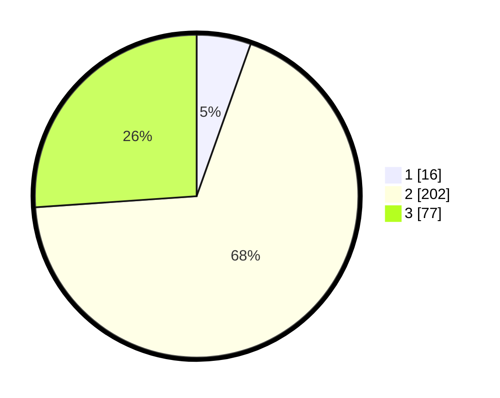

# Hasil

## Grafik

## Tabel

| No. | Nama Paslon    | Suara | Suara (raw) | Persentase |
|:--- |:-------------- | -----:| -----------:| ----------:|
| 1   | ANIES MUHAIMIN | 16    | [16][p-1]   | 5,42       |
| 2   | PRABOWO GIBRAN | 202   | [202][p-2]  | 68,47      |
| 3   | GANJAR MAHFUD  | 77    | [77][p-3]   | 26,10      |

[p-1]: https://github.com/gigit-pemilu/pemilu-2024/blob/main/pilpres/hitung-suara/sub/35-jawa-timur/sub/25-gresik/sub/11-cerme/sub/2023-banjarsari/sub/901-tps/sub/paslon-1.txt
[p-2]: https://github.com/gigit-pemilu/pemilu-2024/blob/main/pilpres/hitung-suara/sub/35-jawa-timur/sub/25-gresik/sub/11-cerme/sub/2023-banjarsari/sub/901-tps/sub/paslon-2.txt
[p-3]: https://github.com/gigit-pemilu/pemilu-2024/blob/main/pilpres/hitung-suara/sub/35-jawa-timur/sub/25-gresik/sub/11-cerme/sub/2023-banjarsari/sub/901-tps/sub/paslon-3.txt

## Foto C Plano

https://sirekap-obj-formc.kpu.go.id/4b60/pemilu/ppwp/35/25/11/20/23/3525112023901-20240215-103038--53baf3dd-d4fb-48db-bba7-e088b9ace682.jpg

https://sirekap-obj-formc.kpu.go.id/4b60/pemilu/ppwp/35/25/11/20/23/3525112023901-20240215-103045--9ddb2267-344f-42ca-9b51-a6df9abd1bfa.jpg

https://sirekap-obj-formc.kpu.go.id/4b60/pemilu/ppwp/35/25/11/20/23/3525112023901-20240215-103050--904ee909-1d85-4d49-b0c1-d380e75da128.jpg

## Metadata

| Key        | Value               |
| ---------- | ------------------- |
| Time Stamp | 2024-02-16 09:00:28 |

## DATA PEMILIH TETAP

Jumlah pemilih dalam DPT: **296**.
 * L: **288**.
 * P: **8**.

## DATA PENGGUNA HAK PILIH

Jumlah pengguna hak pilih dalam DPT: **192**.
 * L: **188**.
 * P: **4**.

Jumlah pengguna hak pilih dalam DPTb: **107**.
 * L: **103**.
 * P: **4**.

Jumlah pengguna hak pilih dalam DPK: **0**.
 * L: **0**.
 * P: **0**.

Jumlah pengguna hak pilih: **299**.
 * L: **291**.
 * P: **8**.

## JUMLAH SUARA SAH DAN TIDAK SAH

JUMLAH SELURUH SUARA SAH: **295**.

JUMLAH SUARA TIDAK SAH: **4**.

JUMLAH SELURUH SUARA SAH DAN SUARA TIDAK SAH: **299**.

