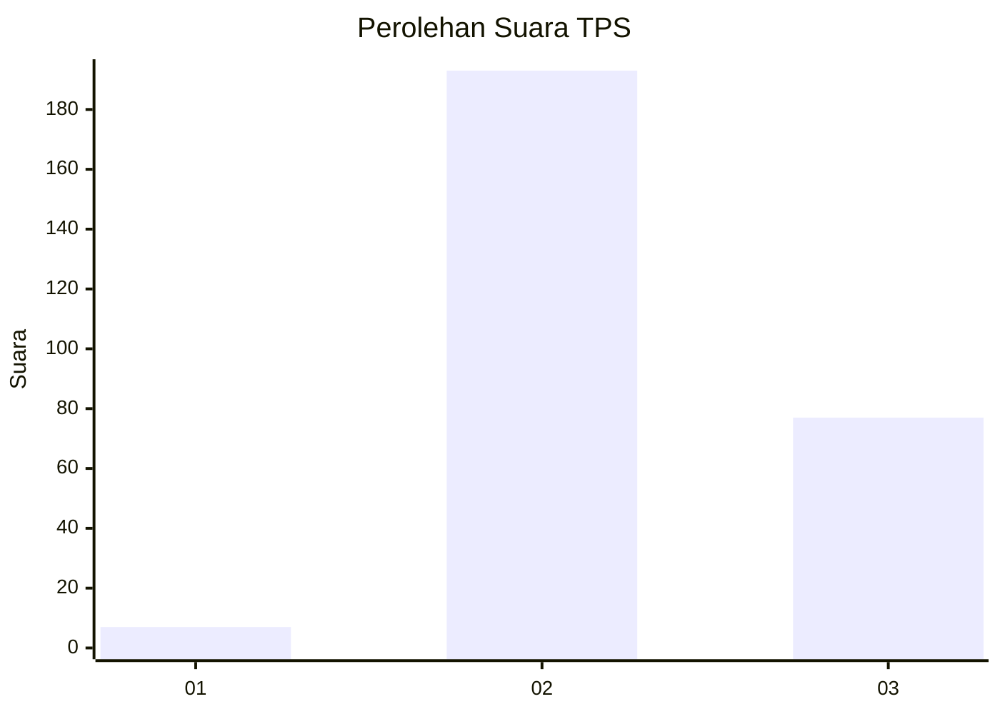
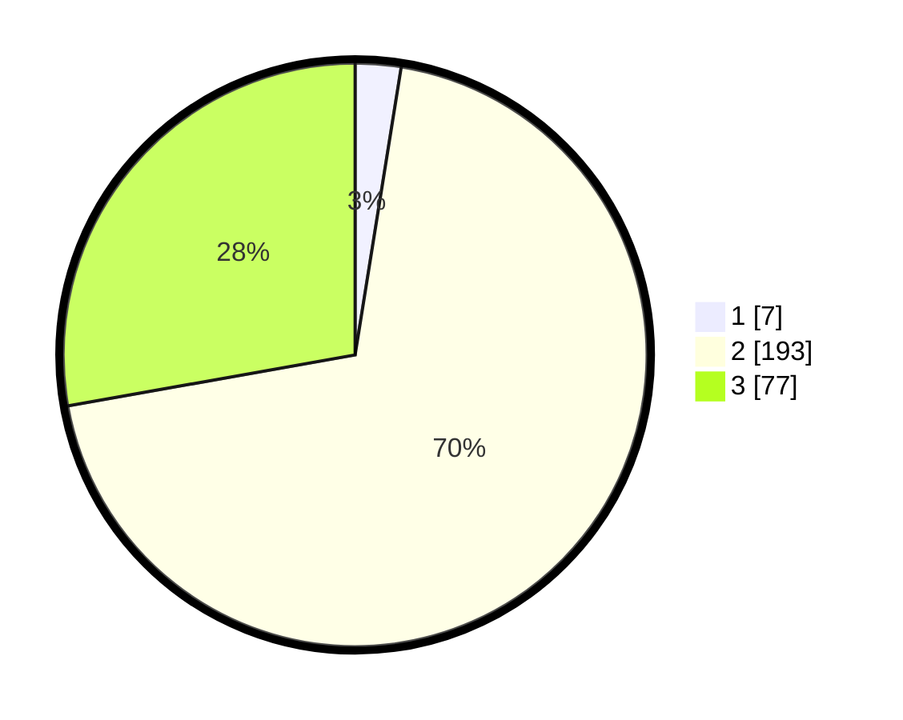

# Hasil

## Grafik

## Tabel

| No. | Nama Paslon    | Suara | Suara (raw) | Persentase |
|:--- |:-------------- | -----:| -----------:| ----------:|
| 1   | ANIES MUHAIMIN | 7     | [7][p-1]    | 2,53       |
| 2   | PRABOWO GIBRAN | 193   | [193][p-2]  | 69,68      |
| 3   | GANJAR MAHFUD  | 77    | [77][p-3]   | 27,80      |

[p-1]: https://github.com/gigit-pemilu/pemilu-2024/blob/main/pilpres/hitung-suara/sub/35-jawa-timur/sub/25-gresik/sub/11-cerme/sub/2023-banjarsari/sub/902-tps/sub/paslon-1.txt
[p-2]: https://github.com/gigit-pemilu/pemilu-2024/blob/main/pilpres/hitung-suara/sub/35-jawa-timur/sub/25-gresik/sub/11-cerme/sub/2023-banjarsari/sub/902-tps/sub/paslon-2.txt
[p-3]: https://github.com/gigit-pemilu/pemilu-2024/blob/main/pilpres/hitung-suara/sub/35-jawa-timur/sub/25-gresik/sub/11-cerme/sub/2023-banjarsari/sub/902-tps/sub/paslon-3.txt

## Foto C Plano

https://sirekap-obj-formc.kpu.go.id/2c6b/pemilu/ppwp/35/25/11/20/23/3525112023902-20240214-203144--4be33a8f-cd49-4476-a6eb-e33da8be41db.jpg

https://sirekap-obj-formc.kpu.go.id/2c6b/pemilu/ppwp/35/25/11/20/23/3525112023902-20240214-215529--abc05244-2449-4813-8f0e-534ba66c54eb.jpg

https://sirekap-obj-formc.kpu.go.id/2c6b/pemilu/ppwp/35/25/11/20/23/3525112023902-20240214-215611--2e9cd8a0-2311-4751-a022-083c5aff0a05.jpg

## Metadata

| Key        | Value               |
| ---------- | ------------------- |
| Time Stamp | 2024-02-16 16:25:10 |

## DATA PEMILIH TETAP

Jumlah pemilih dalam DPT: **274**.
 * L: **268**.
 * P: **6**.

## DATA PENGGUNA HAK PILIH

Jumlah pengguna hak pilih dalam DPT: **201**.
 * L: **196**.
 * P: **5**.

Jumlah pengguna hak pilih dalam DPTb: **79**.
 * L: **77**.
 * P: **2**.

Jumlah pengguna hak pilih dalam DPK: **0**.
 * L: **0**.
 * P: **0**.

Jumlah pengguna hak pilih: **280**.
 * L: **273**.
 * P: **7**.

## JUMLAH SUARA SAH DAN TIDAK SAH

JUMLAH SELURUH SUARA SAH: **277**.

JUMLAH SUARA TIDAK SAH: **3**.

JUMLAH SELURUH SUARA SAH DAN SUARA TIDAK SAH: **280**.

