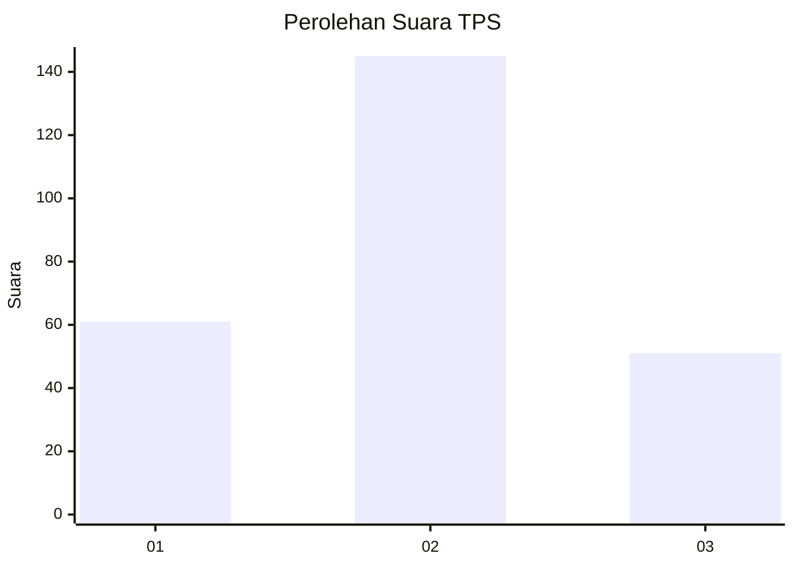
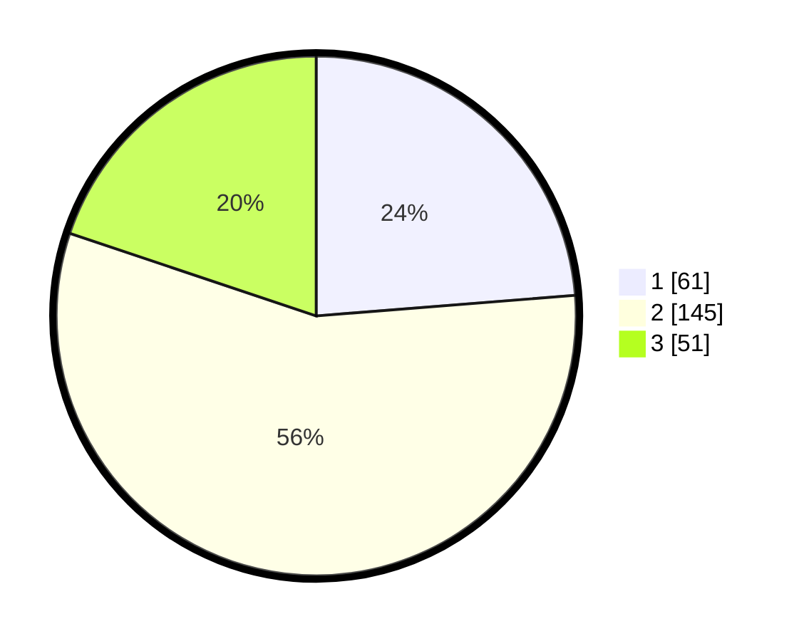

# Hasil

## Grafik

## Tabel

| No. | Nama Paslon    | Suara | Suara (raw) | Persentase |
|:--- |:-------------- | -----:| -----------:| ----------:|
| 1   | ANIES MUHAIMIN | 61    | [61][p-1]   | 23,74      |
| 2   | PRABOWO GIBRAN | 145   | [145][p-2]  | 56,42      |
| 3   | GANJAR MAHFUD  | 51    | [51][p-3]   | 19,84      |

[p-1]: https://github.com/gigit-pemilu/pemilu-2024/blob/main/pilpres/hitung-suara/sub/35-jawa-timur/sub/25-gresik/sub/12-bungah/sub/2003-mojopurowetan/sub/001-tps/sub/paslon-1.txt
[p-2]: https://github.com/gigit-pemilu/pemilu-2024/blob/main/pilpres/hitung-suara/sub/35-jawa-timur/sub/25-gresik/sub/12-bungah/sub/2003-mojopurowetan/sub/001-tps/sub/paslon-2.txt
[p-3]: https://github.com/gigit-pemilu/pemilu-2024/blob/main/pilpres/hitung-suara/sub/35-jawa-timur/sub/25-gresik/sub/12-bungah/sub/2003-mojopurowetan/sub/001-tps/sub/paslon-3.txt

## Foto C Plano

https://sirekap-obj-formc.kpu.go.id/7976/pemilu/ppwp/35/25/12/20/03/3525122003001-20240214-212653--69c00403-df9a-4313-b471-5c368ab8a7f0.jpg

https://sirekap-obj-formc.kpu.go.id/7976/pemilu/ppwp/35/25/12/20/03/3525122003001-20240214-212819--3cb64d32-9992-4dd4-a971-dd72a774ef5d.jpg

https://sirekap-obj-formc.kpu.go.id/7976/pemilu/ppwp/35/25/12/20/03/3525122003001-20240214-213023--4ccb1e07-5c79-4c72-ad7b-49428bd458ad.jpg

## Metadata

| Key        | Value               |
| ---------- | ------------------- |
| Time Stamp | 2024-02-17 10:00:02 |

