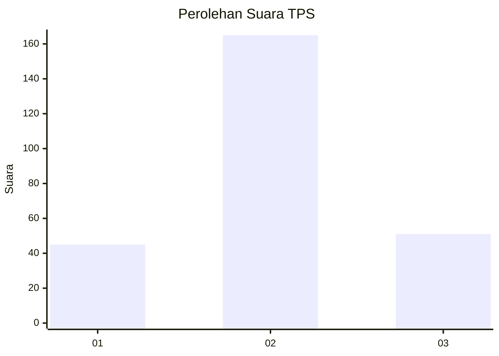
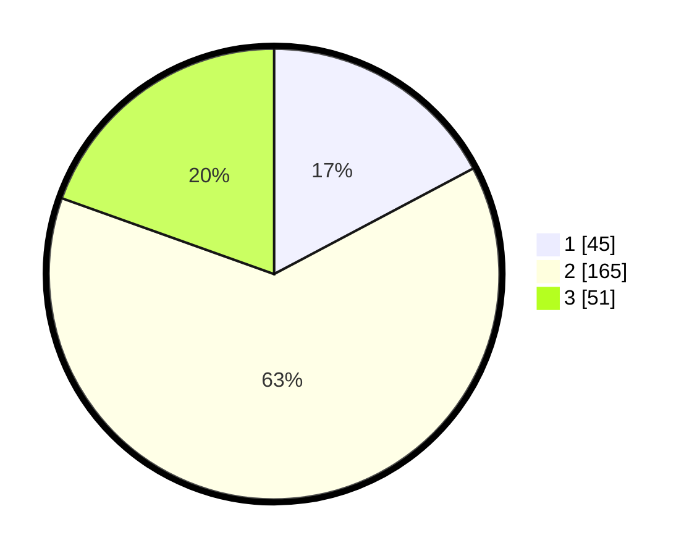

# Hasil

## Grafik

## Tabel

| No. | Nama Paslon    | Suara | Suara (raw) | Persentase |
|:--- |:-------------- | -----:| -----------:| ----------:|
| 1   | ANIES MUHAIMIN | 45    | [45][p-1]   | 17,24      |
| 2   | PRABOWO GIBRAN | 165   | [165][p-2]  | 63,22      |
| 3   | GANJAR MAHFUD  | 51    | [51][p-3]   | 19,54      |

[p-1]: https://github.com/gigit-pemilu/pemilu-2024/blob/main/pilpres/hitung-suara/sub/35-jawa-timur/sub/25-gresik/sub/12-bungah/sub/2003-mojopurowetan/sub/004-tps/sub/paslon-1.txt
[p-2]: https://github.com/gigit-pemilu/pemilu-2024/blob/main/pilpres/hitung-suara/sub/35-jawa-timur/sub/25-gresik/sub/12-bungah/sub/2003-mojopurowetan/sub/004-tps/sub/paslon-2.txt
[p-3]: https://github.com/gigit-pemilu/pemilu-2024/blob/main/pilpres/hitung-suara/sub/35-jawa-timur/sub/25-gresik/sub/12-bungah/sub/2003-mojopurowetan/sub/004-tps/sub/paslon-3.txt

## Foto C Plano

https://sirekap-obj-formc.kpu.go.id/52c1/pemilu/ppwp/35/25/12/20/03/3525122003004-20240214-201252--51190f9d-198f-42a4-b2ad-c0f0b2f5413a.jpg

https://sirekap-obj-formc.kpu.go.id/52c1/pemilu/ppwp/35/25/12/20/03/3525122003004-20240214-234513--c2232d28-fdeb-4c53-ad00-f5486256abc5.jpg

https://sirekap-obj-formc.kpu.go.id/52c1/pemilu/ppwp/35/25/12/20/03/3525122003004-20240214-184732--d0c72de0-0551-4a38-8181-4f270177adfd.jpg

## Metadata

| Key        | Value               |
| ---------- | ------------------- |
| Time Stamp | 2024-02-17 10:00:02 |

