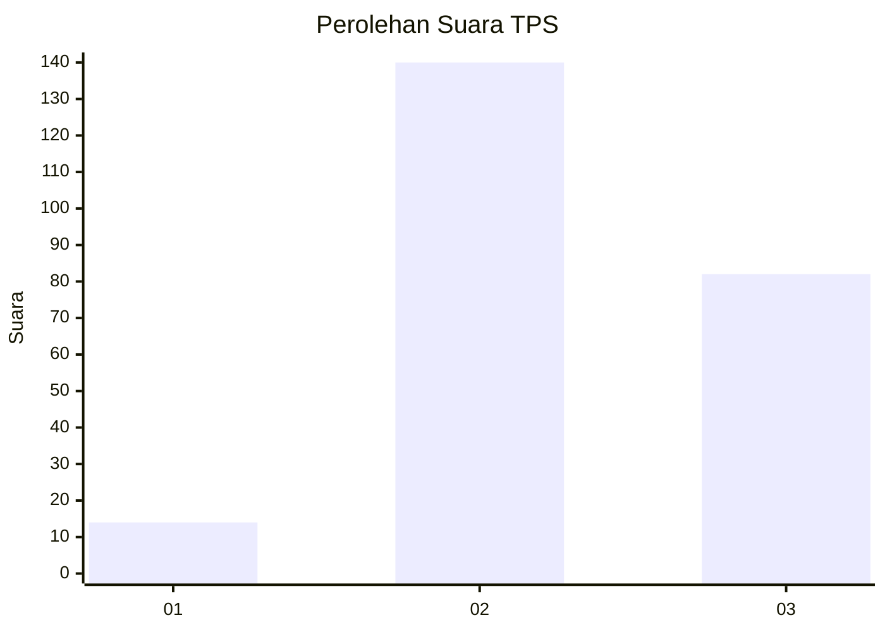
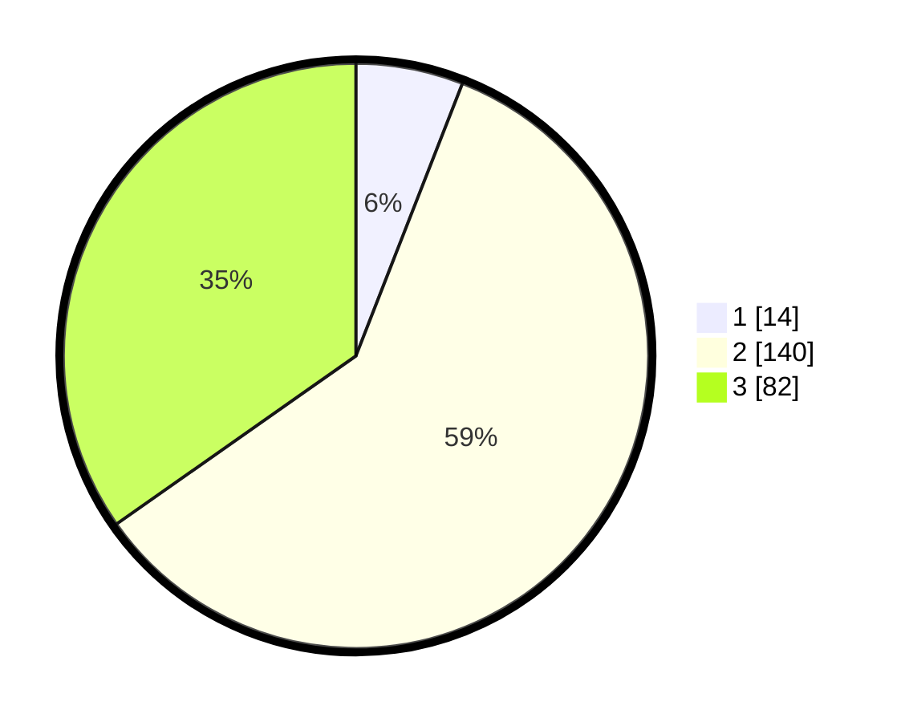

# Hasil

## Grafik

## Tabel

| No. | Nama Paslon    | Suara | Suara (raw) | Persentase |
|:--- |:-------------- | -----:| -----------:| ----------:|
| 1   | ANIES MUHAIMIN | 14    | [14][p-1]   | 5,93       |
| 2   | PRABOWO GIBRAN | 140   | [140][p-2]  | 59,32      |
| 3   | GANJAR MAHFUD  | 82    | [82][p-3]   | 34,75      |

[p-1]: https://github.com/gigit-pemilu/pemilu-2024/blob/main/pilpres/hitung-suara/sub/35-jawa-timur/sub/25-gresik/sub/12-bungah/sub/2004-melirang/sub/014-tps/sub/paslon-1.txt
[p-2]: https://github.com/gigit-pemilu/pemilu-2024/blob/main/pilpres/hitung-suara/sub/35-jawa-timur/sub/25-gresik/sub/12-bungah/sub/2004-melirang/sub/014-tps/sub/paslon-2.txt
[p-3]: https://github.com/gigit-pemilu/pemilu-2024/blob/main/pilpres/hitung-suara/sub/35-jawa-timur/sub/25-gresik/sub/12-bungah/sub/2004-melirang/sub/014-tps/sub/paslon-3.txt

## Foto C Plano

https://sirekap-obj-formc.kpu.go.id/82a4/pemilu/ppwp/35/25/12/20/04/3525122004014-20240214-202727--1f0db6a4-c527-4d8f-9e64-7f8d1dcfe59f.jpg

https://sirekap-obj-formc.kpu.go.id/82a4/pemilu/ppwp/35/25/12/20/04/3525122004014-20240214-203317--e481781e-3d49-406d-96d9-90d2b82b7519.jpg

https://sirekap-obj-formc.kpu.go.id/82a4/pemilu/ppwp/35/25/12/20/04/3525122004014-20240214-203618--3d7e569f-0250-4aa7-b320-a25dadbbb109.jpg

## Metadata

| Key        | Value               |
| ---------- | ------------------- |
| Time Stamp | 2024-02-17 10:00:02 |

