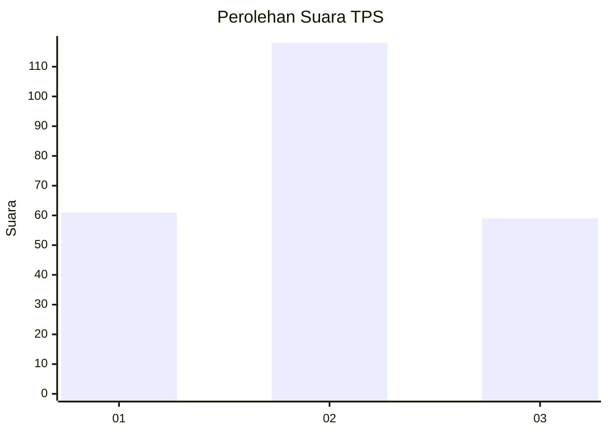
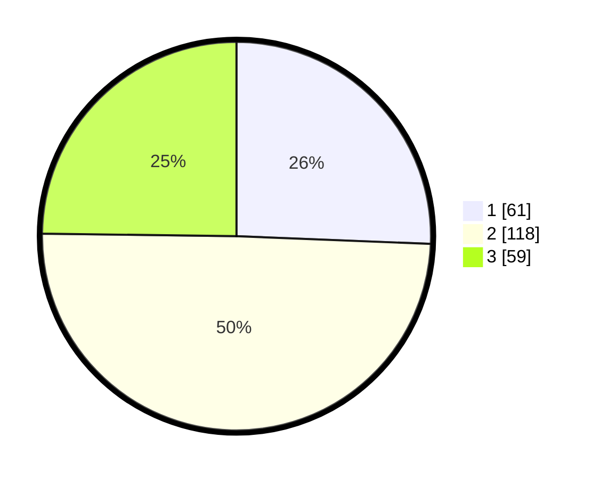

# Hasil

## Grafik

## Tabel

| No. | Nama Paslon    | Suara | Suara (raw) | Persentase |
|:--- |:-------------- | -----:| -----------:| ----------:|
| 1   | ANIES MUHAIMIN | 61    | [61][p-1]   | 25,63      |
| 2   | PRABOWO GIBRAN | 118   | [118][p-2]  | 49,58      |
| 3   | GANJAR MAHFUD  | 59    | [59][p-3]   | 24,79      |

[p-1]: https://github.com/gigit-pemilu/pemilu-2024/blob/main/pilpres/hitung-suara/sub/35-jawa-timur/sub/25-gresik/sub/12-bungah/sub/2012-bungah/sub/007-tps/sub/paslon-1.txt
[p-2]: https://github.com/gigit-pemilu/pemilu-2024/blob/main/pilpres/hitung-suara/sub/35-jawa-timur/sub/25-gresik/sub/12-bungah/sub/2012-bungah/sub/007-tps/sub/paslon-2.txt
[p-3]: https://github.com/gigit-pemilu/pemilu-2024/blob/main/pilpres/hitung-suara/sub/35-jawa-timur/sub/25-gresik/sub/12-bungah/sub/2012-bungah/sub/007-tps/sub/paslon-3.txt

## Foto C Plano

https://sirekap-obj-formc.kpu.go.id/5507/pemilu/ppwp/35/25/12/20/12/3525122012007-20240214-155017--c0813e34-b6a2-42d7-9be2-d5247e14b629.jpg

https://sirekap-obj-formc.kpu.go.id/5507/pemilu/ppwp/35/25/12/20/12/3525122012007-20240214-155025--0e1968a1-4803-41aa-b5f0-12179c9fe6bd.jpg

https://sirekap-obj-formc.kpu.go.id/5507/pemilu/ppwp/35/25/12/20/12/3525122012007-20240214-155010--8d2f8d5f-3a91-4dcd-8ddf-ae04f064d5e8.jpg

## Metadata

| Key        | Value               |
| ---------- | ------------------- |
| Time Stamp | 2024-02-14 21:46:01 |

