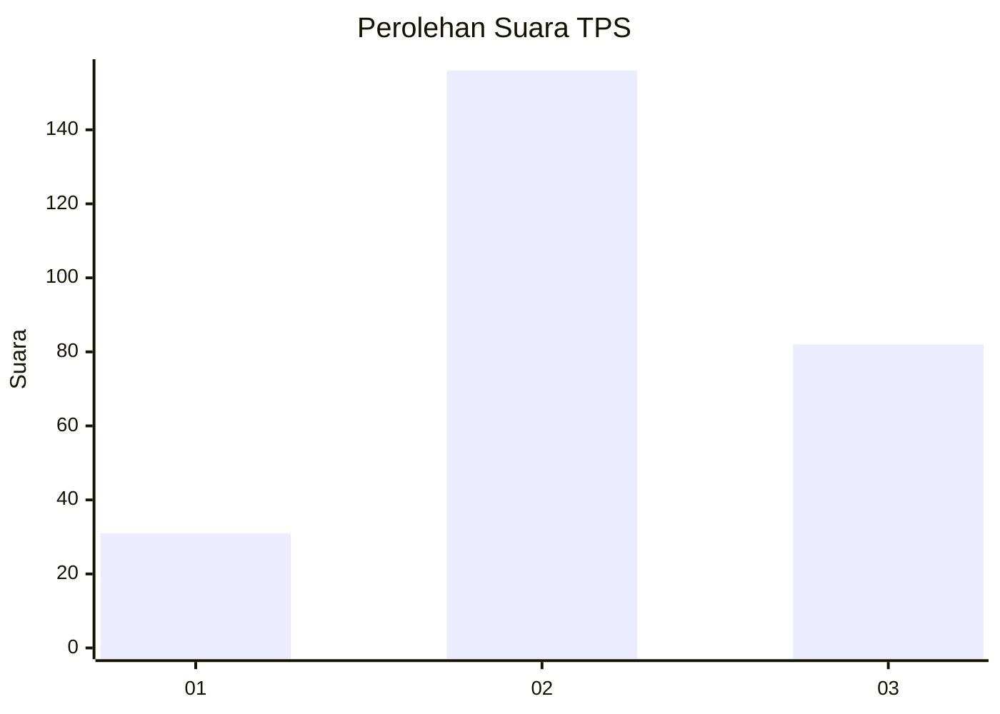
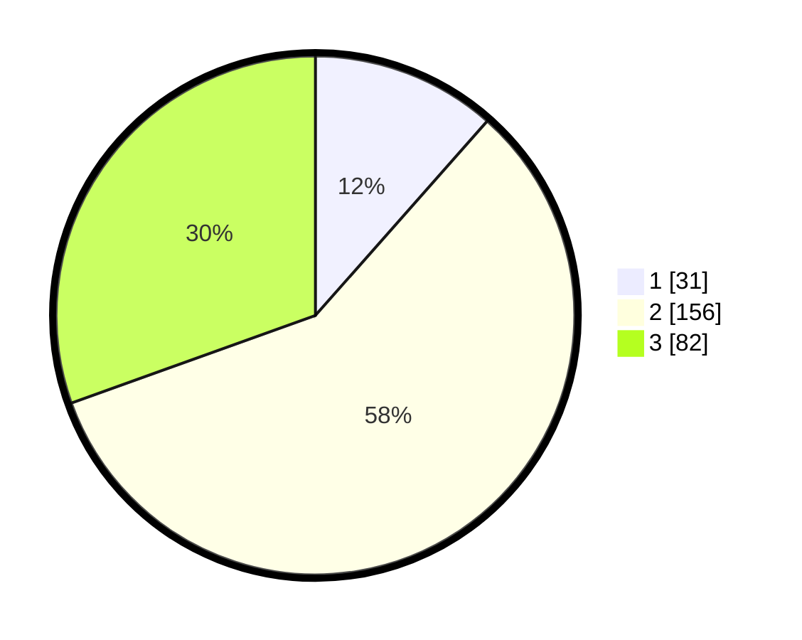

# Hasil

## Grafik

## Tabel

| No. | Nama Paslon    | Suara | Suara (raw) | Persentase |
|:--- |:-------------- | -----:| -----------:| ----------:|
| 1   | ANIES MUHAIMIN | 31    | [31][p-1]   | 11,52      |
| 2   | PRABOWO GIBRAN | 156   | [156][p-2]  | 57,99      |
| 3   | GANJAR MAHFUD  | 82    | [82][p-3]   | 30,48      |

[p-1]: https://github.com/gigit-pemilu/pemilu-2024-35-jawa-timur/blob/main/pilpres/hitung-suara/sub/35-jawa-timur/sub/25-gresik/sub/12-bungah/sub/2012-bungah/sub/016-tps/sub/paslon-1.txt
[p-2]: https://github.com/gigit-pemilu/pemilu-2024-35-jawa-timur/blob/main/pilpres/hitung-suara/sub/35-jawa-timur/sub/25-gresik/sub/12-bungah/sub/2012-bungah/sub/016-tps/sub/paslon-2.txt
[p-3]: https://github.com/gigit-pemilu/pemilu-2024-35-jawa-timur/blob/main/pilpres/hitung-suara/sub/35-jawa-timur/sub/25-gresik/sub/12-bungah/sub/2012-bungah/sub/016-tps/sub/paslon-3.txt

## Foto C Plano

https://sirekap-obj-formc.kpu.go.id/35b8/pemilu/ppwp/35/25/12/20/12/3525122012016-20240214-200309--da8279ac-77de-402b-a022-2127c6f6111e.jpg

https://sirekap-obj-formc.kpu.go.id/35b8/pemilu/ppwp/35/25/12/20/12/3525122012016-20240214-200412--7fe85ca1-83f3-41f8-85ea-4a4548713708.jpg

https://sirekap-obj-formc.kpu.go.id/35b8/pemilu/ppwp/35/25/12/20/12/3525122012016-20240214-200459--2b224bb5-30eb-42d4-a26d-e662ab6ac35d.jpg

## Metadata

| Key        | Value               |
| ---------- | ------------------- |
| Time Stamp | 2024-02-17 13:37:34 |

