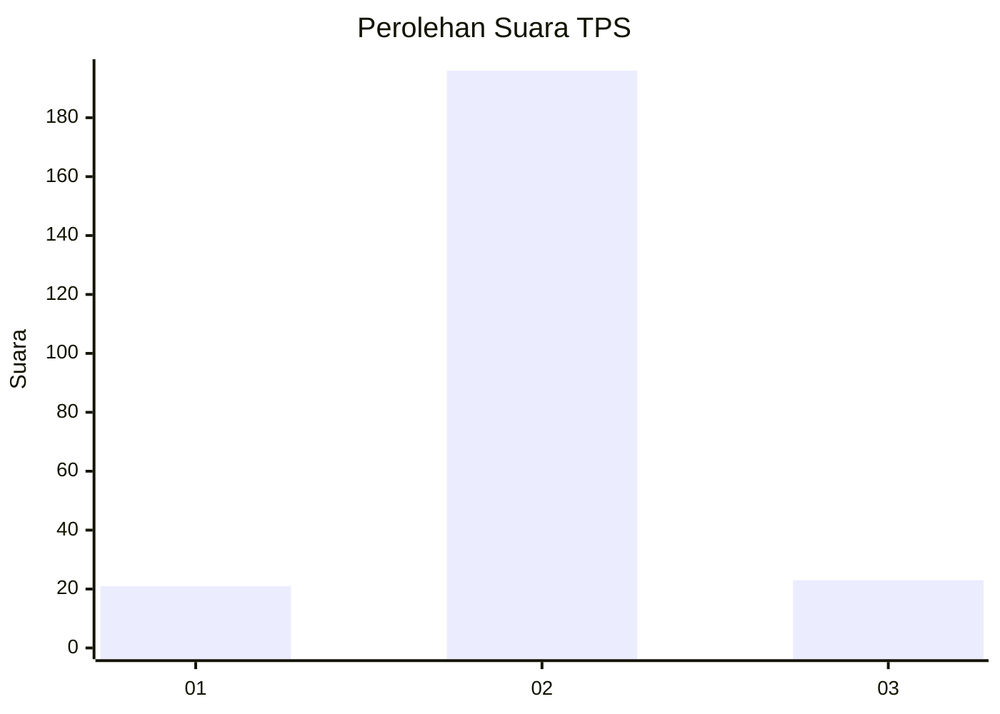
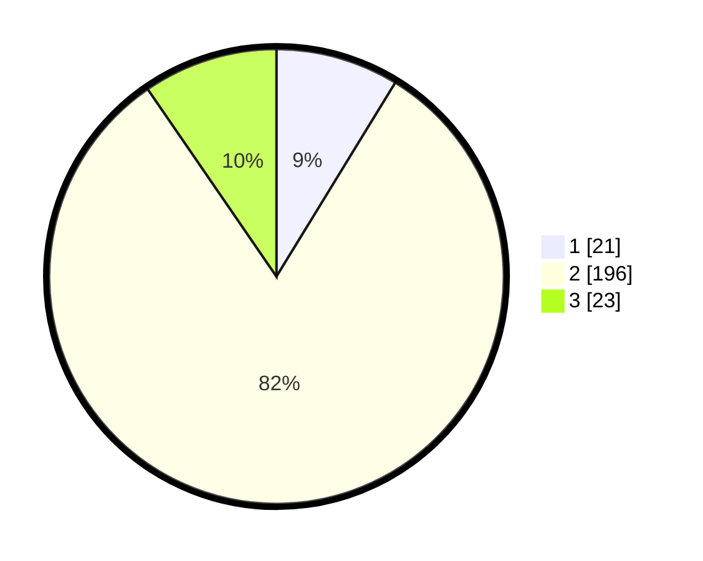

# Hasil

## Grafik

## Tabel

| No. | Nama Paslon    | Suara | Suara (raw) | Persentase |
|:--- |:-------------- | -----:| -----------:| ----------:|
| 1   | ANIES MUHAIMIN | 21    | [21][p-1]   | 8,75       |
| 2   | PRABOWO GIBRAN | 196   | [196][p-2]  | 81,67      |
| 3   | GANJAR MAHFUD  | 23    | [23][p-3]   | 9,58       |

[p-1]: https://github.com/gigit-pemilu/pemilu-2024/blob/main/pilpres/hitung-suara/sub/35-jawa-timur/sub/25-gresik/sub/12-bungah/sub/2019-sungonlegowo/sub/008-tps/sub/paslon-1.txt
[p-2]: https://github.com/gigit-pemilu/pemilu-2024/blob/main/pilpres/hitung-suara/sub/35-jawa-timur/sub/25-gresik/sub/12-bungah/sub/2019-sungonlegowo/sub/008-tps/sub/paslon-2.txt
[p-3]: https://github.com/gigit-pemilu/pemilu-2024/blob/main/pilpres/hitung-suara/sub/35-jawa-timur/sub/25-gresik/sub/12-bungah/sub/2019-sungonlegowo/sub/008-tps/sub/paslon-3.txt

## Foto C Plano

https://sirekap-obj-formc.kpu.go.id/09a9/pemilu/ppwp/35/25/12/20/19/3525122019008-20240214-191817--7cd9f10a-0b4e-4471-b96c-af199792a0c4.jpg

https://sirekap-obj-formc.kpu.go.id/09a9/pemilu/ppwp/35/25/12/20/19/3525122019008-20240214-203528--baeea8c0-490e-4a7c-82a3-bdfa6fb6e84d.jpg

https://sirekap-obj-formc.kpu.go.id/09a9/pemilu/ppwp/35/25/12/20/19/3525122019008-20240214-203709--6aab1098-5904-40b9-afb5-43dc68911e33.jpg

## Metadata

| Key        | Value               |
| ---------- | ------------------- |
| Time Stamp | 2024-02-15 01:47:43 |

