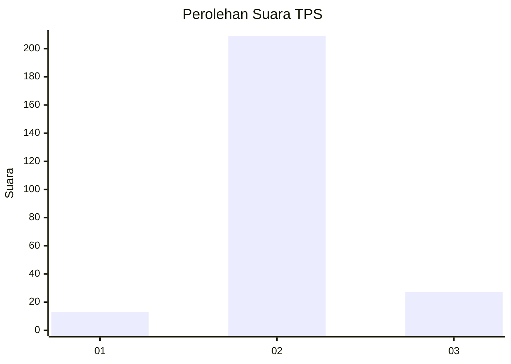
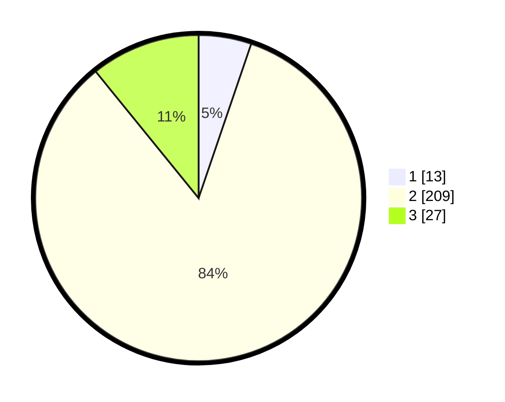

# Hasil

## Grafik

## Tabel

| No. | Nama Paslon    | Suara | Suara (raw) | Persentase |
|:--- |:-------------- | -----:| -----------:| ----------:|
| 1   | ANIES MUHAIMIN | 13    | [13][p-1]   | 5,22       |
| 2   | PRABOWO GIBRAN | 209   | [209][p-2]  | 83,94      |
| 3   | GANJAR MAHFUD  | 27    | [27][p-3]   | 10,84      |

[p-1]: https://github.com/gigit-pemilu/pemilu-2024-35-jawa-timur/blob/main/pilpres/hitung-suara/sub/35-jawa-timur/sub/25-gresik/sub/13-menganti/sub/2004-bringkang/sub/005-tps/sub/paslon-1.txt
[p-2]: https://github.com/gigit-pemilu/pemilu-2024-35-jawa-timur/blob/main/pilpres/hitung-suara/sub/35-jawa-timur/sub/25-gresik/sub/13-menganti/sub/2004-bringkang/sub/005-tps/sub/paslon-2.txt
[p-3]: https://github.com/gigit-pemilu/pemilu-2024-35-jawa-timur/blob/main/pilpres/hitung-suara/sub/35-jawa-timur/sub/25-gresik/sub/13-menganti/sub/2004-bringkang/sub/005-tps/sub/paslon-3.txt

## Foto C Plano

https://sirekap-obj-formc.kpu.go.id/8beb/pemilu/ppwp/35/25/13/20/04/3525132004005-20240214-231226--1cb6e315-1b88-4f86-9daa-ffc4881a5cd2.jpg

https://sirekap-obj-formc.kpu.go.id/8beb/pemilu/ppwp/35/25/13/20/04/3525132004005-20240214-231400--047dde03-f0fb-4c9d-af49-824564cf5b09.jpg

https://sirekap-obj-formc.kpu.go.id/8beb/pemilu/ppwp/35/25/13/20/04/3525132004005-20240214-231446--ade9eade-958a-459e-ac8d-2f9f26bc99fd.jpg

## Metadata

| Key        | Value               |
| ---------- | ------------------- |
| Time Stamp | 2024-02-17 16:00:02 |

