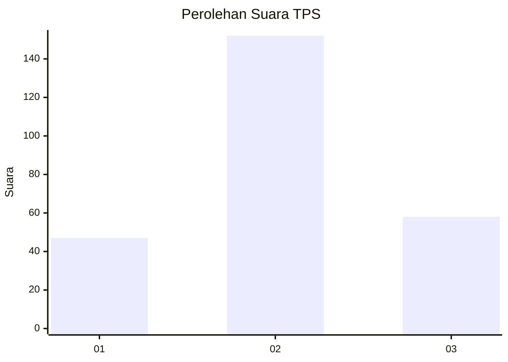
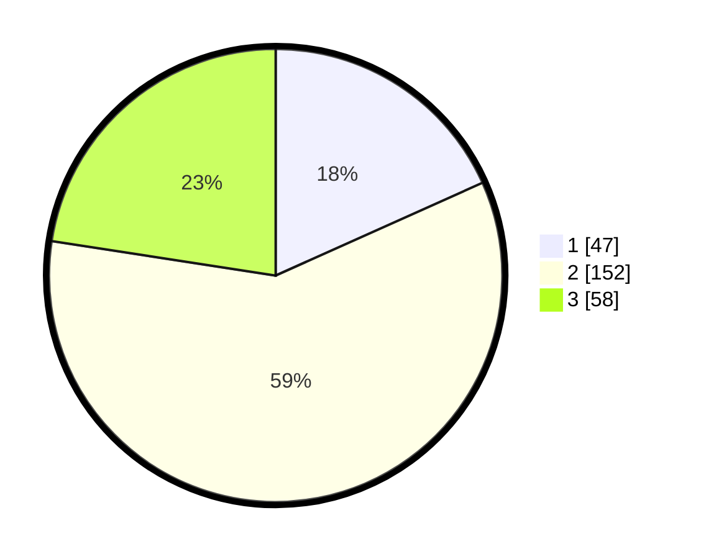

# Hasil

## Grafik

## Tabel

| No. | Nama Paslon    | Suara | Suara (raw) | Persentase |
|:--- |:-------------- | -----:| -----------:| ----------:|
| 1   | ANIES MUHAIMIN | 47    | [47][p-1]   | 18,29      |
| 2   | PRABOWO GIBRAN | 152   | [152][p-2]  | 59,14      |
| 3   | GANJAR MAHFUD  | 58    | [58][p-3]   | 22,57      |

[p-1]: https://github.com/gigit-pemilu/pemilu-2024-35-jawa-timur/blob/main/pilpres/hitung-suara/sub/35-jawa-timur/sub/25-gresik/sub/13-menganti/sub/2004-bringkang/sub/012-tps/sub/paslon-1.txt
[p-2]: https://github.com/gigit-pemilu/pemilu-2024-35-jawa-timur/blob/main/pilpres/hitung-suara/sub/35-jawa-timur/sub/25-gresik/sub/13-menganti/sub/2004-bringkang/sub/012-tps/sub/paslon-2.txt
[p-3]: https://github.com/gigit-pemilu/pemilu-2024-35-jawa-timur/blob/main/pilpres/hitung-suara/sub/35-jawa-timur/sub/25-gresik/sub/13-menganti/sub/2004-bringkang/sub/012-tps/sub/paslon-3.txt

## Foto C Plano

https://sirekap-obj-formc.kpu.go.id/519f/pemilu/ppwp/35/25/13/20/04/3525132004012-20240214-210537--24a759f7-90c5-4d78-9436-eba40144d64c.jpg

https://sirekap-obj-formc.kpu.go.id/519f/pemilu/ppwp/35/25/13/20/04/3525132004012-20240214-210714--5c3770fc-9ce1-49ee-a6ab-4f97d9f5d76d.jpg

https://sirekap-obj-formc.kpu.go.id/519f/pemilu/ppwp/35/25/13/20/04/3525132004012-20240214-210913--1ed76512-d652-4f7c-943a-6d37a09beb9b.jpg

## Metadata

| Key        | Value               |
| ---------- | ------------------- |
| Time Stamp | 2024-02-17 16:00:02 |

