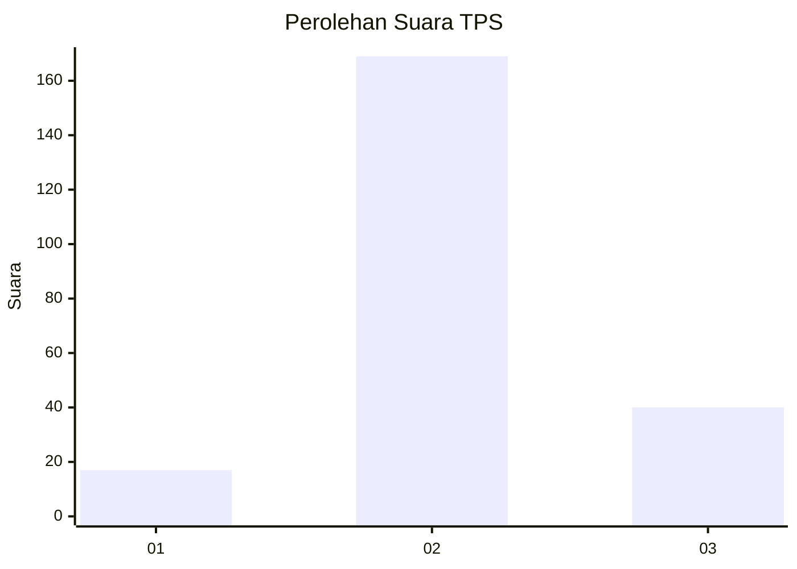

# Hasil

## Grafik

## Tabel

| No. | Nama Paslon    | Suara | Suara (raw) | Persentase |
|:--- |:-------------- | -----:| -----------:| ----------:|
| 1   | ANIES MUHAIMIN | 17    | [17][p-1]   | 7,52       |
| 2   | PRABOWO GIBRAN | 169   | [169][p-2]  | 74,78      |
| 3   | GANJAR MAHFUD  | 40    | [40][p-3]   | 17,70      |

[p-1]: https://github.com/gigit-pemilu/pemilu-2024/blob/main/pilpres/hitung-suara/sub/35-jawa-timur/sub/25-gresik/sub/13-menganti/sub/2010-sidojangkung/sub/006-tps/sub/paslon-1.txt
[p-2]: https://github.com/gigit-pemilu/pemilu-2024/blob/main/pilpres/hitung-suara/sub/35-jawa-timur/sub/25-gresik/sub/13-menganti/sub/2010-sidojangkung/sub/006-tps/sub/paslon-2.txt
[p-3]: https://github.com/gigit-pemilu/pemilu-2024/blob/main/pilpres/hitung-suara/sub/35-jawa-timur/sub/25-gresik/sub/13-menganti/sub/2010-sidojangkung/sub/006-tps/sub/paslon-3.txt

## Foto C Plano

https://sirekap-obj-formc.kpu.go.id/9c62/pemilu/ppwp/35/25/13/20/10/3525132010006-20240215-012054--a0733fba-d70e-44d2-a2df-1f11c07a15ba.jpg

https://sirekap-obj-formc.kpu.go.id/9c62/pemilu/ppwp/35/25/13/20/10/3525132010006-20240215-012451--6f6049e4-1a05-4b05-a6a7-164157756817.jpg

https://sirekap-obj-formc.kpu.go.id/9c62/pemilu/ppwp/35/25/13/20/10/3525132010006-20240214-210749--6b79fcc7-d4b1-42b9-8014-2d68aee95759.jpg

## Metadata

| Key        | Value               |
| ---------- | ------------------- |
| Time Stamp | 2024-02-17 18:00:00 |

