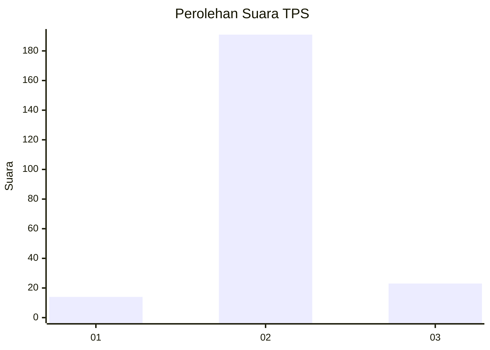
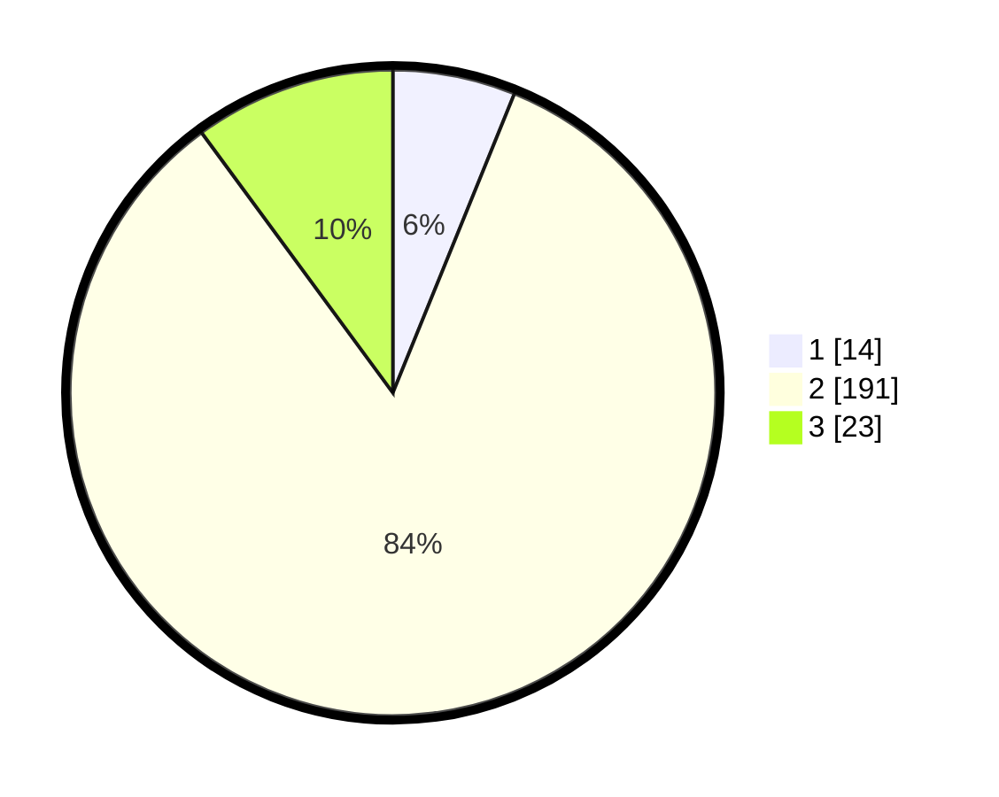

# Hasil

## Grafik

## Tabel

| No. | Nama Paslon    | Suara | Suara (raw) | Persentase |
|:--- |:-------------- | -----:| -----------:| ----------:|
| 1   | ANIES MUHAIMIN | 14    | [14][p-1]   | 6,14       |
| 2   | PRABOWO GIBRAN | 191   | [191][p-2]  | 83,77      |
| 3   | GANJAR MAHFUD  | 23    | [23][p-3]   | 10,09      |

[p-1]: https://github.com/gigit-pemilu/pemilu-2024/blob/main/pilpres/hitung-suara/sub/35-jawa-timur/sub/25-gresik/sub/13-menganti/sub/2011-hendrosari/sub/007-tps/sub/paslon-1.txt
[p-2]: https://github.com/gigit-pemilu/pemilu-2024/blob/main/pilpres/hitung-suara/sub/35-jawa-timur/sub/25-gresik/sub/13-menganti/sub/2011-hendrosari/sub/007-tps/sub/paslon-2.txt
[p-3]: https://github.com/gigit-pemilu/pemilu-2024/blob/main/pilpres/hitung-suara/sub/35-jawa-timur/sub/25-gresik/sub/13-menganti/sub/2011-hendrosari/sub/007-tps/sub/paslon-3.txt

## Foto C Plano

https://sirekap-obj-formc.kpu.go.id/6c08/pemilu/ppwp/35/25/13/20/11/3525132011007-20240214-225257--edcbdff6-22ac-4eef-a5cf-3e9b7647b21a.jpg

https://sirekap-obj-formc.kpu.go.id/6c08/pemilu/ppwp/35/25/13/20/11/3525132011007-20240214-225555--9e0eda68-2d6f-4a71-afaa-621fae29d9f2.jpg

https://sirekap-obj-formc.kpu.go.id/6c08/pemilu/ppwp/35/25/13/20/11/3525132011007-20240214-225701--2864bf94-4923-4854-9f7d-b14ae6d12a09.jpg

## Metadata

| Key        | Value               |
| ---------- | ------------------- |
| Time Stamp | 2024-02-17 18:00:00 |

