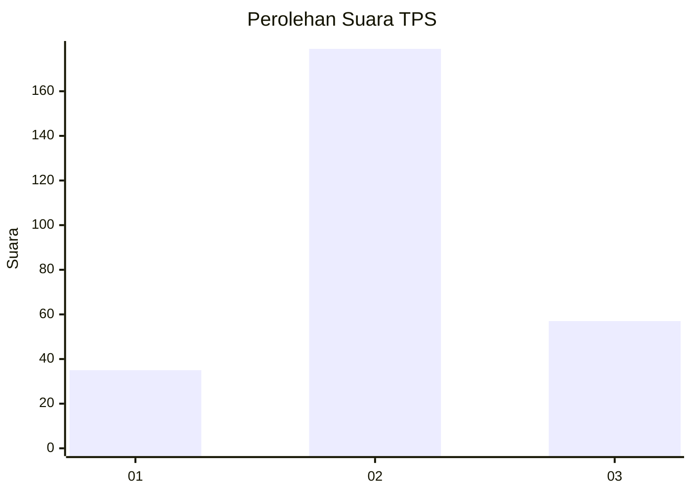
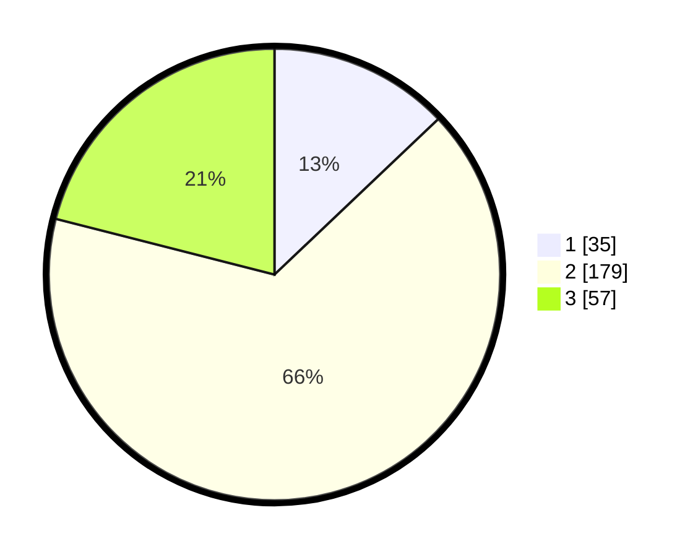

# Hasil

## Grafik

## Tabel

| No. | Nama Paslon    | Suara | Suara (raw) | Persentase |
|:--- |:-------------- | -----:| -----------:| ----------:|
| 1   | ANIES MUHAIMIN | 35    | [35][p-1]   | 12,92      |
| 2   | PRABOWO GIBRAN | 179   | [179][p-2]  | 66,05      |
| 3   | GANJAR MAHFUD  | 57    | [57][p-3]   | 21,03      |

[p-1]: https://github.com/gigit-pemilu/pemilu-2024/blob/main/pilpres/hitung-suara/sub/35-jawa-timur/sub/25-gresik/sub/13-menganti/sub/2012-pelemwatu/sub/004-tps/sub/paslon-1.txt
[p-2]: https://github.com/gigit-pemilu/pemilu-2024/blob/main/pilpres/hitung-suara/sub/35-jawa-timur/sub/25-gresik/sub/13-menganti/sub/2012-pelemwatu/sub/004-tps/sub/paslon-2.txt
[p-3]: https://github.com/gigit-pemilu/pemilu-2024/blob/main/pilpres/hitung-suara/sub/35-jawa-timur/sub/25-gresik/sub/13-menganti/sub/2012-pelemwatu/sub/004-tps/sub/paslon-3.txt

## Foto C Plano

https://sirekap-obj-formc.kpu.go.id/9b92/pemilu/ppwp/35/25/13/20/12/3525132012004-20240214-222404--63495be8-b2de-4a65-8be7-51650f9cb34b.jpg

https://sirekap-obj-formc.kpu.go.id/9b92/pemilu/ppwp/35/25/13/20/12/3525132012004-20240214-223635--caef0989-c398-4c1d-a17d-a34a473c7cfc.jpg

https://sirekap-obj-formc.kpu.go.id/9b92/pemilu/ppwp/35/25/13/20/12/3525132012004-20240214-223413--7dcaa333-0166-45f6-8303-ba324ee808b0.jpg

## Metadata

| Key        | Value               |
| ---------- | ------------------- |
| Time Stamp | 2024-02-17 18:00:00 |

