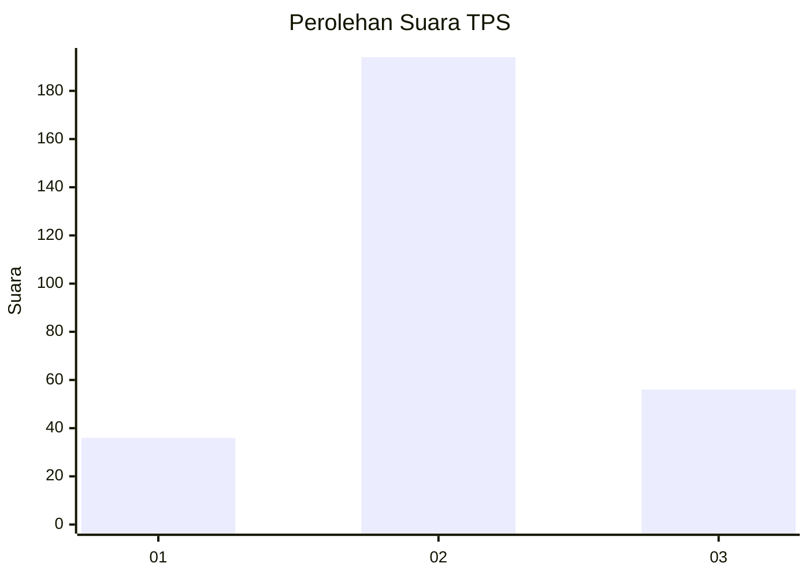
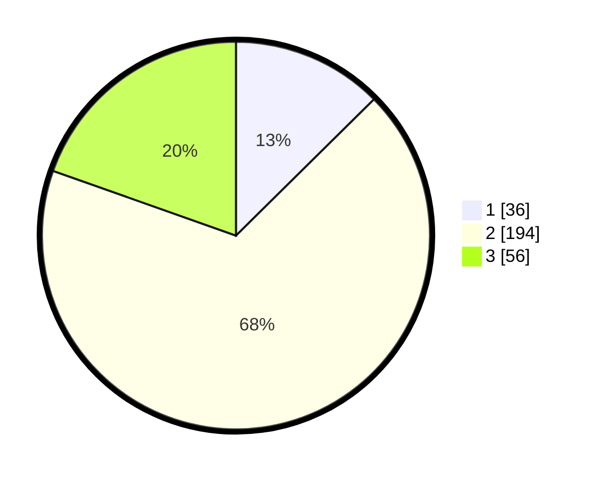

# Hasil

## Grafik

## Tabel

| No. | Nama Paslon    | Suara | Suara (raw) | Persentase |
|:--- |:-------------- | -----:| -----------:| ----------:|
| 1   | ANIES MUHAIMIN | 36    | [36][p-1]   | 12,59      |
| 2   | PRABOWO GIBRAN | 194   | [194][p-2]  | 67,83      |
| 3   | GANJAR MAHFUD  | 56    | [56][p-3]   | 19,58      |

[p-1]: https://github.com/gigit-pemilu/pemilu-2024-35-jawa-timur/blob/main/pilpres/hitung-suara/sub/35-jawa-timur/sub/25-gresik/sub/13-menganti/sub/2012-pelemwatu/sub/016-tps/sub/paslon-1.txt
[p-2]: https://github.com/gigit-pemilu/pemilu-2024-35-jawa-timur/blob/main/pilpres/hitung-suara/sub/35-jawa-timur/sub/25-gresik/sub/13-menganti/sub/2012-pelemwatu/sub/016-tps/sub/paslon-2.txt
[p-3]: https://github.com/gigit-pemilu/pemilu-2024-35-jawa-timur/blob/main/pilpres/hitung-suara/sub/35-jawa-timur/sub/25-gresik/sub/13-menganti/sub/2012-pelemwatu/sub/016-tps/sub/paslon-3.txt

## Foto C Plano

https://sirekap-obj-formc.kpu.go.id/238a/pemilu/ppwp/35/25/13/20/12/3525132012016-20240214-210348--00b418aa-afb4-4aca-bde8-9d06fe2e9eb4.jpg

https://sirekap-obj-formc.kpu.go.id/238a/pemilu/ppwp/35/25/13/20/12/3525132012016-20240214-210431--be301b1e-0b3f-4960-bddf-f41d57d24270.jpg

https://sirekap-obj-formc.kpu.go.id/238a/pemilu/ppwp/35/25/13/20/12/3525132012016-20240214-210537--18798738-0a6d-42d2-8e8b-11f2d6b8265b.jpg

## Metadata

| Key        | Value               |
| ---------- | ------------------- |
| Time Stamp | 2024-02-17 18:30:00 |

