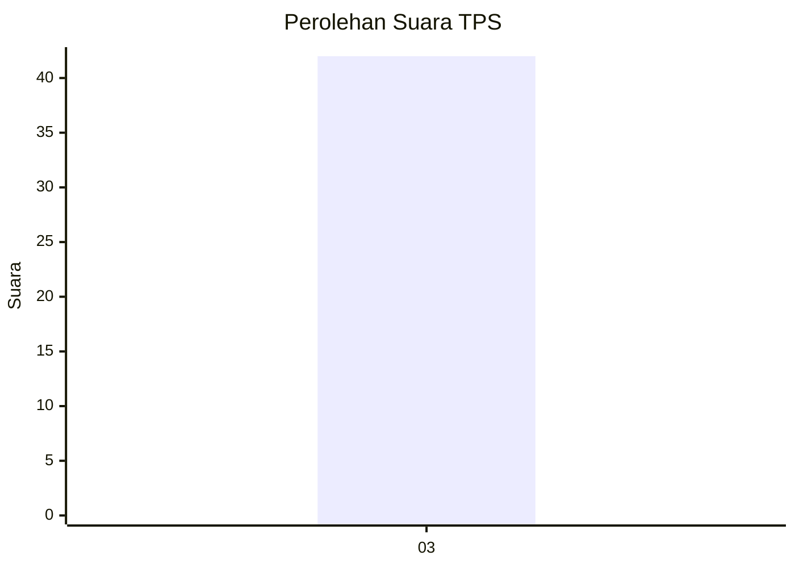
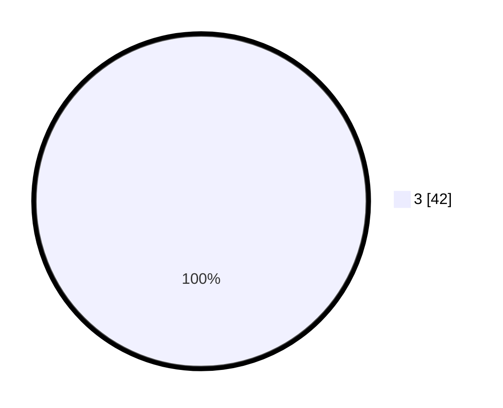

# Hasil

## Grafik

## Tabel

| No. | Nama Paslon   | Suara | Suara (raw) | Persentase |
|:--- |:------------- | -----:| -----------:| ----------:|
| 3   | GANJAR MAHFUD | 42    | [42][p-3]   | 100,00     |

[p-1]: https://github.com/gigit-pemilu/pemilu-2024/blob/main/pilpres/hitung-suara/sub/35-jawa-timur/sub/25-gresik/sub/13-menganti/sub/2013-menganti/sub/002-tps/sub/paslon-1.txt
[p-2]: https://github.com/gigit-pemilu/pemilu-2024/blob/main/pilpres/hitung-suara/sub/35-jawa-timur/sub/25-gresik/sub/13-menganti/sub/2013-menganti/sub/002-tps/sub/paslon-2.txt
[p-3]: https://github.com/gigit-pemilu/pemilu-2024/blob/main/pilpres/hitung-suara/sub/35-jawa-timur/sub/25-gresik/sub/13-menganti/sub/2013-menganti/sub/002-tps/sub/paslon-3.txt

## Foto C Plano

https://sirekap-obj-formc.kpu.go.id/68f8/pemilu/ppwp/35/25/13/20/13/3525132013002-20240215-085841--548bf291-c3c9-4fe9-88dc-19fd87f958ad.jpg

https://sirekap-obj-formc.kpu.go.id/68f8/pemilu/ppwp/35/25/13/20/13/3525132013002-20240215-085943--5aac5bdd-5331-43f0-938e-3a746619cc30.jpg

https://sirekap-obj-formc.kpu.go.id/68f8/pemilu/ppwp/35/25/13/20/13/3525132013002-20240215-090018--56093d39-4ae7-4fbd-a9ef-9d447b8e668a.jpg

## Metadata

| Key        | Value               |
| ---------- | ------------------- |
| Time Stamp | 2024-02-25 15:00:00 |

