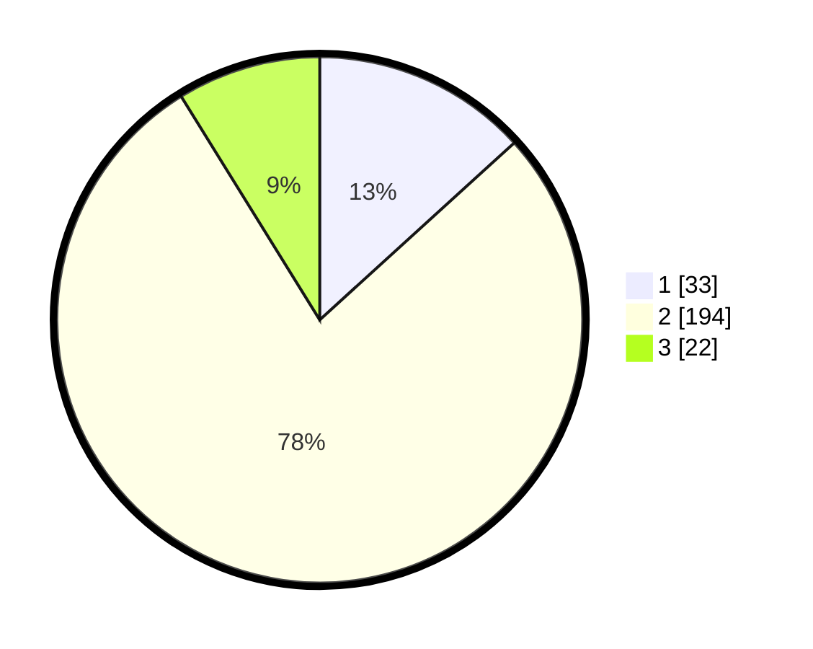

# Hasil

## Grafik

## Tabel

| No. | Nama Paslon    | Suara | Suara (raw) | Persentase |
|:--- |:-------------- | -----:| -----------:| ----------:|
| 1   | ANIES MUHAIMIN | 33    | [33][p-1]   | 13,25      |
| 2   | PRABOWO GIBRAN | 194   | [194][p-2]  | 77,91      |
| 3   | GANJAR MAHFUD  | 22    | [22][p-3]   | 8,84       |

[p-1]: https://github.com/gigit-pemilu/pemilu-2024-35-jawa-timur/blob/main/pilpres/hitung-suara/sub/35-jawa-timur/sub/25-gresik/sub/13-menganti/sub/2013-menganti/sub/008-tps/sub/paslon-1.txt
[p-2]: https://github.com/gigit-pemilu/pemilu-2024-35-jawa-timur/blob/main/pilpres/hitung-suara/sub/35-jawa-timur/sub/25-gresik/sub/13-menganti/sub/2013-menganti/sub/008-tps/sub/paslon-2.txt
[p-3]: https://github.com/gigit-pemilu/pemilu-2024-35-jawa-timur/blob/main/pilpres/hitung-suara/sub/35-jawa-timur/sub/25-gresik/sub/13-menganti/sub/2013-menganti/sub/008-tps/sub/paslon-3.txt

## Foto C Plano

https://sirekap-obj-formc.kpu.go.id/709e/pemilu/ppwp/35/25/13/20/13/3525132013008-20240214-223341--09609f21-7e51-4eaa-beb7-a7c87ae6cf2d.jpg

https://sirekap-obj-formc.kpu.go.id/709e/pemilu/ppwp/35/25/13/20/13/3525132013008-20240214-223249--f09a9451-3a38-4ead-8dfd-642135bcea98.jpg

https://sirekap-obj-formc.kpu.go.id/709e/pemilu/ppwp/35/25/13/20/13/3525132013008-20240214-223324--7fc96e89-aeb0-41aa-bdde-9c9b052b165e.jpg

## Metadata

| Key        | Value               |
| ---------- | ------------------- |
| Time Stamp | 2024-02-17 18:30:00 |

