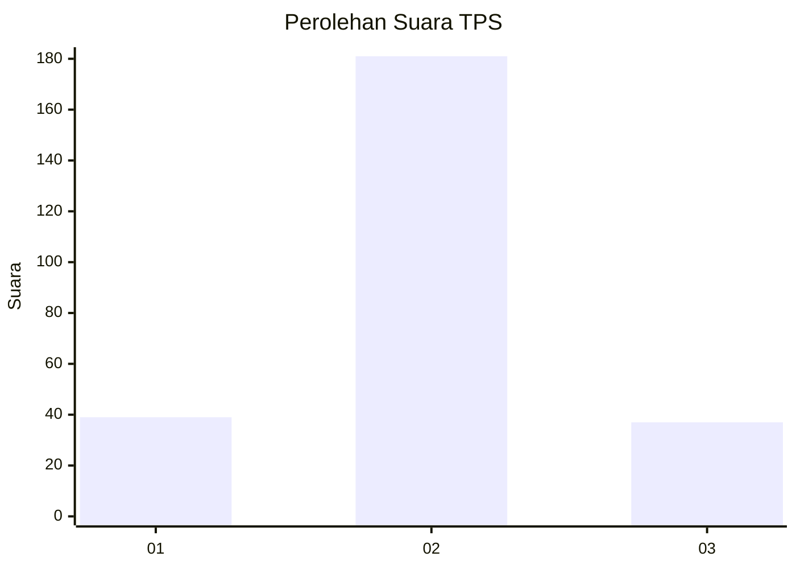

# Hasil

## Grafik

## Tabel

| No. | Nama Paslon    | Suara | Suara (raw) | Persentase |
|:--- |:-------------- | -----:| -----------:| ----------:|
| 1   | ANIES MUHAIMIN | 39    | [39][p-1]   | 15,18      |
| 2   | PRABOWO GIBRAN | 181   | [181][p-2]  | 70,43      |
| 3   | GANJAR MAHFUD  | 37    | [37][p-3]   | 14,40      |

[p-1]: https://github.com/gigit-pemilu/pemilu-2024/blob/main/pilpres/hitung-suara/sub/35-jawa-timur/sub/25-gresik/sub/13-menganti/sub/2013-menganti/sub/010-tps/sub/paslon-1.txt
[p-2]: https://github.com/gigit-pemilu/pemilu-2024/blob/main/pilpres/hitung-suara/sub/35-jawa-timur/sub/25-gresik/sub/13-menganti/sub/2013-menganti/sub/010-tps/sub/paslon-2.txt
[p-3]: https://github.com/gigit-pemilu/pemilu-2024/blob/main/pilpres/hitung-suara/sub/35-jawa-timur/sub/25-gresik/sub/13-menganti/sub/2013-menganti/sub/010-tps/sub/paslon-3.txt

## Foto C Plano

https://sirekap-obj-formc.kpu.go.id/97c6/pemilu/ppwp/35/25/13/20/13/3525132013010-20240215-004440--093fb67e-0b35-4037-b894-f87d4b385945.jpg

https://sirekap-obj-formc.kpu.go.id/97c6/pemilu/ppwp/35/25/13/20/13/3525132013010-20240215-004227--b6200da1-6b57-4e3d-bec0-422ea0c6cdfe.jpg

https://sirekap-obj-formc.kpu.go.id/97c6/pemilu/ppwp/35/25/13/20/13/3525132013010-20240215-004405--e90a3618-8f25-4a65-9dcc-e24f0acab3bf.jpg

## Metadata

| Key        | Value               |
| ---------- | ------------------- |
| Time Stamp | 2024-02-17 18:30:00 |

