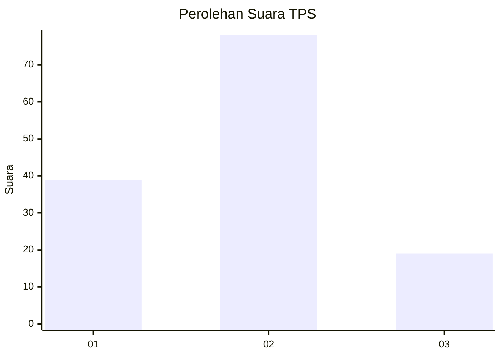
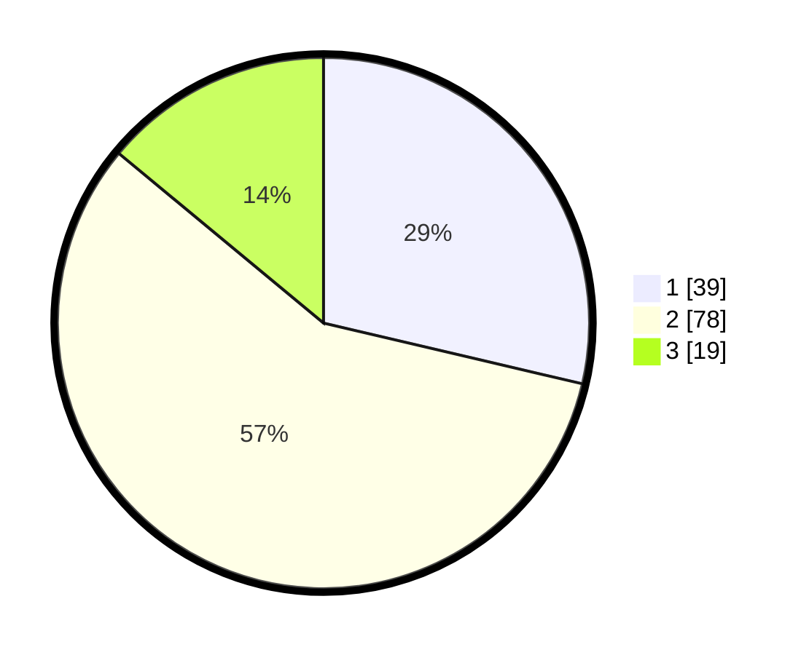

# Hasil

## Grafik

## Tabel

| No. | Nama Paslon    | Suara | Suara (raw) | Persentase |
|:--- |:-------------- | -----:| -----------:| ----------:|
| 1   | ANIES MUHAIMIN | 39    | [39][p-1]   | 28,68      |
| 2   | PRABOWO GIBRAN | 78    | [78][p-2]   | 57,35      |
| 3   | GANJAR MAHFUD  | 19    | [19][p-3]   | 13,97      |

[p-1]: https://github.com/gigit-pemilu/pemilu-2024/blob/main/pilpres/hitung-suara/sub/35-jawa-timur/sub/25-gresik/sub/13-menganti/sub/2013-menganti/sub/023-tps/sub/paslon-1.txt
[p-2]: https://github.com/gigit-pemilu/pemilu-2024/blob/main/pilpres/hitung-suara/sub/35-jawa-timur/sub/25-gresik/sub/13-menganti/sub/2013-menganti/sub/023-tps/sub/paslon-2.txt
[p-3]: https://github.com/gigit-pemilu/pemilu-2024/blob/main/pilpres/hitung-suara/sub/35-jawa-timur/sub/25-gresik/sub/13-menganti/sub/2013-menganti/sub/023-tps/sub/paslon-3.txt

## Foto C Plano

https://sirekap-obj-formc.kpu.go.id/6846/pemilu/ppwp/35/25/13/20/13/3525132013023-20240214-224752--ce579483-95e3-47ea-bd1b-5193787fc154.jpg

https://sirekap-obj-formc.kpu.go.id/6846/pemilu/ppwp/35/25/13/20/13/3525132013023-20240214-224838--fa7c86e0-9c59-476e-a398-cfcc436f3939.jpg

https://sirekap-obj-formc.kpu.go.id/6846/pemilu/ppwp/35/25/13/20/13/3525132013023-20240214-225008--fe8f2beb-6f7b-42f0-941f-cd9c695e5076.jpg

## Metadata

| Key        | Value               |
| ---------- | ------------------- |
| Time Stamp | 2024-02-17 18:30:00 |

