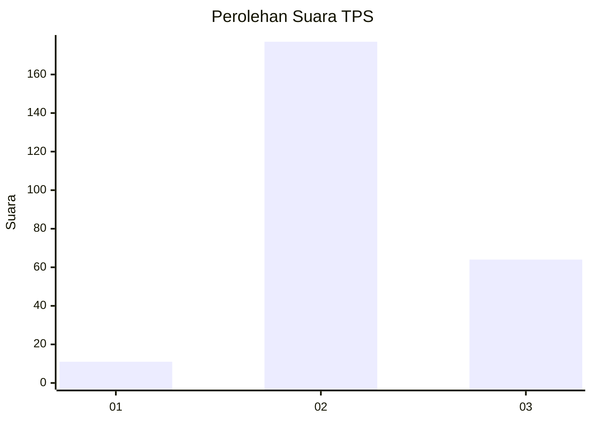
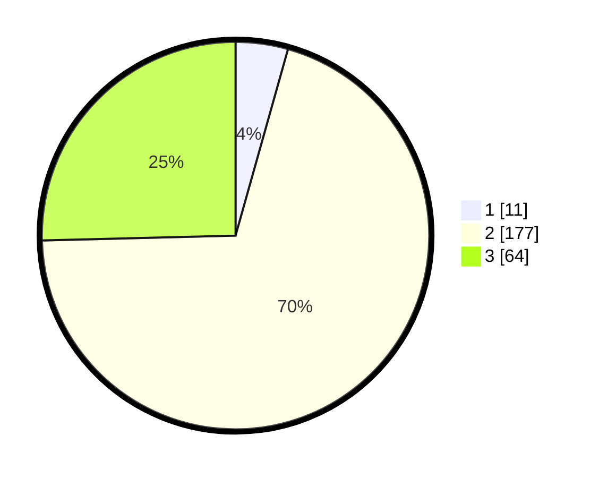

# Hasil

## Grafik

## Tabel

| No. | Nama Paslon    | Suara | Suara (raw) | Persentase |
|:--- |:-------------- | -----:| -----------:| ----------:|
| 1   | ANIES MUHAIMIN | 11    | [11][p-1]   | 4,37       |
| 2   | PRABOWO GIBRAN | 177   | [177][p-2]  | 70,24      |
| 3   | GANJAR MAHFUD  | 64    | [64][p-3]   | 25,40      |

[p-1]: https://github.com/gigit-pemilu/pemilu-2024-35-jawa-timur/blob/main/pilpres/hitung-suara/sub/35-jawa-timur/sub/25-gresik/sub/13-menganti/sub/2014-hulaan/sub/012-tps/sub/paslon-1.txt
[p-2]: https://github.com/gigit-pemilu/pemilu-2024-35-jawa-timur/blob/main/pilpres/hitung-suara/sub/35-jawa-timur/sub/25-gresik/sub/13-menganti/sub/2014-hulaan/sub/012-tps/sub/paslon-2.txt
[p-3]: https://github.com/gigit-pemilu/pemilu-2024-35-jawa-timur/blob/main/pilpres/hitung-suara/sub/35-jawa-timur/sub/25-gresik/sub/13-menganti/sub/2014-hulaan/sub/012-tps/sub/paslon-3.txt

## Foto C Plano

https://sirekap-obj-formc.kpu.go.id/ea4d/pemilu/ppwp/35/25/13/20/14/3525132014012-20240214-230716--033dcbbb-5d9d-4d09-82ee-243ac69830d5.jpg

https://sirekap-obj-formc.kpu.go.id/ea4d/pemilu/ppwp/35/25/13/20/14/3525132014012-20240214-200757--f8a12f57-9a55-4931-ae2e-f1b553c326a3.jpg

https://sirekap-obj-formc.kpu.go.id/ea4d/pemilu/ppwp/35/25/13/20/14/3525132014012-20240214-201006--dee2e970-bf00-4240-9767-39f5eee43aaf.jpg

## Metadata

| Key        | Value               |
| ---------- | ------------------- |
| Time Stamp | 2024-02-15 15:00:29 |

