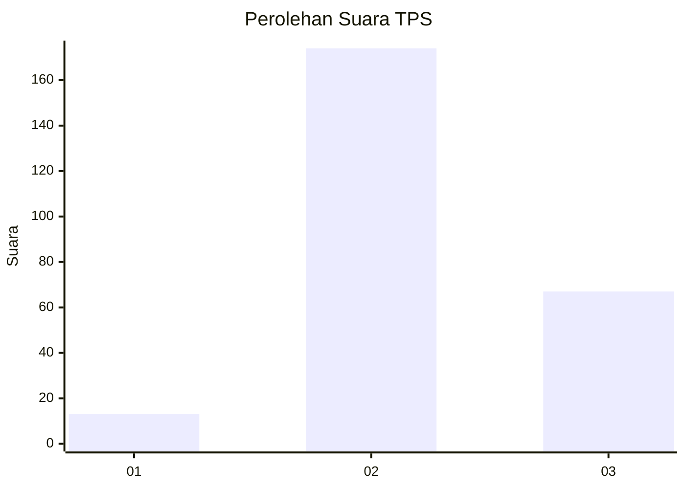

# Hasil

## Grafik

## Tabel

| No. | Nama Paslon    | Suara | Suara (raw) | Persentase |
|:--- |:-------------- | -----:| -----------:| ----------:|
| 1   | ANIES MUHAIMIN | 13    | [13][p-1]   | 5,12       |
| 2   | PRABOWO GIBRAN | 174   | [174][p-2]  | 68,50      |
| 3   | GANJAR MAHFUD  | 67    | [67][p-3]   | 26,38      |

[p-1]: https://github.com/gigit-pemilu/pemilu-2024-35-jawa-timur/blob/main/pilpres/hitung-suara/sub/35-jawa-timur/sub/25-gresik/sub/13-menganti/sub/2014-hulaan/sub/013-tps/sub/paslon-1.txt
[p-2]: https://github.com/gigit-pemilu/pemilu-2024-35-jawa-timur/blob/main/pilpres/hitung-suara/sub/35-jawa-timur/sub/25-gresik/sub/13-menganti/sub/2014-hulaan/sub/013-tps/sub/paslon-2.txt
[p-3]: https://github.com/gigit-pemilu/pemilu-2024-35-jawa-timur/blob/main/pilpres/hitung-suara/sub/35-jawa-timur/sub/25-gresik/sub/13-menganti/sub/2014-hulaan/sub/013-tps/sub/paslon-3.txt

## Foto C Plano

https://sirekap-obj-formc.kpu.go.id/9968/pemilu/ppwp/35/25/13/20/14/3525132014013-20240214-233406--0ee8c933-4b9f-47b9-9d21-572ef44fc3a5.jpg

https://sirekap-obj-formc.kpu.go.id/9968/pemilu/ppwp/35/25/13/20/14/3525132014013-20240215-031638--8eb039fb-2835-4621-9b88-44921078dddd.jpg

https://sirekap-obj-formc.kpu.go.id/9968/pemilu/ppwp/35/25/13/20/14/3525132014013-20240215-031659--e9077961-a0c2-4fc4-bbf7-d4c1adae010a.jpg

## Metadata

| Key        | Value               |
| ---------- | ------------------- |
| Time Stamp | 2024-02-17 19:00:04 |

