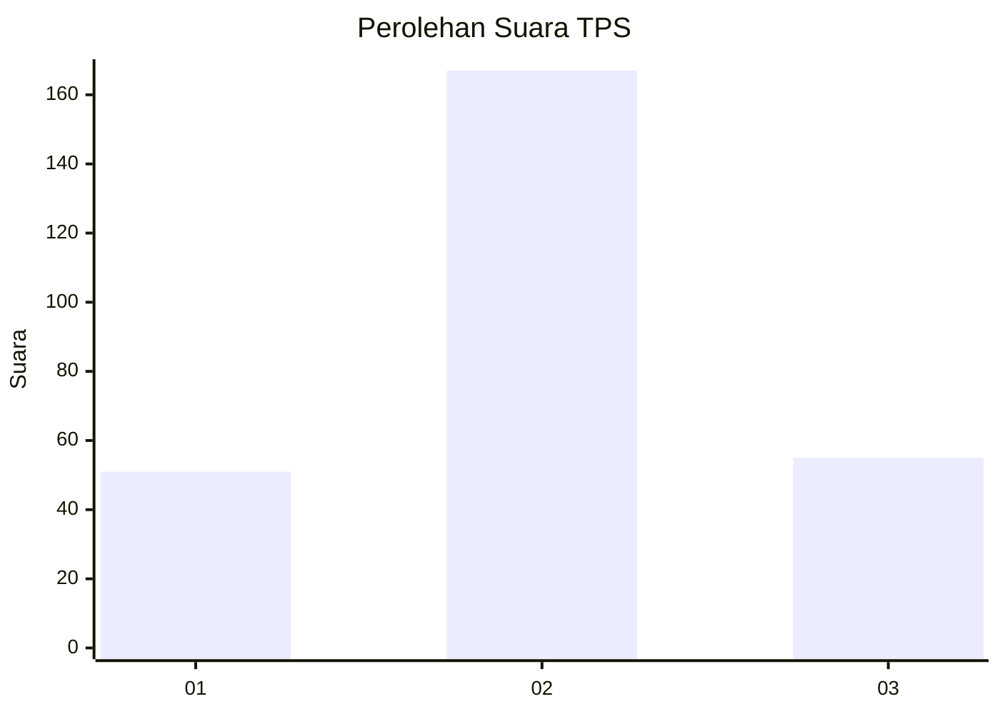
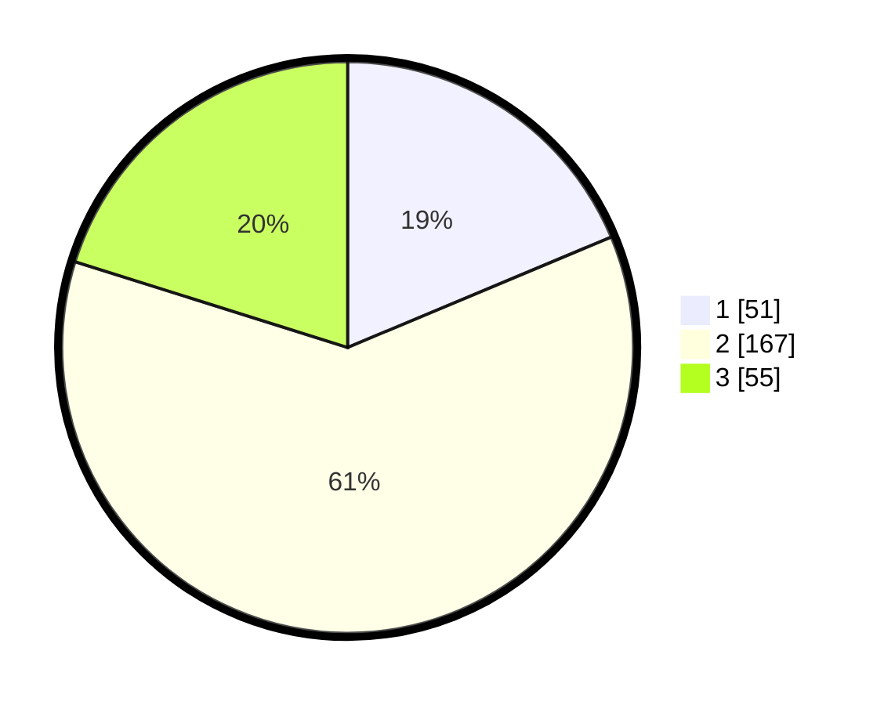

# Hasil

## Grafik

## Tabel

| No. | Nama Paslon    | Suara | Suara (raw) | Persentase |
|:--- |:-------------- | -----:| -----------:| ----------:|
| 1   | ANIES MUHAIMIN | 51    | [51][p-1]   | 18,68      |
| 2   | PRABOWO GIBRAN | 167   | [167][p-2]  | 61,17      |
| 3   | GANJAR MAHFUD  | 55    | [55][p-3]   | 20,15      |

[p-1]: https://github.com/gigit-pemilu/pemilu-2024-35-jawa-timur/blob/main/pilpres/hitung-suara/sub/35-jawa-timur/sub/25-gresik/sub/13-menganti/sub/2015-kepatihan/sub/018-tps/sub/paslon-1.txt
[p-2]: https://github.com/gigit-pemilu/pemilu-2024-35-jawa-timur/blob/main/pilpres/hitung-suara/sub/35-jawa-timur/sub/25-gresik/sub/13-menganti/sub/2015-kepatihan/sub/018-tps/sub/paslon-2.txt
[p-3]: https://github.com/gigit-pemilu/pemilu-2024-35-jawa-timur/blob/main/pilpres/hitung-suara/sub/35-jawa-timur/sub/25-gresik/sub/13-menganti/sub/2015-kepatihan/sub/018-tps/sub/paslon-3.txt

## Foto C Plano

https://sirekap-obj-formc.kpu.go.id/7ed1/pemilu/ppwp/35/25/13/20/15/3525132015018-20240220-091720--90db6f1c-53d1-4282-8843-74d3fbd44635.jpg

https://sirekap-obj-formc.kpu.go.id/7ed1/pemilu/ppwp/35/25/13/20/15/3525132015018-20240220-091924--3be5b9bc-7131-445b-bcf9-49164071d04a.jpg

https://sirekap-obj-formc.kpu.go.id/7ed1/pemilu/ppwp/35/25/13/20/15/3525132015018-20240220-092017--44a8b1ed-3857-42c8-9033-04e19d4166f9.jpg

## Metadata

| Key        | Value               |
| ---------- | ------------------- |
| Time Stamp | 2024-02-20 10:00:00 |

## DATA PEMILIH TETAP

Jumlah pemilih dalam DPT: **264**.
 * L: **134**.
 * P: **130**.

## DATA PENGGUNA HAK PILIH

Jumlah pengguna hak pilih dalam DPT: **237**.
 * L: **117**.
 * P: **120**.

Jumlah pengguna hak pilih dalam DPTb: **220**.
 * L: **0**.
 * P: **222**.

Jumlah pengguna hak pilih dalam DPK: **14**.
 * L: **6**.
 * P: **7**.

Jumlah pengguna hak pilih: **250**.
 * L: **123**.
 * P: **127**.

## JUMLAH SUARA SAH DAN TIDAK SAH

JUMLAH SELURUH SUARA SAH: **243**.

JUMLAH SUARA TIDAK SAH: **7**.

JUMLAH SELURUH SUARA SAH DAN SUARA TIDAK SAH: **250**.

