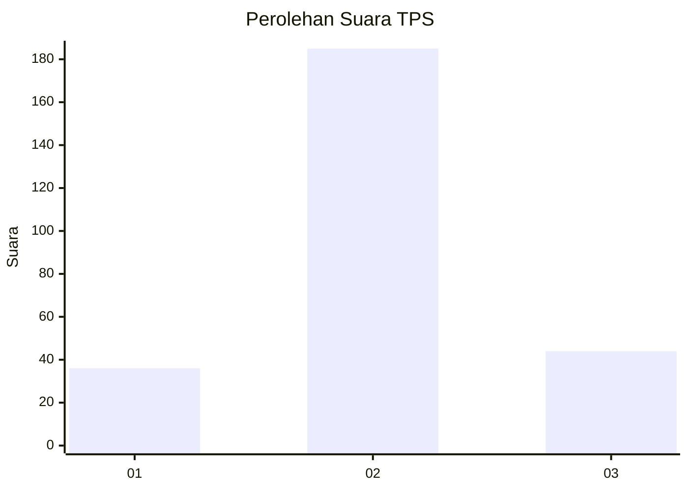
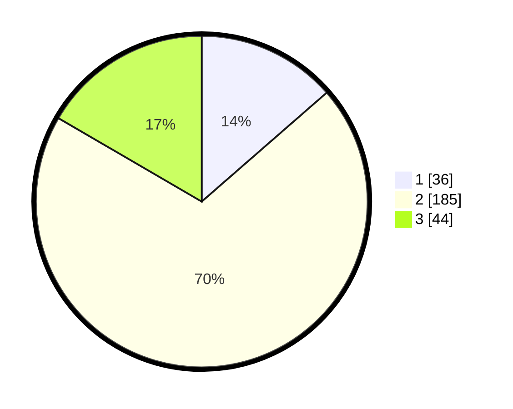

# Hasil

## Grafik

## Tabel

| No. | Nama Paslon    | Suara | Suara (raw) | Persentase |
|:--- |:-------------- | -----:| -----------:| ----------:|
| 1   | ANIES MUHAIMIN | 36    | [36][p-1]   | 13,58      |
| 2   | PRABOWO GIBRAN | 185   | [185][p-2]  | 69,81      |
| 3   | GANJAR MAHFUD  | 44    | [44][p-3]   | 16,60      |

[p-1]: https://github.com/gigit-pemilu/pemilu-2024-35-jawa-timur/blob/main/pilpres/hitung-suara/sub/35-jawa-timur/sub/25-gresik/sub/13-menganti/sub/2016-gempolkurung/sub/013-tps/sub/paslon-1.txt
[p-2]: https://github.com/gigit-pemilu/pemilu-2024-35-jawa-timur/blob/main/pilpres/hitung-suara/sub/35-jawa-timur/sub/25-gresik/sub/13-menganti/sub/2016-gempolkurung/sub/013-tps/sub/paslon-2.txt
[p-3]: https://github.com/gigit-pemilu/pemilu-2024-35-jawa-timur/blob/main/pilpres/hitung-suara/sub/35-jawa-timur/sub/25-gresik/sub/13-menganti/sub/2016-gempolkurung/sub/013-tps/sub/paslon-3.txt

## Foto C Plano

https://sirekap-obj-formc.kpu.go.id/a10d/pemilu/ppwp/35/25/13/20/16/3525132016013-20240218-182642--f3d726f4-8d97-494b-adf6-acefe9cc2333.jpg

https://sirekap-obj-formc.kpu.go.id/a10d/pemilu/ppwp/35/25/13/20/16/3525132016013-20240220-110102--74c76c23-8963-49c8-bd6b-efe654916024.jpg

https://sirekap-obj-formc.kpu.go.id/a10d/pemilu/ppwp/35/25/13/20/16/3525132016013-20240220-111648--2cc7f26c-f9fc-4489-9add-b872d7b033f8.jpg

## Metadata

| Key        | Value               |
| ---------- | ------------------- |
| Time Stamp | 2024-02-25 16:00:00 |

