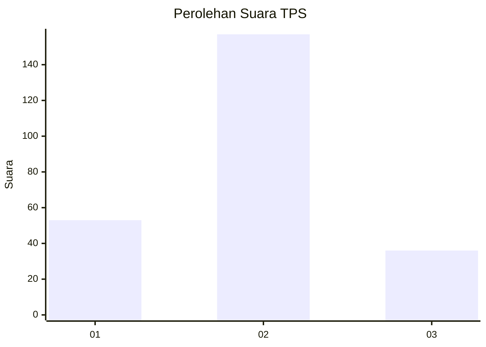
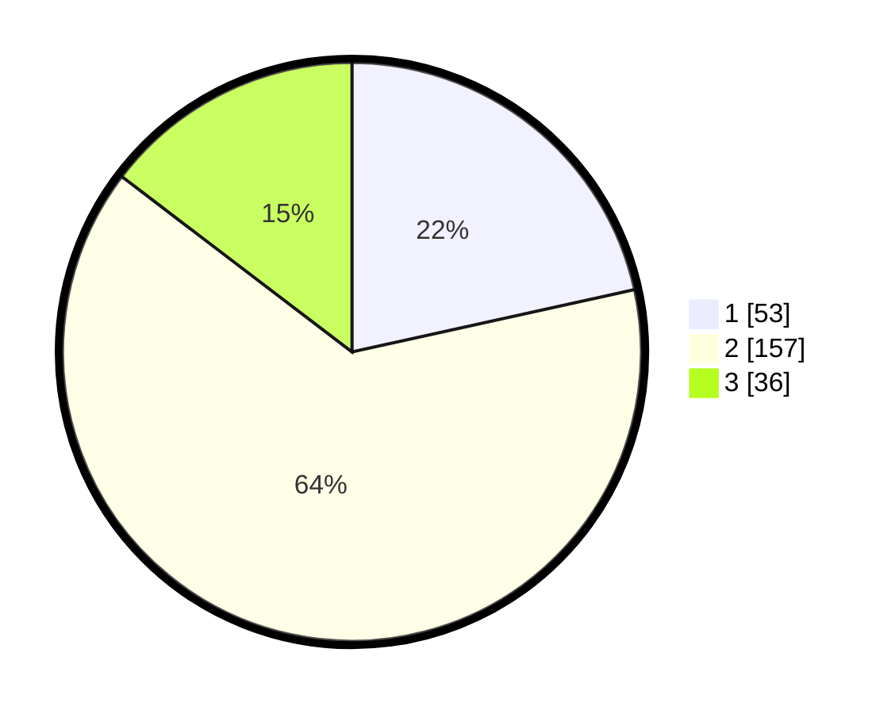

# Hasil

## Grafik

## Tabel

| No. | Nama Paslon    | Suara | Suara (raw) | Persentase |
|:--- |:-------------- | -----:| -----------:| ----------:|
| 1   | ANIES MUHAIMIN | 53    | [53][p-1]   | 21,54      |
| 2   | PRABOWO GIBRAN | 157   | [157][p-2]  | 63,82      |
| 3   | GANJAR MAHFUD  | 36    | [36][p-3]   | 14,63      |

[p-1]: https://github.com/gigit-pemilu/pemilu-2024/blob/main/pilpres/hitung-suara/sub/35-jawa-timur/sub/25-gresik/sub/13-menganti/sub/2018-sidowungu/sub/006-tps/sub/paslon-1.txt
[p-2]: https://github.com/gigit-pemilu/pemilu-2024/blob/main/pilpres/hitung-suara/sub/35-jawa-timur/sub/25-gresik/sub/13-menganti/sub/2018-sidowungu/sub/006-tps/sub/paslon-2.txt
[p-3]: https://github.com/gigit-pemilu/pemilu-2024/blob/main/pilpres/hitung-suara/sub/35-jawa-timur/sub/25-gresik/sub/13-menganti/sub/2018-sidowungu/sub/006-tps/sub/paslon-3.txt

## Foto C Plano

https://sirekap-obj-formc.kpu.go.id/7581/pemilu/ppwp/35/25/13/20/18/3525132018006-20240215-122234--c9baf62b-04ef-4de5-929c-d180d2ee3443.jpg

https://sirekap-obj-formc.kpu.go.id/7581/pemilu/ppwp/35/25/13/20/18/3525132018006-20240214-155534--fd31c51c-cddd-48b3-a343-0ce38a44514e.jpg

https://sirekap-obj-formc.kpu.go.id/7581/pemilu/ppwp/35/25/13/20/18/3525132018006-20240214-155633--9c0f02a4-4976-4c6b-9dab-6dfd080e94d4.jpg

## Metadata

| Key        | Value               |
| ---------- | ------------------- |
| Time Stamp | 2024-02-15 18:30:25 |

