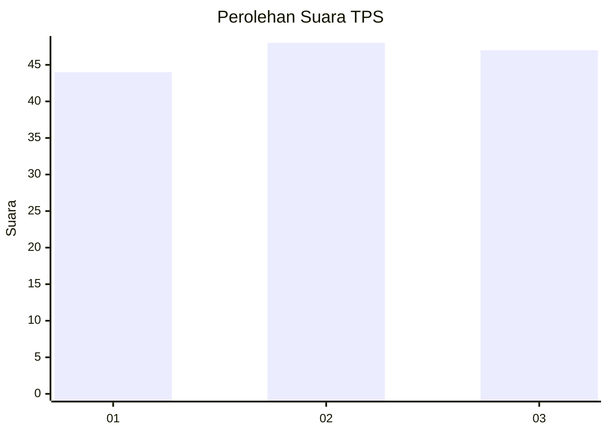
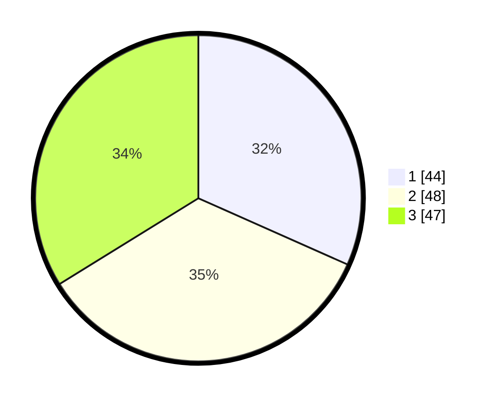

# Hasil

## Grafik

## Tabel

| No. | Nama Paslon    | Suara | Suara (raw) | Persentase |
|:--- |:-------------- | -----:| -----------:| ----------:|
| 1   | ANIES MUHAIMIN | 44    | [44][p-1]   | 31,65      |
| 2   | PRABOWO GIBRAN | 48    | [48][p-2]   | 34,53      |
| 3   | GANJAR MAHFUD  | 47    | [47][p-3]   | 33,81      |

[p-1]: https://github.com/gigit-pemilu/pemilu-2024-35-jawa-timur/blob/main/pilpres/hitung-suara/sub/35-jawa-timur/sub/25-gresik/sub/13-menganti/sub/2020-setro/sub/010-tps/sub/paslon-1.txt
[p-2]: https://github.com/gigit-pemilu/pemilu-2024-35-jawa-timur/blob/main/pilpres/hitung-suara/sub/35-jawa-timur/sub/25-gresik/sub/13-menganti/sub/2020-setro/sub/010-tps/sub/paslon-2.txt
[p-3]: https://github.com/gigit-pemilu/pemilu-2024-35-jawa-timur/blob/main/pilpres/hitung-suara/sub/35-jawa-timur/sub/25-gresik/sub/13-menganti/sub/2020-setro/sub/010-tps/sub/paslon-3.txt

## Foto C Plano

https://sirekap-obj-formc.kpu.go.id/1e22/pemilu/ppwp/35/25/13/20/20/3525132020010-20240220-201102--07ef8e74-a19c-4a7b-a041-fa3836217332.jpg

https://sirekap-obj-formc.kpu.go.id/1e22/pemilu/ppwp/35/25/13/20/20/3525132020010-20240220-201156--90a752cb-315d-4a8c-8c4f-41db01c5e6a5.jpg

https://sirekap-obj-formc.kpu.go.id/1e22/pemilu/ppwp/35/25/13/20/20/3525132020010-20240220-201257--973d381e-1fff-4299-8ae4-e6e4009d69a1.jpg

## Metadata

| Key        | Value               |
| ---------- | ------------------- |
| Time Stamp | 2024-02-20 21:00:00 |

## DATA PEMILIH TETAP

Jumlah pemilih dalam DPT: **270**.
 * L: **837**.
 * P: **33**.

## DATA PENGGUNA HAK PILIH

Jumlah pengguna hak pilih dalam DPT: **555**.
 * L: **29**.
 * P: **155**.

Jumlah pengguna hak pilih dalam DPTb: **800**.
 * L: **0**.
 * P: **88**.

Jumlah pengguna hak pilih dalam DPK: **883**.
 * L: **801**.
 * P: **2**.

Jumlah pengguna hak pilih: **259**.
 * L: **430**.
 * P: **24**.

## JUMLAH SUARA SAH DAN TIDAK SAH

JUMLAH SELURUH SUARA SAH: **239**.

JUMLAH SUARA TIDAK SAH: **65**.

JUMLAH SELURUH SUARA SAH DAN SUARA TIDAK SAH: **254**.

