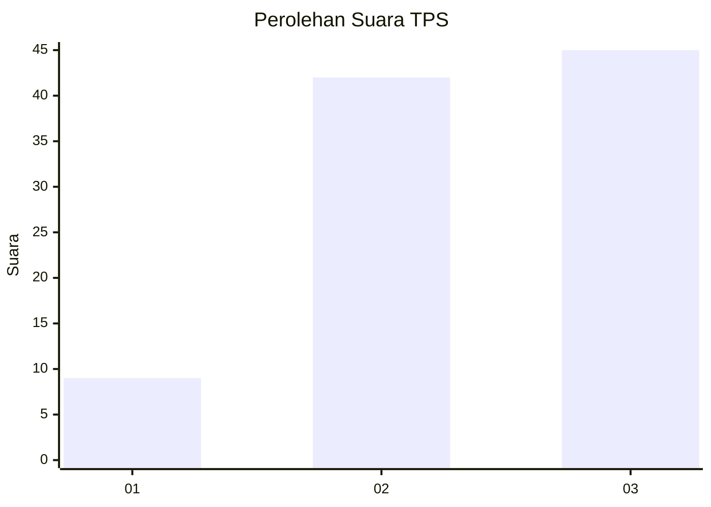
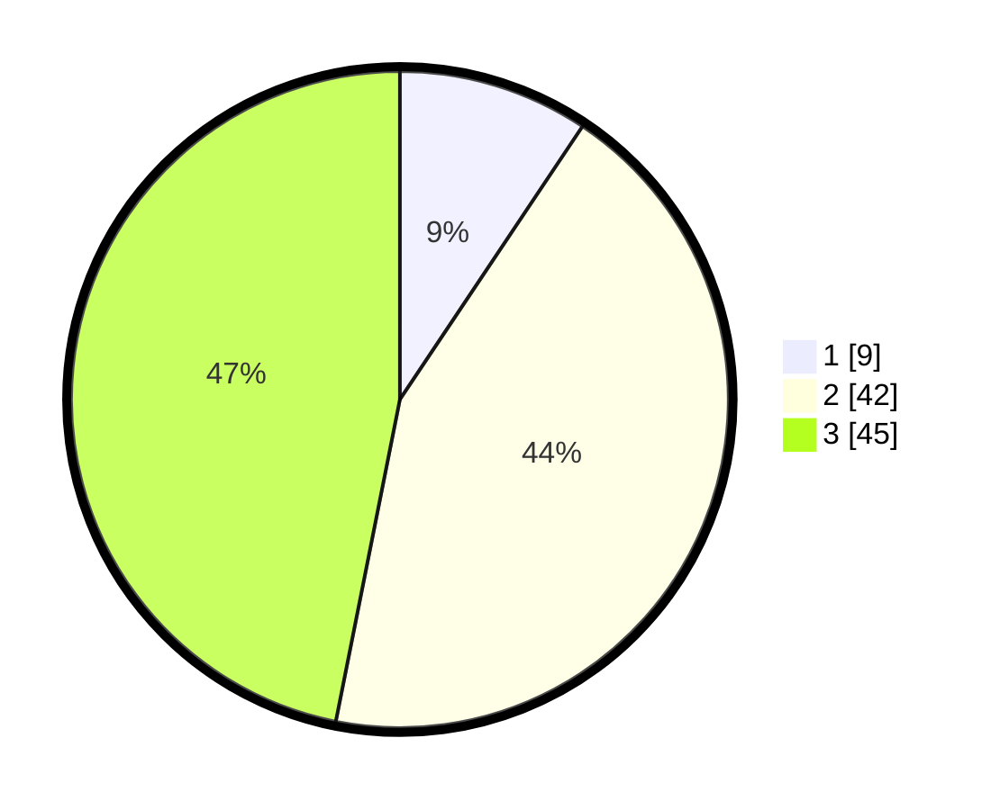

# Hasil

## Grafik

## Tabel

| No. | Nama Paslon    | Suara | Suara (raw) | Persentase |
|:--- |:-------------- | -----:| -----------:| ----------:|
| 1   | ANIES MUHAIMIN | 9     | [9][p-1]    | 9,38       |
| 2   | PRABOWO GIBRAN | 42    | [42][p-2]   | 43,75      |
| 3   | GANJAR MAHFUD  | 45    | [45][p-3]   | 46,88      |

[p-1]: https://github.com/gigit-pemilu/pemilu-2024-35-jawa-timur/blob/main/pilpres/hitung-suara/sub/35-jawa-timur/sub/25-gresik/sub/13-menganti/sub/2020-setro/sub/015-tps/sub/paslon-1.txt
[p-2]: https://github.com/gigit-pemilu/pemilu-2024-35-jawa-timur/blob/main/pilpres/hitung-suara/sub/35-jawa-timur/sub/25-gresik/sub/13-menganti/sub/2020-setro/sub/015-tps/sub/paslon-2.txt
[p-3]: https://github.com/gigit-pemilu/pemilu-2024-35-jawa-timur/blob/main/pilpres/hitung-suara/sub/35-jawa-timur/sub/25-gresik/sub/13-menganti/sub/2020-setro/sub/015-tps/sub/paslon-3.txt

## Foto C Plano

https://sirekap-obj-formc.kpu.go.id/a43d/pemilu/ppwp/35/25/13/20/20/3525132020015-20240220-201637--2e93cec1-5e03-44b0-9008-89888b801453.jpg

https://sirekap-obj-formc.kpu.go.id/a43d/pemilu/ppwp/35/25/13/20/20/3525132020015-20240220-201714--a9a6f30c-faa3-4ab3-8cbd-0add2087a902.jpg

https://sirekap-obj-formc.kpu.go.id/a43d/pemilu/ppwp/35/25/13/20/20/3525132020015-20240220-201839--c5497518-bfab-4a35-b070-be0015071204.jpg

## Metadata

| Key        | Value               |
| ---------- | ------------------- |
| Time Stamp | 2024-02-20 21:00:00 |

## DATA PEMILIH TETAP

Jumlah pemilih dalam DPT: **275**.
 * L: **435**.
 * P: **440**.

## DATA PENGGUNA HAK PILIH

Jumlah pengguna hak pilih dalam DPT: **555**.
 * L: **255**.
 * P: **555**.

Jumlah pengguna hak pilih dalam DPTb: **888**.
 * L: **888**.
 * P: **828**.

Jumlah pengguna hak pilih dalam DPK: **805**.
 * L: **884**.
 * P: **804**.

Jumlah pengguna hak pilih: **263**.
 * L: **434**.
 * P: **432**.

## JUMLAH SUARA SAH DAN TIDAK SAH

JUMLAH SELURUH SUARA SAH: **247**.

JUMLAH SUARA TIDAK SAH: **16**.

JUMLAH SELURUH SUARA SAH DAN SUARA TIDAK SAH: **263**.

