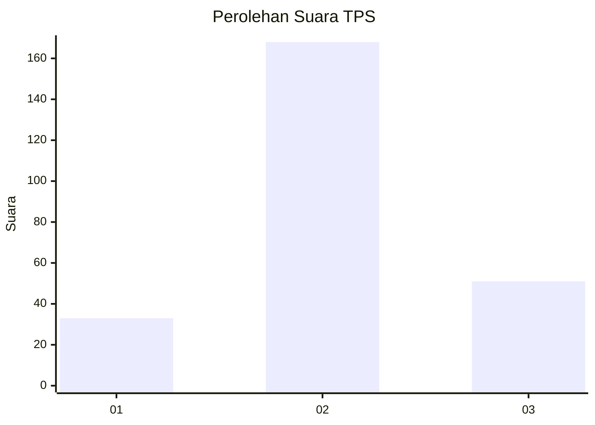
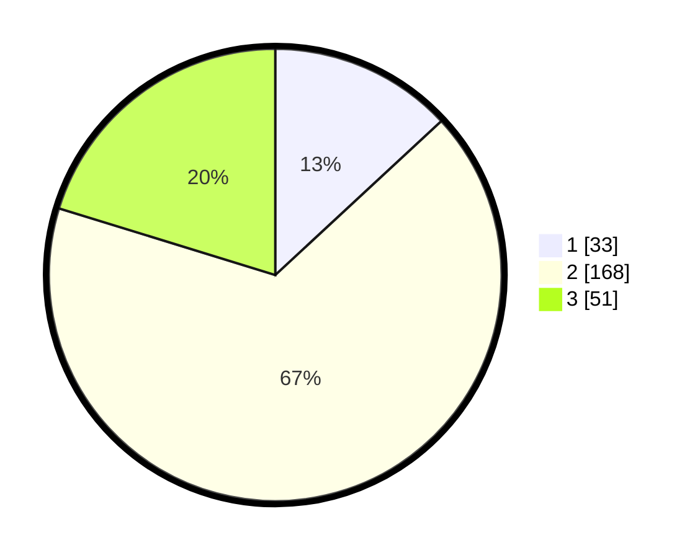

# Hasil

## Grafik

## Tabel

| No. | Nama Paslon    | Suara | Suara (raw) | Persentase |
|:--- |:-------------- | -----:| -----------:| ----------:|
| 1   | ANIES MUHAIMIN | 33    | [33][p-1]   | 13,10      |
| 2   | PRABOWO GIBRAN | 168   | [168][p-2]  | 66,67      |
| 3   | GANJAR MAHFUD  | 51    | [51][p-3]   | 20,24      |

[p-1]: https://github.com/gigit-pemilu/pemilu-2024-35-jawa-timur/blob/main/pilpres/hitung-suara/sub/35-jawa-timur/sub/25-gresik/sub/14-kebomas/sub/1006-gulomantung/sub/002-tps/sub/paslon-1.txt
[p-2]: https://github.com/gigit-pemilu/pemilu-2024-35-jawa-timur/blob/main/pilpres/hitung-suara/sub/35-jawa-timur/sub/25-gresik/sub/14-kebomas/sub/1006-gulomantung/sub/002-tps/sub/paslon-2.txt
[p-3]: https://github.com/gigit-pemilu/pemilu-2024-35-jawa-timur/blob/main/pilpres/hitung-suara/sub/35-jawa-timur/sub/25-gresik/sub/14-kebomas/sub/1006-gulomantung/sub/002-tps/sub/paslon-3.txt

## Foto C Plano

https://sirekap-obj-formc.kpu.go.id/ac37/pemilu/ppwp/35/25/14/10/06/3525141006002-20240214-194727--36679c09-a93a-4140-ab75-363a3704ba8d.jpg

https://sirekap-obj-formc.kpu.go.id/ac37/pemilu/ppwp/35/25/14/10/06/3525141006002-20240214-191508--84653256-c94b-4e59-bf2a-8cbad9f3572d.jpg

https://sirekap-obj-formc.kpu.go.id/ac37/pemilu/ppwp/35/25/14/10/06/3525141006002-20240214-191628--9c42f3f5-3fbd-4657-9df2-1c705537c088.jpg

## Metadata

| Key        | Value               |
| ---------- | ------------------- |
| Time Stamp | 2024-02-16 12:51:22 |

