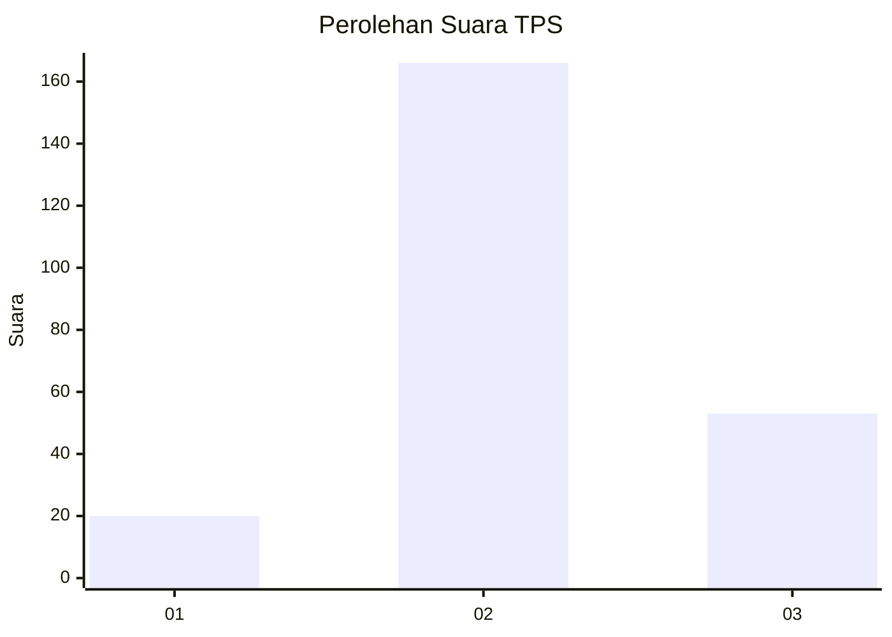
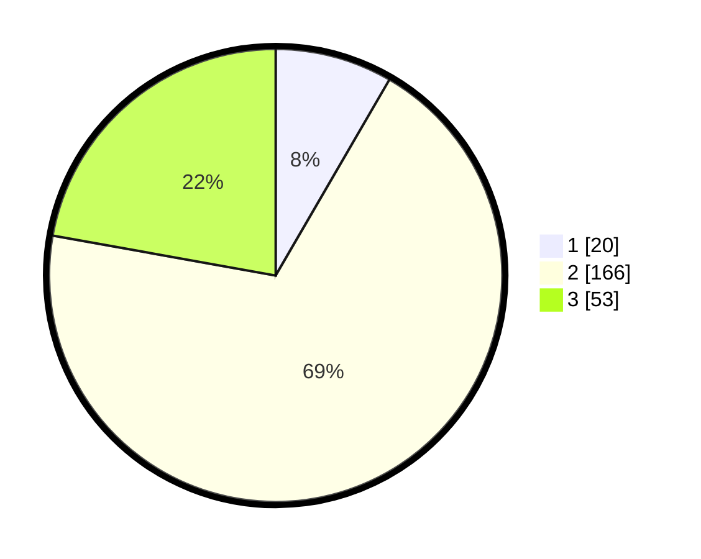

# Hasil

## Grafik

## Tabel

| No. | Nama Paslon    | Suara | Suara (raw) | Persentase |
|:--- |:-------------- | -----:| -----------:| ----------:|
| 1   | ANIES MUHAIMIN | 20    | [20][p-1]   | 8,37       |
| 2   | PRABOWO GIBRAN | 166   | [166][p-2]  | 69,46      |
| 3   | GANJAR MAHFUD  | 53    | [53][p-3]   | 22,18      |

[p-1]: https://github.com/gigit-pemilu/pemilu-2024/blob/main/pilpres/hitung-suara/sub/35-jawa-timur/sub/25-gresik/sub/14-kebomas/sub/1006-gulomantung/sub/004-tps/sub/paslon-1.txt
[p-2]: https://github.com/gigit-pemilu/pemilu-2024/blob/main/pilpres/hitung-suara/sub/35-jawa-timur/sub/25-gresik/sub/14-kebomas/sub/1006-gulomantung/sub/004-tps/sub/paslon-2.txt
[p-3]: https://github.com/gigit-pemilu/pemilu-2024/blob/main/pilpres/hitung-suara/sub/35-jawa-timur/sub/25-gresik/sub/14-kebomas/sub/1006-gulomantung/sub/004-tps/sub/paslon-3.txt

## Foto C Plano

https://sirekap-obj-formc.kpu.go.id/f720/pemilu/ppwp/35/25/14/10/06/3525141006004-20240214-221449--4a1d5011-7609-44d3-8716-87c8bed11c64.jpg

https://sirekap-obj-formc.kpu.go.id/f720/pemilu/ppwp/35/25/14/10/06/3525141006004-20240214-221613--ff7a5877-df8d-4fa7-9acc-4c683a8b8f51.jpg

https://sirekap-obj-formc.kpu.go.id/f720/pemilu/ppwp/35/25/14/10/06/3525141006004-20240214-221737--f91d74c7-08d5-4c27-9371-c05fc41782e6.jpg

## Metadata

| Key        | Value               |
| ---------- | ------------------- |
| Time Stamp | 2024-02-16 12:51:22 |

