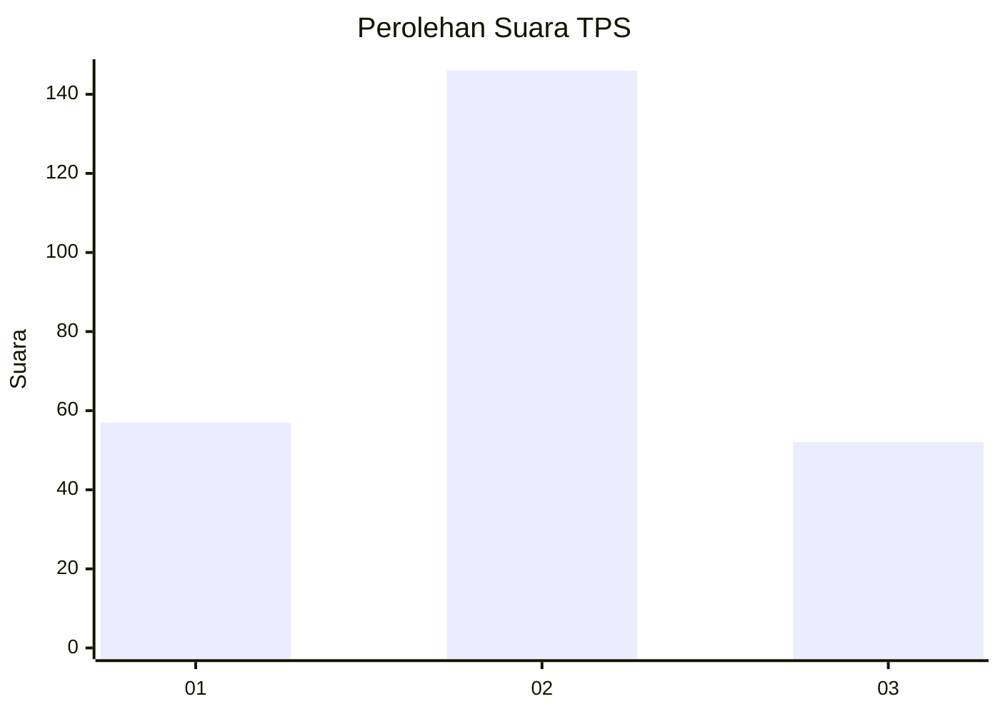
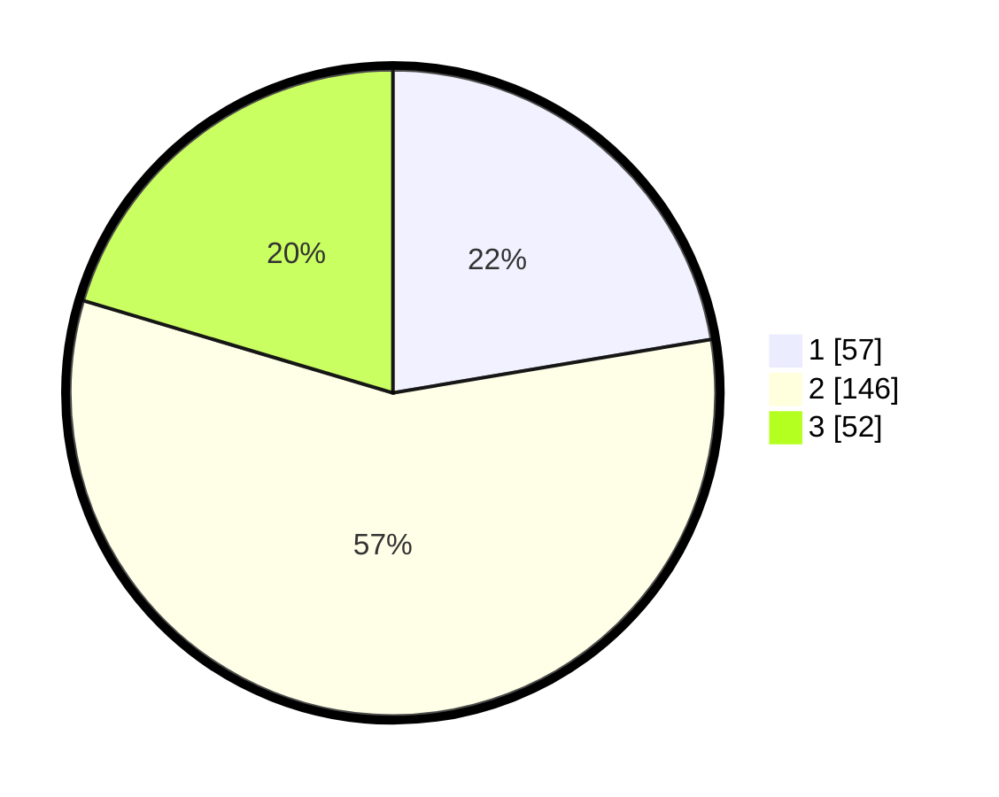

# Hasil

## Grafik

## Tabel

| No. | Nama Paslon    | Suara | Suara (raw) | Persentase |
|:--- |:-------------- | -----:| -----------:| ----------:|
| 1   | ANIES MUHAIMIN | 57    | [57][p-1]   | 22,35      |
| 2   | PRABOWO GIBRAN | 146   | [146][p-2]  | 57,25      |
| 3   | GANJAR MAHFUD  | 52    | [52][p-3]   | 20,39      |

[p-1]: https://github.com/gigit-pemilu/pemilu-2024-35-jawa-timur/blob/main/pilpres/hitung-suara/sub/35-jawa-timur/sub/25-gresik/sub/14-kebomas/sub/1008-sidomukti/sub/003-tps/sub/paslon-1.txt
[p-2]: https://github.com/gigit-pemilu/pemilu-2024-35-jawa-timur/blob/main/pilpres/hitung-suara/sub/35-jawa-timur/sub/25-gresik/sub/14-kebomas/sub/1008-sidomukti/sub/003-tps/sub/paslon-2.txt
[p-3]: https://github.com/gigit-pemilu/pemilu-2024-35-jawa-timur/blob/main/pilpres/hitung-suara/sub/35-jawa-timur/sub/25-gresik/sub/14-kebomas/sub/1008-sidomukti/sub/003-tps/sub/paslon-3.txt

## Foto C Plano

https://sirekap-obj-formc.kpu.go.id/6493/pemilu/ppwp/35/25/14/10/08/3525141008003-20240215-064026--1ef1960c-004d-478b-a8cb-fcb381e8d375.jpg

https://sirekap-obj-formc.kpu.go.id/6493/pemilu/ppwp/35/25/14/10/08/3525141008003-20240215-064127--2372e99c-99bb-4b60-8153-14b74557302c.jpg

https://sirekap-obj-formc.kpu.go.id/6493/pemilu/ppwp/35/25/14/10/08/3525141008003-20240215-064226--74d436da-893c-496c-8990-0d670dbdd108.jpg

## Metadata

| Key        | Value               |
| ---------- | ------------------- |
| Time Stamp | 2024-02-16 10:30:29 |

