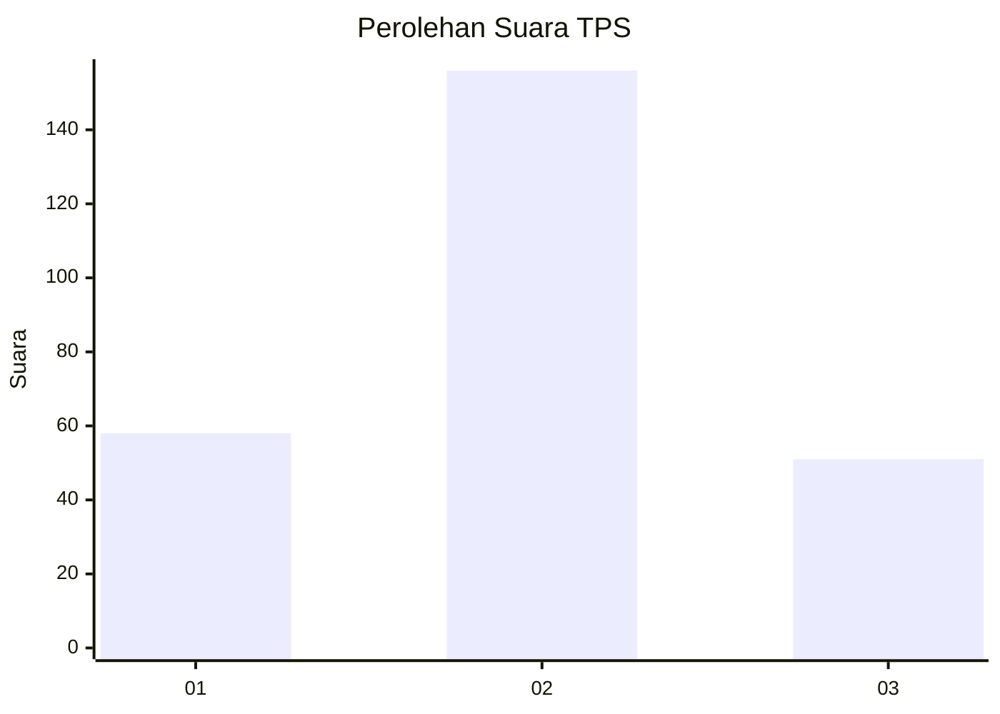
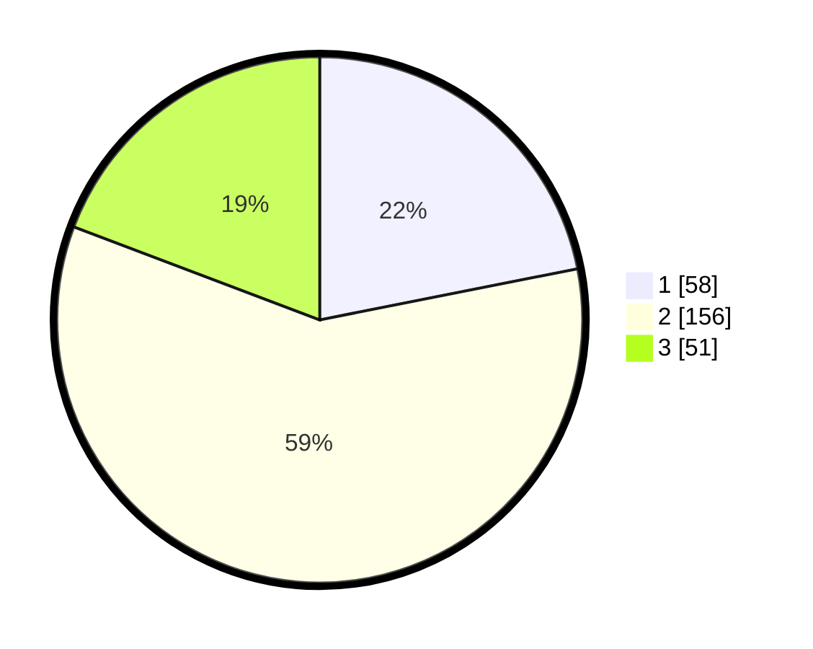

# Hasil

## Grafik

## Tabel

| No. | Nama Paslon    | Suara | Suara (raw) | Persentase |
|:--- |:-------------- | -----:| -----------:| ----------:|
| 1   | ANIES MUHAIMIN | 58    | [58][p-1]   | 21,89      |
| 2   | PRABOWO GIBRAN | 156   | [156][p-2]  | 58,87      |
| 3   | GANJAR MAHFUD  | 51    | [51][p-3]   | 19,25      |

[p-1]: https://github.com/gigit-pemilu/pemilu-2024-35-jawa-timur/blob/main/pilpres/hitung-suara/sub/35-jawa-timur/sub/25-gresik/sub/14-kebomas/sub/1008-sidomukti/sub/006-tps/sub/paslon-1.txt
[p-2]: https://github.com/gigit-pemilu/pemilu-2024-35-jawa-timur/blob/main/pilpres/hitung-suara/sub/35-jawa-timur/sub/25-gresik/sub/14-kebomas/sub/1008-sidomukti/sub/006-tps/sub/paslon-2.txt
[p-3]: https://github.com/gigit-pemilu/pemilu-2024-35-jawa-timur/blob/main/pilpres/hitung-suara/sub/35-jawa-timur/sub/25-gresik/sub/14-kebomas/sub/1008-sidomukti/sub/006-tps/sub/paslon-3.txt

## Foto C Plano

https://sirekap-obj-formc.kpu.go.id/9c9c/pemilu/ppwp/35/25/14/10/08/3525141008006-20240214-202617--dcb3feda-60d2-497d-9a3c-45fab7dc651a.jpg

https://sirekap-obj-formc.kpu.go.id/9c9c/pemilu/ppwp/35/25/14/10/08/3525141008006-20240214-202622--8d67e7da-c3a1-4188-800a-9928b85c490c.jpg

https://sirekap-obj-formc.kpu.go.id/9c9c/pemilu/ppwp/35/25/14/10/08/3525141008006-20240214-202627--530970ff-5b9f-4126-bdf7-2d3b8b883833.jpg

## Metadata

| Key        | Value               |
| ---------- | ------------------- |
| Time Stamp | 2024-02-16 12:51:22 |

